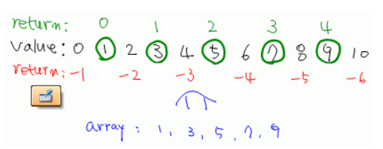

# DP

동적 계획법(Dynamic Programming)은 그리디 알고리즘과 같이 최적화 문제를 해결하는 알고리즘이다.

> 최적화 문제 : 최적(최대 또는 최소)값을 구하는 문제

DP를 사용하려면 중복 부분문제 구조여야하고, 최적 부분문제 구조여야한다.


## 상향식, 하향식

n번째 최적값을 구하기 위해 상향식, 하향식 2가지 방법으로 접근할 수 있다.

상향식은 n=1일때부터 작은 문제들을 해결해나가며, 이 작은 문제의 결과값을 이후 큰 문제에 적용하는 것이다.

하향식은 n일때 값을 구하기 위해 점화식을 따라 숫자를 내리면서 진행한다. 해당 값 첫 방문시에 값을 dp 배열에 저장하고, 재방문시 dp 배열에서 바로 꺼내 사용한다. 보통 재귀를 이용해 풀어나가는데, 재귀의 종료 조건을 함수 초반에 선언해야한다. (n==1 등)

> 하향식은 상향식과 다르게, dp배열의 모든 값이 채워지지 않을 수도 있다.


하향식으로 접근한 문제 : [백준 2228 : 구간 나누기](https://www.acmicpc.net/problem/2228)


## Common Idea

- dp 배열의 값에는 문제에서 원하고자하는 값을 담는 경우가 대다수다.

- dp 배열의 값을 순서대로 채울 필요는 없다. 다른 연산을 하면서 dp가 채워지는 경우도 많다.


## 0/1 Knapsack

가방의 최대 무게가 있다. 넣고자하는 물건 각각의 무게, 가치가 주어졌을 때 가방에 넣을 수 있는 물건들의 가치 합의 최대값을 구하는 문제

1. 물건들 1개씩 돌면서 시작
2. 가방의 최대 가용무게부터 무게를 줄여가면서 dp를 갱신시킨다.

```
for item in items: (i++)
	for j in dp: (j--) // dp[j] = 무게 j까지 최대 가치합
		dp[j] = Max(dp[j], dp[j-item.weight] + item.value)
```


## 최장 증가 수열 (LIS)

**방법 1**

길이 n의 DP 배열에 각 지점을 포함하는 최장수열의 길이를 갱신하면서 문제를 풀 수 있다. O(n^2)

**방법 2**

증가수열의 크기만큼 저장하는 배열 LIS를 각 지점을 지날때마다 갱신한다. 각 지점을 지날때마다 최장증가수열의 길이를 알 수 있다.  O(nlogn)

```java
int size = 0;
for (int i = 0; i < N; i++) {
    int temp = Arrays.binarySearch(LIS, 0, size, arr[i]);
    temp = Math.abs(temp)-1; // 중복값이 없으므로 탐색에 실패하고 음수값이 리턴 
    LIS[temp] = arr[i]; // 맨뒤에 추가되거나 기존위치에 덮어쓰거나

    if(temp == size) ++size;
}

```


### Arrays.binarySearch

 


```java
int[] array = {1,3,5,7,9};
```

여기서 array에 포함되는 숫자가 아닌 다른 숫자를 탐색하려고하면 음수를 리턴한다.

포함되는 숫자를 찾으면 해당 숫자의 인덱스를 반환하고, 없는 숫자라면 그 숫자가 들어가야할 위치에 대한 정보를 반환한다. 맨 앞이 -1이고, 다음 구간으로 갈수록 -1씩 증가한다.

