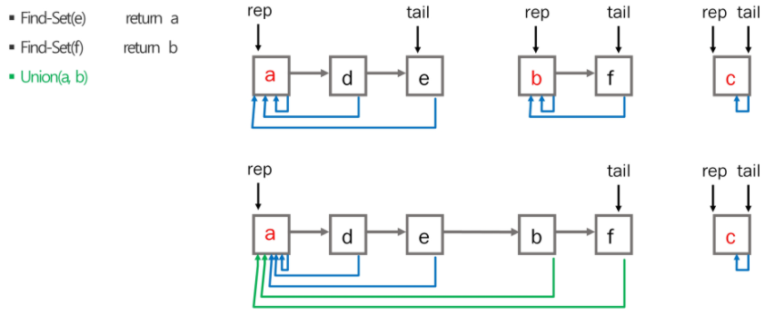
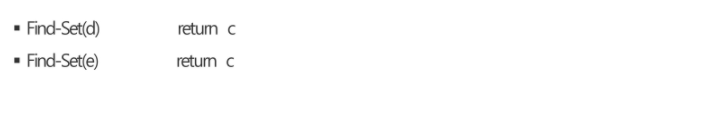
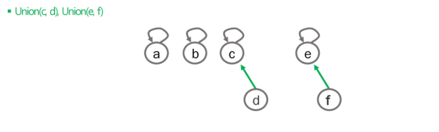
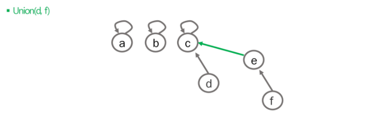
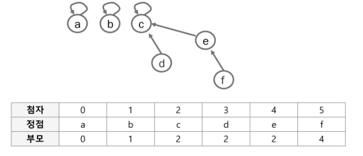
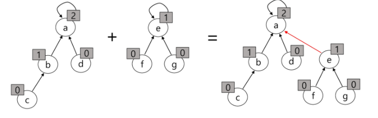
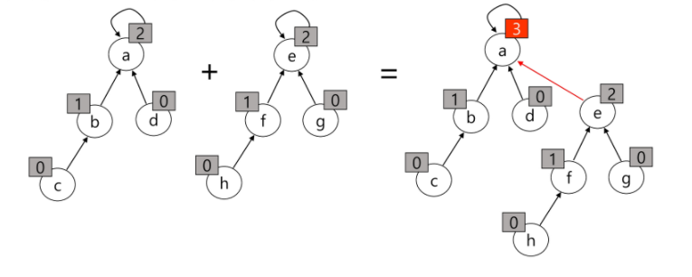
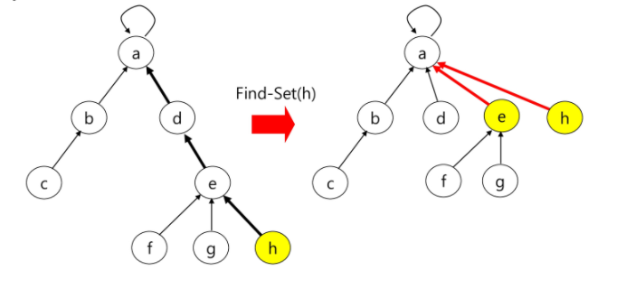

[TOC]


# 서로소 집합(Disjoint-set)

서로소 또는 상호배타 집합들은 서로 중복 포함된 원소가 없는 집합들이다. 즉, 교집합이 없다.

집합에 속한 하나의 특정 멤버를 통해 각 집합들을 구분하는데, 이를 대표자(representative)라고 한다.


> 서로소 집합을 이용한 연산 이름을 따서 유니온 파인드(Union Find) 알고리즘이라고 불리기도 한다.


## 서로소 집합 연산

Make-Set(x) : 보통 집합 초기화에 사용된다.

Find-Set(x) : return representative

Union(x,y) : x를 포함한 집합과 y를 포함한 집합을 합친다.


## 서로소 집합 - 연결 리스트

 

class Node는 멤버변수로 Node next, Node rep를 갖고 있다.


## 서로소 집합 - 트리

하나의 집합을 하나의 트리로 표현한다. 루트 노드가 대표자가 된다.


### 연산

Make-Set(x) : 유일한 멤버 x를 포함하는 새로운 집합을 생성. 크기 1, 부모는 자기 자신

```
Make-Set(x)
	p[x] <- x
```


```java
static void make() {// 크기가 1인 단위집합을 만든다.
    for (int i = 0; i < N; i++) {
        parents[i] = i; // initialize
    }
}
```


Find-Set(x) : x를 포함하는 집합을 찾는 연산

```
Find-Set(x)
	if x==p[x]: return x
	else      : return Find-Set(p[x])
```


 

```java
static int findSet(int a) {
    if(parents[a]==a) return a;
    //		return findSet(parents[a]); // path compression 전 
    return parents[a] = findSet(parents[a]); // path compression 후 
}
```


Union(x,y) : x와 y를 포함하는 두 집합을 통합하는 연산.

```
Union(x,y)
	if Find-Set(y) == Find-Set(x) return; // do nothing
	p[Find-Set(y)] <- Find-Set(x)
```

 

 

 

```java
static boolean union(int a,int b) {
    int aRoot = find(a);
    int bRoot = find(b);

    if (rank[aRoot] < rank[bRoot]) { // 트리의 깊이를 서로 비교해서 작은것을 큰것아래에 붙인다.(트리의 깊이 최소화)
        parents[aRoot] = bRoot;
    } else {
        parents[bRoot] = aRoot;
        if (rank[aRoot] == rank[bRoot]) {
            rank[aRoot]++;
        }
    }
}
```


트리의 배열을 이용해 표현하면 아래와 같다.

 

**Rank**

각 노드는 자신을 루트로 하는 subtree의 높이를 랭크(rank)라는 이름으로 저장한다. 그러면 노드가 자신의 부모를 찾기 위해 끊임없이 재귀함수를 실행시키는 것을 효율적으로 개선할 수 있다.


### Path Compression 

**Union**

두 집합을 합칠 때 rank가 낮은 집합을 rank가 높은 집합에 붙인다.

 

랭크가 같은 경우 Union시 루트의 랭크를 증가시킨다.

 

**Find_Set**

Find_Set 연산 실행 시, 특정 노드에서 루트까지의 경로를 찾아가면서 노드의 부모정보를 갱신한다.

 

```
Find_Set(x)
	if x==p[x] : return x
	else       : return p[x] = Find_Set(p[x])
```


