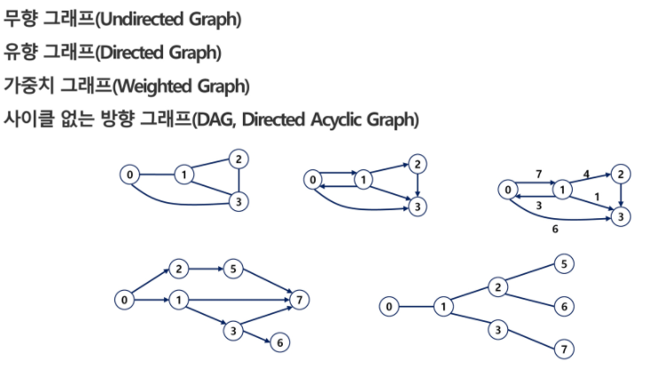
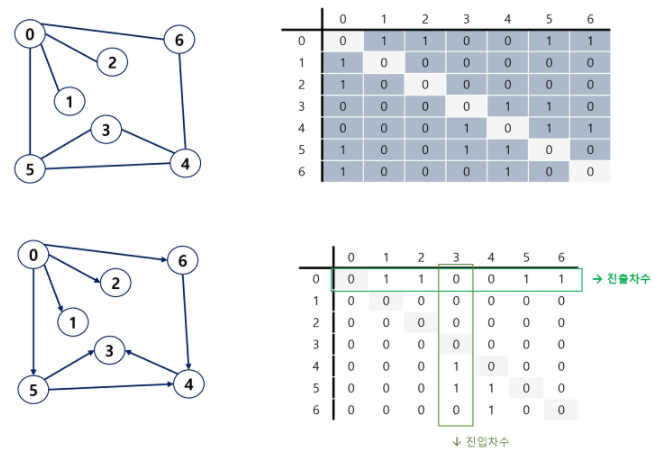
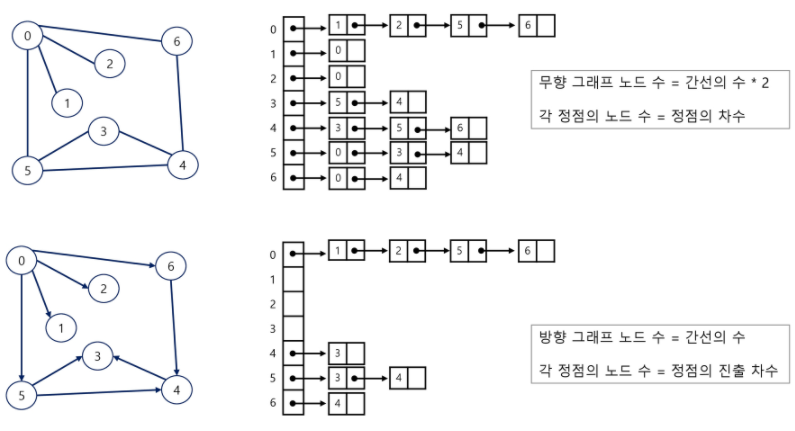
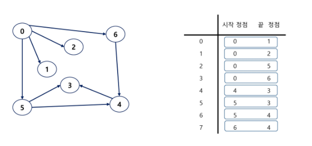

[TOC]

# 그래프

그래프는 정점(Vertex)들의 집합과 이들을 연결하는 간선(Edge)들의 집합으로 구성된 자료구조다. 


## 그래프의 유형

 

트리는 사이클이 없는 무향 연결 그래프다.

완전 그래프 : 가능한 모든 간선을 가진 그래프

부분 그래프 : 원래 그래프에서 일부의 정점이나 간선을 제외한 그래프


# 그래프 표현

간선의 정보를 저장하는 방식, 메모리나 성능을 고려해서 결정한다.


## 인접 행렬(Adjacent Matrix)

V x V 크기의 2차원 배열 이용해 간선 정보를 저장한다. 배열의 배열

 

## 인접 리스트(Adjacent List)

각 정점마다 다른 정점으로 나가는 간선의 정보를 저장한다. 하나의 정점에 대한 인접 정점들을 각각 노드로 하는 연결 리스트로 저장한다.

정점에 비해 간선이 적을 경우(희소 그래프), 인접 행렬에 비해 효율적으로 사용할 수 있다.

  


## 간선 리스트(Edge List)

간선(시작 정점, 끝 정점)의 정보를 객체로 표현해 리스트에 저장한다.

 


# 그래프 탐색
## BFS

너비 우선 탐색


아래 3가지를 꼭 기억하자. 예제는 [백준 2206 벽 부수고 이동하기](https://www.acmicpc.net/source/26882834) 의 자바 코드

1. 내가 필요한 것을 변수로 만들어서 Class로 가지고다니기

   ```java
   class Position {
   	int r, c, cnt;
   	int power;
   
   	Position(int r, int c, int power, int cnt) {
   		this.r = r;
   		this.c = c;
   		this.power = power;
   		this.cnt = cnt;
   	}
   }
   ```

   

2. 방문 배열을 int형으로 생성하고, 무한대로 초기화한다.

   ```java
   // initialize visit 
   visit = new int[N][M];
   for (int i = 0; i < N; i++) {
       for (int j = 0; j < M; j++) {
           visit[i][j] = 1000000;
       }
   }
   ```

   

3. BFS 안에서 돌면서 주변을 탐색하면 같은 위치를 여러번 탐색하게 된다. 이 때 방문 배열의 최소값을 계속 들고다닌다. 들고다니는 값과 방문 배열의 값을 비교하면서 방문 여부를 검사한다.

   ```java
   // 이미 방문했다면
   if (visit[nr][nc]<=power) continue;
   ```

   


## DFS

재귀로 푼다.

# 위상 정렬

Topology Sort. 어떤 일을 하는 순서를 찾는 알고리즘이다. 특징은 다음과 같다.

- 방향 그래프에 존재하는 각 정점들의 선행 순서를 위배하지않으면서 모든 정점을 나열하는 것
- 사이클이 발생하지 않는 방향 그래프 (Direct Acyclic Graph)에서만 적용가능

## 해결 방법

1. 진입차수가 0인 정점 (=들어오는 간선의 수가 0) 선택. 시작점

	- 여러개일 경우, 순서는 상관없다.
	- 초기에 간선의 수가 0인 모든 정점 '큐에 삽입'

1. 선택된 정점과 여기 부속된 모든 간선 삭제

	- 선택된 정점 큐에서 '삭제'
	- 선택된 정점에 부속된 모든 간선에 대해 '간선의 수 감소'

1. 모든 정점이 선택,삭제되면 알고리즘 종료


## 예제

[백준 1005](https://www.acmicpc.net/problem/1005)

단순히 노드의 순서만을 물어보는 경우가 있고, 각 노드의 실행시간까지 포함한 문제도 있다. 아래 코드는 각 노드가 선행관계를 갖고, 노드의 실행시간까지 있는 문제다. 

```java
// Initial Setting
int[] time = new int[N+1]; // 각각 걸리는 시간
int[] indegree= new int[N+1]; // 남아있는 인접한 노드의 개수
int[] result=new int[N+1]; // 현재 노드가 실행된 결과
ArrayList<Integer>[] adj = new ArrayList[N+1];

for(int i=0; i<K; i++) {
    int x = Integer.parseInt(st.nextToken());
    int y = Integer.parseInt(st.nextToken());
    // x에서 출발해 y로 도착
    // x를 제거하면 y에서 -1 해줘야됨.
    adj[x].add(y);
    indegree[y]++;
}

// Topology Sort
Queue<Integer> queue = new LinkedList<Integer>();
for(int i=1; i<=N; i++) {
    // 지금 출발할 수 있는 친구들 모두 출발!
    if(indegree[i]==0)
        queue.add(i);
}

while(!queue.isEmpty()) {
    int cur = queue.poll();

    for(int a: adj[cur]) {
        indegree[a]--;
        // result[a]는 a 이전 노드에서 걸린시간 + a의 걸린시간
        // a 이전 노드에서 걸린시간 중, 가장 오래걸린 애를 찾아서 그 값을 넣어줘야한다.
        result[a] = Math.max(result[a], result[cur] + time[a]);
        if(indegree[a]==0) {
            queue.add(a);
        }
    }
    // 만약 도착했다면 종료. 모든 노드 방문이라면 while문 밖에서 결과를 얻는다.
    if(cur==target) {
        // result[cur]
        break;
    }
}
```

