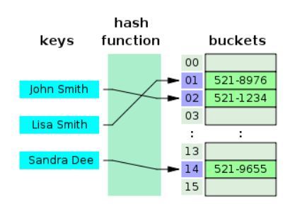
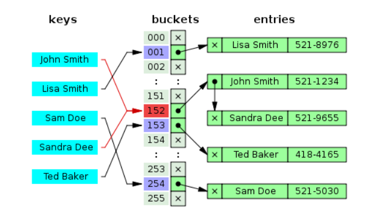
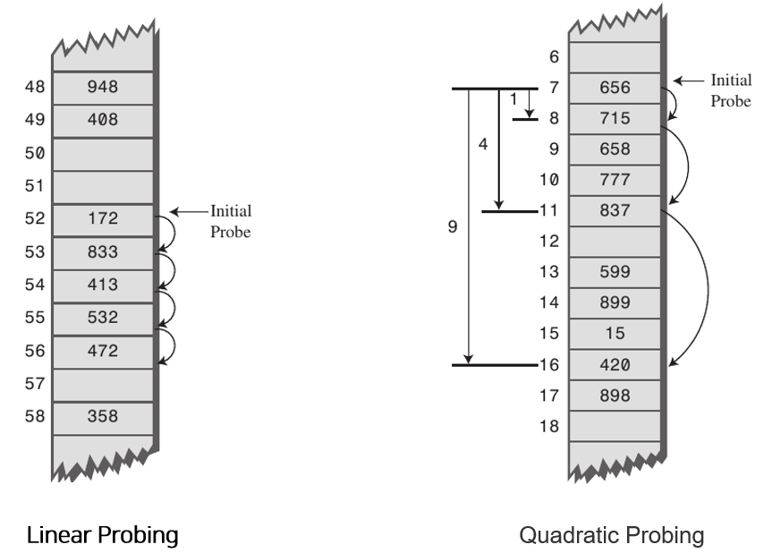
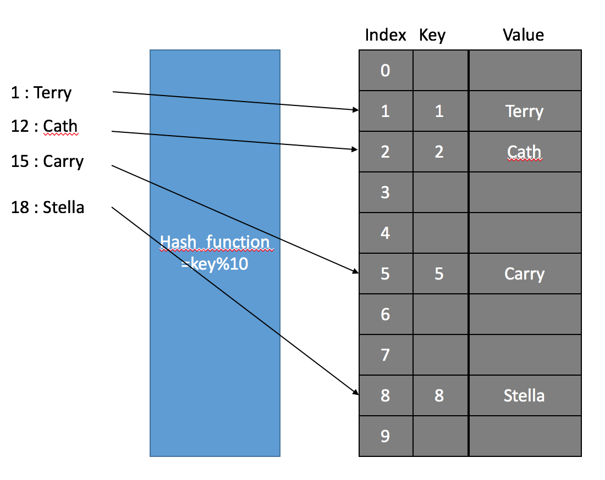
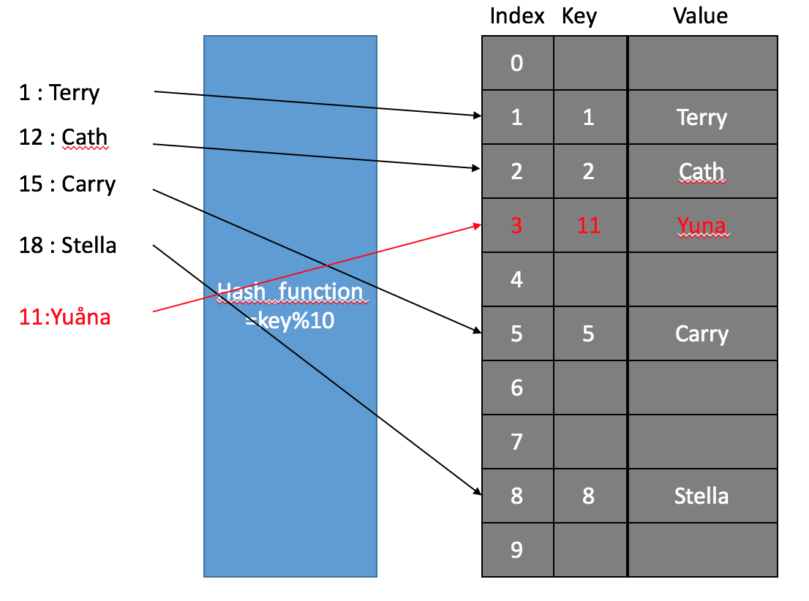
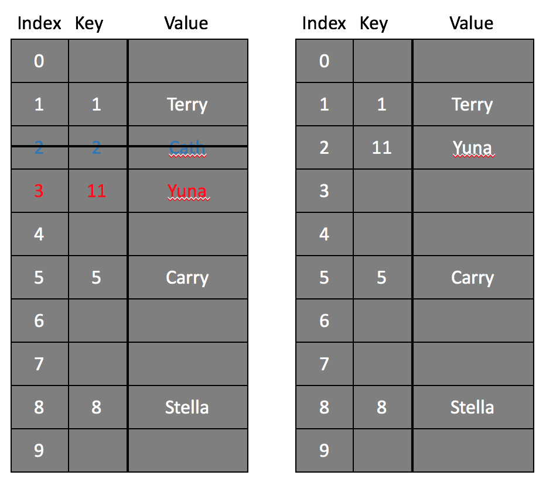

# HashTable

[toc]

[참조1](https://github.com/JaeYeopHan/Interview_Question_for_Beginner/tree/master/DataStructure#hash-table), [참조2](https://bcho.tistory.com/1072)

해시 테이블은 Key, Value로 데이터를 저장하는 자료구조중 하나다. 각 key값에 해시함수를 적용해 고유한 index를 생성하고, 이 index를 활용해 실제 값이 저장되는 장소(bucket)를 찾아간다.

 

 

## Hash Function

Hash는 내부적으로 배열을 사용해 데이터를 저장해 빠른 검색속도를 갖는다. 

특별한 알고리즘을 이용해 저장할 데이터와 연관된 **고유한 숫자**를 만들어내 이를 인덱스로 사용한다. 이 특별한 알고리즘을 hash method 또는 hash function이라고 하고, 이 메소드에 의해 변환된 데이터의 고유 숫자값을 `hashcode`라고 한다. 

동일한 key 값에 복수 개의 데이터가 하나의 테이블에 존재할 수 있다. 서로 다른 두 개의 키가 같은 인덱스로 hashing되는 경우를 `Collision`이라고 한다. 

`hash function`를 무조건 1:1 로 만드는 것보다 Collision 을 최소화하는 방향으로 설계하고 발생하는 Collision 에 대비해 어떻게 대응할 것인가가 더 중요하다. 1:1 대응이 되도록 만드는 것이 거의 불가능하기도 하지만 그런 `hash function`를 만들어봤자 그건 array 와 다를바 없고 메모리를 너무 차지하게 된다. 그렇다고 Collision이 많아지면 검색에 필요한 Time Complexity가 O(n)에 가까워진다.

# Resolve Conflict

해시 충돌을 해결하기 위한 두 가지 응용방법이 있다.

## Seperate Chaining

분리 연결법.

  

동일한 버킷의 데이터에 대해 추가 메모리를 사용해 **다음 데이터의 주소**를 저장하는 것이다. Java 8의 Hash 테이블은 Self-Balancing Binary Search Tree 자료구조를 사용해 Chaining 방식을 구현했다. 별도의 해시 테이블 확장이 필요없고 간단하게 구현이 가능하며, 손쉽게 삭제할 수 있다는 장점이 있지만 데이터의 수가 많아지면 동일한 버킷에 chaining되는 데이터가 많아져 그에 따라 캐시의 효율성이 감소한다.

 

## Open Address

개방 주소법.

 

비어있는 해시테이블의 공간을 활용하는 방법이다. Open Addressing을 구현하기 위한 대표적인 방법으로 3가지가 존재한다.

### Linear Probing

현재의 버킷 index로부터 고정폭만큼 이동해 차례대로 검색해 비어있는 버킷에 데이터를 저장한다.

+1, +1, +1

**추가**

**검색** 

**삭제**

 

### Quandratic Probing

해시의 저장순서 폭을 제곱으로 저장하는 방식이다.

ex : 처음 충돌이 발생한 경우는 1^2만큼 이동, 그 다음 계속 충돌이 발생하면 2^2, 3^2칸 이동

### Double Hashing Probing

해시된 값을 한 번 더 해싱하여 해시의 규칙성을 없애는 방식이다. 다른 방법들보다 많은 연산을 하게 된다.

1.  `%13`
2. `%7 + 1`

## Resizing

Separate Chaining(Closed Addressing)에서 사용되는 연결리스트가 길어지거나 Open Addressing에서 사용되는 고정 크기 배열이 가득차면 검색 효율이 떨어지기때문에 Bucket의 개수를 늘려줘야한다. 이 때 새로운 배열에 기존 배열의 키를 Rehashing한다.

# Java의 Hash

**병렬 처리**를 하면서 자원의 동기화를 고려해야 하는 상황이라면 해시테이블(HashTable)을 사용해야 하며, 병렬 처리를 하지 않거나 자원의 동기화를 고려하지 않는 상황이라면 해시맵(HashMap)을 사용하면 된다.