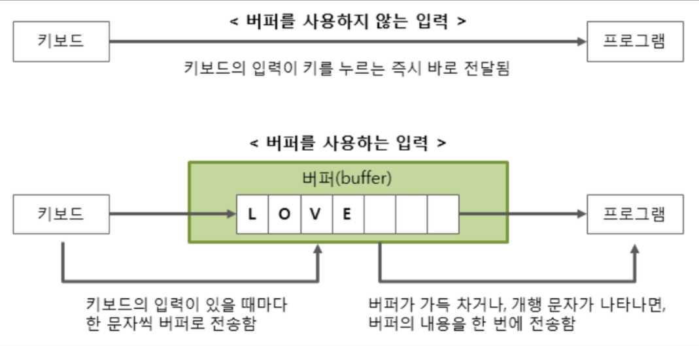

# BufferedReader

이름처럼 버퍼를 이용해서 읽는 함수다. 버퍼를 이용하기때문에 입출력의 효율이 좋아진다.

> 버퍼(buffer) : 데이터를 한 곳에서 다른 곳으로 전송할 때 일시적으로 데이터를 보관하는 임시 메모리 영역.



버퍼링 없이 키보드가 눌릴때마다 문자의 정보를 목적지로 바로 이동시키는것보다 중간에 메모리버퍼를 둬서 데이터를 한데 묶어서 이동시키는 것이 보다 효율적이고 빠르다.


## 사용방법

readline()을 사용하면 데이터를 라인단위로 읽을 수 있다. String으로 받는다.

```java
BufferedReader in = new BufferedReader(new InputStreamReader(System.in));
int n=Integer.parseInt(in.readLine());

```


## StringTokenizer

String으로 받은 문자열을 나누기 위해 String 클래스의 split함수와 함께 쓰인다.

nextToken 함수를 이용해 다음 token 을 호출할 수 있다.

```java
BufferedReader in = new BufferedReader(new InputStreamReader(System.in));

// nextToken
StringTokenizer st = new StringTokenizer(in.readLine()," ");
for(int i=0; i<n; i++) 
{
    System.out.println(st.nextToken());
}

// char 배열로 바꾸기
char[] ch = in.readLine().toCharArray();
for (char c : ch) {
    System.out.println(c);
}

// tokenize 후, int로 자료형 바꾸기
StringTokenizer st = new StringTokenizer(in.readLine(), " ");
int i = Integer.parseInt(st.nextToken());
int j = Integer.parseInt(st.nextToken());

```


# StringBuilder

문자열의 조작을 지원하는 클래스

자바에서 상수로 취급되는 문자열을 조작시마다 새로운 문자열이 생성되는 것을 방지한다.

- append(), toString()


```java
StringBuilder sb = new StringBuilder();
sb.append("Hello ");
sb.append("SSAFY").append("!!");
System.out.println(sb.toString()); // Hello SSAFY!!

sb.setLength(sb.length() - 2);
System.out.println(sb.toString()); // Hello SSAFY
```


# BufferedWriter

`System.out.print("");` 과 동일하게 사용가능한 함수다. 많은 양의 출력이 필요할 때 좋다.


```java
BufferedWriter bw = new BufferedWriter(new OutputStreamWriter(System.out));//선언
// BufferedWriter bw = new BufferedWriter(new FileWriter("test.txt"));
bw.write("hello\n");
bw.newLine(); // 개행
bw.write("I am writing\n");
bw.flush(); // 남아있는 데이터를 모두 출력
bw.close(); // 스트림 닫기
```

