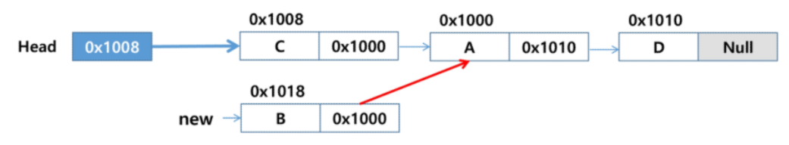
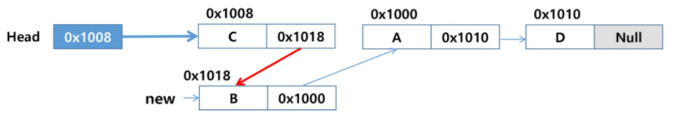
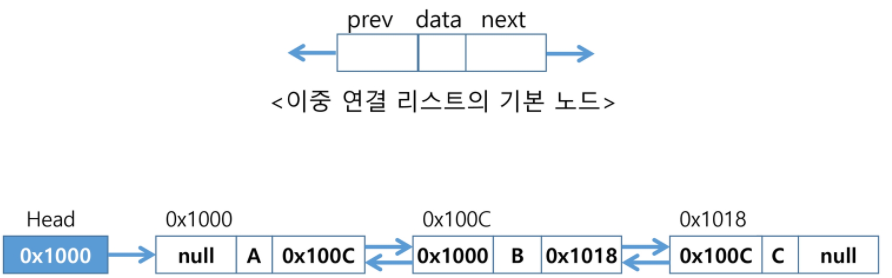
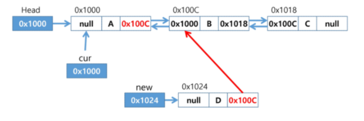
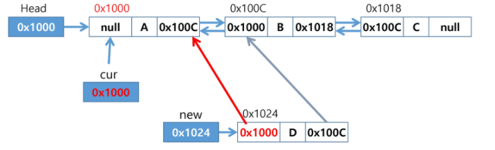
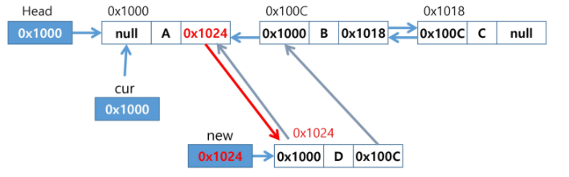
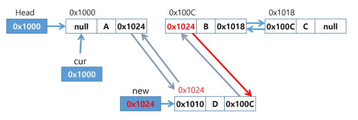
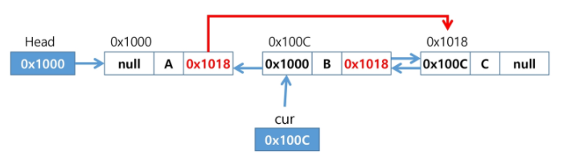
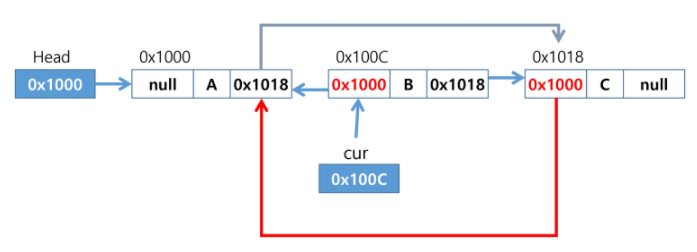
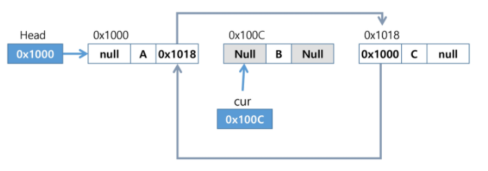

[TOC]

# 순차 리스트

순차 리스트는 배열의 인덱스를 이용해 원하는 위치의 데이터에 접근할 수 있다.

순차리스트는 중간에 삽입, 삭제 연산을 할 때 해당 위치 다음의 항목들을 이동해야한다. 때문에 삽입/삭제 연산이 빈번하게 일어날수록 작업에 소요되는 시간이 크게 증가한다.

배열의 크기가 정해져있어서 메모리가 남거나 부족한 경우가 발생한다.

## List

리스트는 배열과 비슷한 자바의 자료형으로 배열보다 편리한 기능을 많이 가지고 있다. List 컬렉션의 종류로는 **ArrayList, Vector, LinkedList**가 있다. List는 컬렉션 인터페이스로, 사용할 때는 ArrayList 등의 List를 구현한 클래스로 생성해야된다.

객체를 인덱스로 관리하기 때문에 List 컬렉션에 객체를 추가하면 자동 인덱스가 부여된다. 즉, 크기를 동적으로 늘릴 수 있다.

List 컬렉션 인터페이스에는 객체를 추가(add), 검색(contain, get, size), 삭제(remove, clear) 기능의 메서드가 선언되어 있다.

## ArrayList, Vector

Vector는 ArrayList와 동일한 내부 구조를 가지고 있다. ArrayList와 차이점으로는 Vector 클래스는 **동기화된(synchronized) 메서드**로 구성되어 있다. 그렇기 때문에 멀티 스레드 환경에서 안전하게 객체를 추가, 삭제할 수 있다. 즉, 스레드에 안전하다(Thread Safe)라고 말합니다. 

다만 동기화되어 있기 때문에 ArrayList 보다는 객체를 추가, 삭제하는 과정은 느릴수 밖에 없다. 안전성을 추구하는데 있어서 속도를 포기한 트레이드 오프(trade off)이다.

# 연결 리스트

자료를 임의의 저장공간에 기억시키되, 자료의 순서에 따라 노드의 포인터 부분을 이용해 서로 연결시킨 구조다. 삽입,삭제가 용이하고 기억공간이 연속적이지 않아도 저장이 가능하다.

앞에서 사용하던 큐(Queue)도 인터페이스 형태로, 연결 리스트(LinkedList)를 통해 생성한다. 그렇기때문에 사이즈가 가변적이고 쉽게 늘어난다.

링크드리스트는 순차 리스트에 비해 기억공간 이용 효율이 좋지 않다. 포인터(링크) 부분이 필요하기때문이다. 즉, 포인터를 찾는 시간때문에 접근 속도가 느리다.

## 기본 구조

### 노드

- 데이터 필드 : 원소의 값을 저장하는 자료구조.
- 링크 필드 : 다음 노드의 주소를 저장하는 자료구조.

### 헤드

리스트의 처음 노드를 가리키는 레퍼런스. 데이터 필드가 없다!

## 단순 연결 리스트

노드가 하나의 링크필드에 의해 다음 노드와 연결되는 구조.

헤드가 가장 앞의 노드를 가리킨다. 최종적으로 NULL을 가리키는 노드가 리스트의 가장 마지막 노드.

**연산**

### 공백 리스트에 노드 삽입

1. 메모리 할당하여 새로운 노드 new 생성. 주소 0x1000 (데이터 필드, 링크 필드 비어있음)
2. 새로운 노드 new의 데이터 필드에 값('A') 저장

3. Head에 저장된 주소값(Null)을 새로운 노드 new의 링크 필드값에 저장 (Null)
4. Head에 새로운 노드 new의 주소값(0x1000) 저장

### 첫번째 노드로 삽입

1. 메모리 할당하여 새로운 노드 new 생성. 주소 0x1008

2. 새로운 노드 new의 데이터 필드에 값('C') 저장
3. Head에 저장된 주소값(0x1000)을 새로운 노드 new의 링크 필드 값에 저장
4. Head에 새로운 노드 new의 주소값(0x1008) 저장

### 마지막 노드로 삽입

1. 메모리 할당하여 새로운 노드 new 생성. 주소 0x1010
2. 새로운 노드 new의 데이터 필드에 값('D') 저장. 링크 필드에는 Null 저장
3. 리스트의 마지막 노드의 링크필드에 새로운 노드 new의 주소값(0x1010) 저장

### 가운데 노드로 삽입

1. 메모리 할당하여 새로운 노드 new 생성. 주소 0x1018

2. 새로운 노드 new의 데이터필드에 값('B') 저장

3. 삽입될 위치의 바로 **다음에 위치한 노드**의 주소(0x1000)를 new의 링크 필드에 저장

   

4. 새로운 노드 new의 주소(0x1018)를 **앞 노드**의 링크 필드에 저장 

   

### 삭제 연산

1. 삭제할 노드의 앞 노드(선행노드) **탐색**
2. 삭제할 노드의 링크 필드를 선행노드의 링크 필드에 복사
3. 삭제할 노드의 링크 필드에 Null 저장 (완전한 삭제. 할당된 메모리 반납)

## 이중 연결 리스트

Doubly Linked List. 양쪽 방향으로 순회할 수 있도록 노드를 연결한 리스트. 두 개의 링크 필드와 한 개의 데이터 필드로 구성.

### 삽입 연산

[시작](#이중-연결-리스트)

1. 메모리 할당하여 새로운 노드 new 생성하고, 데이터 필드에 'D'를 저장한다.

2. 삽입하고자하는 위치의 이전 노드(0x1000)의 next(0x100C)를 new의 next에 저장한다.

   

3. 이전 노드(0x1000)의 주소값을 new의 prev에 저장한다.

   

4. new의 주소를 이전 노드(0x1000)의 next에 저장한다. 

   

5. new의 주소를 new의 오른쪽 노드의 prev에 저장한다.

   

### 삭제 연산

[시작](#이중-연결-리스트)

1. 삭제할 노드의 다음 노드의 주소(0x1018)를 삭제할 노드의 이전 노드의 next에 저장한다.

    

2. 삭제할 노드의 이전 노드의 주소(0x1000)를 다음 노드의 prev에 저장한다.

    

3. 삭제할 노드가 가리키는 노드의 prev, next에 Null을 저장한다.

    