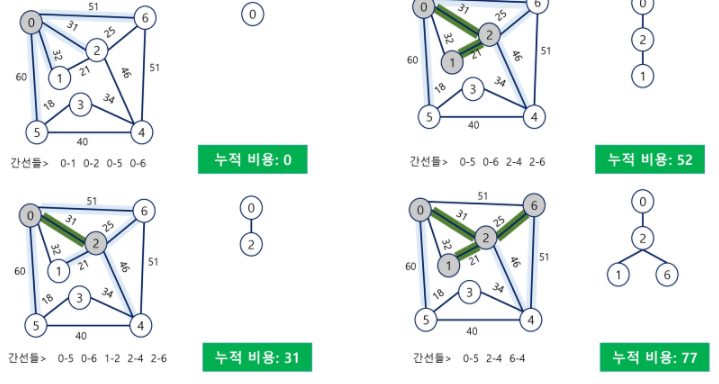

# 최소 신장 트리 (Minimum Spanning Tree)

신장 트리

- n개의 정점으로 이루어진 **무향** 그래프에서 n개의 정점과 n-1개의 간선으로 이루어진 트리


**최소 신장 트리**

- **무향** **가중치** 그래프에서 신장 트리를 구성하는 간선들의 **가중치의 합이 최소**인 신장 트리


그래프에서 모든 정점을 연결하는 간선들의 가중치의 합이 최소가 되는 트리, 두 정점 사이의 최소 비용의 경로 찾기 문제 등이 등장하는데, MST는 가중치의 합이 최소가 되는 트리다.


# 크루스칼(Kruskal) 알고리즘

MST를 구하는 알고리즘

1. 최초, 모든 간선을 가중치에 따라 오름차순으로 **정렬**한다.
2. 가중치가 가장 낮은 간선부터 선택하며 트리를 증가시킨다.
   - 이 때 싸이클이 발생하는 간선이라면 선택하지 않고 다음 간선을 선택한다.
3. N-1개의 간선이 선택될 때까지 2를 반복한다.


```java
class Edge implements Comparable<Edge>{
    // 멤버변수
    // 생성자
    @Override
    public int compareTo(Edge e){
        return Integer.compare(this.weight, e.weight);
    }
}

edgeList[i] = new Edge(from, to, weight);
Arrays.sort(edgeList);

for(Edge edge: edgeList){
    if(union(edge.from, edge.to)) { // if not cycled
        result += edge.weight;
        if(count++ == N-1) break;
    }
}
```


# PRIM 알고리즘

하나의 정점에서 연결된 간선들 중에 하나씩 선택하면서 MST를 만들어가는 방식이다.

1. 임의 정점을 하나 선택해서 시작
2. 선택한 정점과 인접하는 정점들 중 최소 비용의 간선이 존재하는 정점을 선택
3. 모든 정점이 선택될때까지 1,2 반복

서로소인 2개의 집합 정보를 유지한다. (선택된 정점과 선택되지 않은 정점)

 

