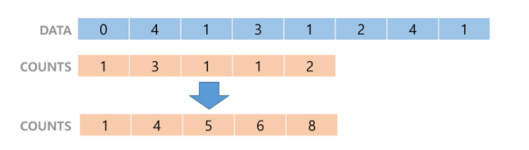
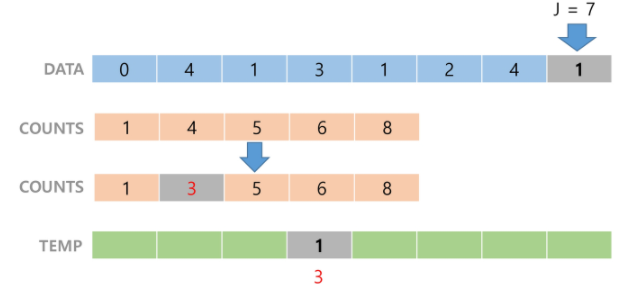
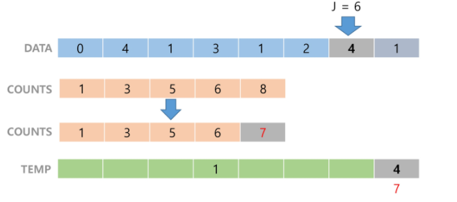

# 정렬

[TOC]

[알고리즘 스터디 정렬 자료(Python)](https://docs.google.com/document/d/1zZsbkrUlFOsAQwxj3MTqWcKNYodVBhSxxkGXIXAUopI)

# 버블 정렬

**인접한** 두 개의 원소를 비교하며 자리를 계속 교환한다.


## 구현 

둘 중 더 큰 원소를 뒤로 보낸다(swap).

한 단계가 끝나면 가장 큰 원소가 마지막 자리로 정렬된다.

**시간복잡도**

O(n^2)

# 카운팅 정렬

집합에 각 항목이 몇 개씩 있는지 세는 작업을 하여, 선형시간에 정렬하는 효율적인 알고리즘이다.

## 제한

정수나 정수로 표현할 수 있는 자료에만 적용할 수 있다.

집합 내의 가장 큰 정수를 알아야한다.

## 구현

1. 각 항목이 몇 개씩 있는지 COUNTS 배열에 저장한 후, 구간합으로 값을 조정해준다.

   

2. DATA의 마지막 항목(1)부터, COUNTS에서 찾아 1 감소시키고(4 -> 3), TEMP의 해당 위치(3)에 저장한다. 

   

   

   

**시간복잡도**

O(n+k) // n:리스트 길이, k:정수의 최대값


# 선택 정렬

가장 작은 숫자부터 차례대로 선택하여 위치를 교환한다. 

## 구현

주어진 리스트 중 최소값을 찾는다.

그 값을 리스트의 맨 앞에 위치한 값과 교환한다.

맨 처음 위치를 제외한 나머지 리스트를 대상으로 반복한다.

**시간복잡도**

O(n^2)


# 병합 정렬

여러 개의 정렬된 자료의 집합을 병합하여 한 개의 정렬된 집합으로 만드는 방식


**시간복잡도**

O(nlogn)


# 퀵 정렬

퀵 정렬은 분할할 때 기준 아이템(pivot item)을 중심으로, 이보다 작은 것은 왼편, 큰 것은 오른편에 위치시킨다.


**시간복잡도**

O(nlogn)


# Arrays.sort(array)

java의 배열을 정렬하는 메소드에는 `Arrays.sort()`가 있다. 크게 4가지로 오버로딩돼있다.

1. `Arrays.sort(array)`
2. `Arrays.sort(array, new CustomComparator())`

3. `Arrays.sort(array, index_start, index_end)`
4. `Arrays.sort(array, index_start, index_end, new CustomComparator())`


1번의 경우, array의 원소들의 크기를 비교할 수 있다면 오름차순으로 정렬이 되고, 비교할 수 없다면(사용자 클래스) 사용자 클래스에서 `Comparable` 인터페이스를 구현하고, `compareTo()`  메소드를 오버라이드해서 비교가 가능하게 해준다.

2번의 경우, `Comparator` 인터페이스를 구현한 사용자 클래스를 sort 메소드의 인자로 넘겨주면, 사용자 클래스에서 오버라이드한 `compare` 메소드의 리턴값에 따라 정렬된다.

3,4번은 배열의 일부만 정렬할 수 있도록 index를 인자로 넘겨주고, 선택에 따라 Comparator 인터페이스를 구현한 클래스를 인자로 추가로 넘겨줄 수 있다.


## Comparable / Comparator

PriorityQueue같은 경우, 힙 정렬을 하기 위해선 각 노드의 값을 비교해 정렬한다. 근데 사용자가 직접 만든 클래스의 경우는 클래스의 어떤 멤버를 통해 크기를 비교할지 정해져있지 않다. 또, 정렬의 key를 직접 customize하고싶은 경우가 있는데, 이런 경우들에 사용할 수 있는 것이 다음 2가지 인터페이스다.

> Primitive Type(int, char)의 배열에는 적용이 불가능하니 Integer같은 Wrapper "Class"를 이용해야한다.


### Comparable

구현하고자하는 클래스가 `Comparable` interface를 구현한다. 이 때, `Comparable` 인터페이스는 `compareTo`라는 메소드를 갖고있으므로, 이를 오버라이드해야한다.

```java
public class Student implements Comparable<Student> {
    @Override
	public int compareTo(Student o) {
		return this.no - o.no;
	}
    
    // Students가 Comparable 구현했으면 바로 정렬 가능
    public static void main(String[] args) {
		 Arrays.sort(students);
    }    
}


```


### Comparator

`int[][]` 배열같은 경우, 직접 Comparable 인터페이스를 구현할 수 없기때문에, 별도의 클래스를 생성하고 `Comparator` 라는 인터페이스를 구현해줘야한다. 물론 Comparable 인터페이스를 구현할 수 없는 경우가 아니더라도 사용한다. 이 경우 `compare`라는 메소드를 오버라이드하게된다.

```java	
static class StudentCompartor implements Comparator<Student>{
    @Override
    public int compare(Student o1, Student o2) {
        return o2.no - o1.no;
    }
    public static void main(String[] args) {
        // compare를 override한 StudentComparator로 정렬
        Arrays.sort(students, new StudentCompartor());

        // 또는 이런 방법도 가능
        Arrays.sort(students, new Comparator<Student>() {
            @Override
            public int compare(Student o1, Student o2) {
                return o1.score - o2.score;
            }
         });
         // 바로 위의 정렬을 Lambda식으로 바꾼 것
         Arrays.sort(students, (o1,o2)-> o2.score - o1.score);
    }
}

```


