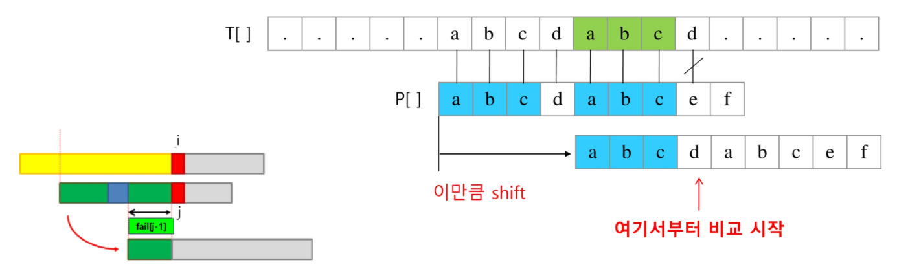
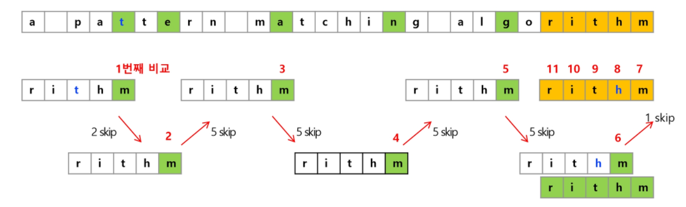

# 문자열 패턴 매칭

- brute force
- KMP
- 라빈 카프
- 보이어 무어

# KMP

문자열 비교중, 불일치가 발생한 텍스트 문자열의 앞 부분에 어떤 문자가 있는지 이미 알고있으므로, 불일치가 발생한 앞 부분에 대해 다시 비교하지 않고 매칭을 수행한다.

패턴을 전처리해 배열 fail[k]를 구해서 잘못된 시작을 최소화한다.

> fail[k] : 패턴의 k인덱스까지에서 접두사와 접미사가 일치하는 최대 길이

시간 복잡도 : O(M+N)

 

## 실패함수

위의 작업을 하려면 패턴을 이용한 실패함수를 만들어놓아야한다. 실패함수란, 매칭이 실패했을 때 패턴 포인터가 돌아갈 곳을 말한다.

패턴의 **0번째 인덱스를 제외한** 각 인덱스마다 맨 앞부터 해당 인덱스까지의 부분문자열 중 접두사와 접미사가 일치하는 **최대 길이**로 계산하여 작성

**예제**

패턴 : ababaca

| i    | i위치까지 패턴 | 일치하는 최대 접두사/접미사 | fail[i] |
| ---- | -------------- | --------------------------- | ------- |
| 0    | a              |                             | 0       |
| 1    | ab             |                             | 0       |
| 2    | aba            | a                           | 1       |
| 3    | abab           | ab                          | 2       |
| 4    | ababa          | aba                         | 3       |
| 5    | ababac         |                             | 0       |
| 6    | ababaca        | a                           | 1       |

문자열과 패턴을 매칭할 때, 문자열의 인덱스를 i, 패턴 내의 인덱스를 j라고 한다. 문자열의 i번째 문자와 패턴의 j번째 문자를 비교한다.

**매칭 성공**

두 문자가 같으면 문자열의 인덱스와 패턴의 인덱스를 모두 증가시킨다. 

> i++, j++

패턴의 끝까지 매칭했다면 매칭 성공!

**매칭 실패**

j = 0일 때 실패하면 다음 문자열을 탐색한다. 

> i++

j번째 인덱스에서 실패했으면 j-1까지는 일치했었던 것이다. 패턴의 위치를 j - fail[j-1]만큼 점프한다. 

패턴의 fail[j-1]부터 매칭을 실시한다. 

> j = fail[j-1]

# 라빈 카프

문자열 검색을 위해 해시값 함수 이용한다. 문자들을 일일이 비교하는 대신 패턴의 해시값과 본문 안에 있는 하위문자열의 해시값을 비교한다.

찾고자하는 문자열에서 한글자씩 이동하며 패턴길이만큼 읽어서 해쉬값을 새로 계산하는 것이 아니라, 새로 추가되는 문자와 그전에 읽었던 값을 이용해 해쉬값을 구한다.

**고려사항**

해시값이 너무 커지는 것을 방지하기 위해 mod 연산을 취해준다. 해시 충돌이 발생할 수도 있다.

# 보이어 무어

패턴의 오른쪽부터 매칭을 진행한다.

 

