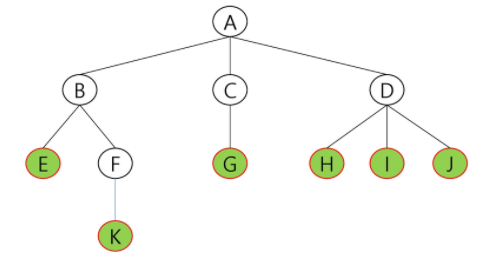
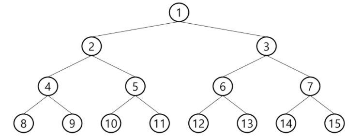
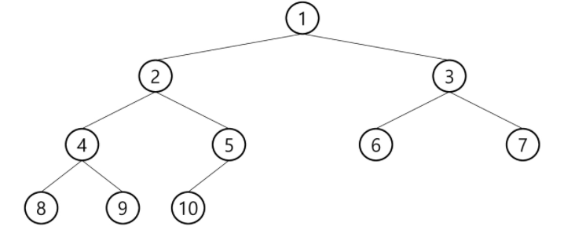

# Tree
트리는 비선형구조, 1:n 관계를 갖는 자료구조다.



## 용어
노드(node) : 트리의 원소. A~K

간선(edge) : 노드를 연결하는 선. 부모 노드와 자식 노드를 연결

루트 노드(root node) : 트리의 시작 노드. A

형제 노드(sibling node) : 같은 부모 노드의 자식 노드. B,C,D는 형제 노드

조상 노드 : 간선을 따라 루트노드까지 이르는 경로에 있는 모든 노드. K의 조상=F,B,A

서브트리(subtree) : 부모 노드와 연결된 간선을 **끊었을 때 생성**되는 트리

자손 노드 : 서브 트리에 있는 하위 레벨의 노드들. B의 자손 노드=E,F,K

차수(degree)

- 노드의 차수 : 노드에 연결된 자식 노드의 수. B의 차수=2
- 트리의 차수 : 트리에 있는 노드의 차수 중 가장 큰 값
- 단말 노드(leaf node) : 차수가 0인 노드.

높이

- 노드의 높이 : 루트에서 노드에 이르는 간선의 수. 노드의 레벨. B의 높이=1, F의 높이=2
- 트리의 높이 : 트리에 있는 노드의 높이 중에서 가장 큰 값. 최대 레벨


## 구현

```java
// input : Object data, left_data, right_data
// for (something) makeNode(a,b,c);

class Node {
	Object data;
	Node left;
	Node right;
	
    // data를 가진 Node 생성
	Node(Object data){
		this.data = data;
	} 
}

class Tree {
	Node root;
	
	void makeNode(Object data, Object left, Object right){
		// root 없으면 root 생성
		if (root==null) {
			root = new Node(data);
			// 좌,우에 left, right 생성
			if (left !='.') root.left = new Node(left);
			if (right!='.') root.right= new Node(right);
		}
		else {
			// data를 값으로 갖는 node를 찾아 left, right를 넣어주자
			searchNode(root, data, left, right);
		}
	}
	
	void searchNode(Node node, Object data, Object left, Object right) {
		// 더이상 자식노드가 없다면 찾기 중단
		if (node==null) return;
		
		// 찾았을 때
		else if (node.data == data) {
			if (left !='.') node.left = new Node(left);
			if (right!='.') node.right= new Node(right);
		}
		else {
			// 시작 노드의 좌우를 찾기
			searchNode(node.left, data, left, right);
			searchNode(node.right, data, left, right);
		}
	}
}
```


# 이진트리

모든 노드들이 2개의 서브트리를 갖는 특별한 형태의 트리

각 노드가 자식 노드를 최대한 2개까지만 가질 수 있는 트리

## 포화 이진 트리(Full Binary Tree)

모든 레벨의 노드가 포화상태로 차있는 이진 트리




## 완전 이진 트리(Complete Binary Tree)

노드 수가 n개일 때, 노드번호 1번부터 n번까지 빈 자리가 없는 이진 트리

 


## 배열을 이용한 이진 트리 표현

index 0은 비우고, index 1부터 배열을 노드의 값으로 채운다.

노드 번호가 i인 노드의 부모 노드번호 = i/2


## 순회(Traversal)

트리의 노드들을 체계적으로 방문하는 것을 순회라고 한다.


### DFS

```
    (1)
   ↙  ↘
  (2)  (3)
 ↙  ↘
(4)  (5)
```

- 전위 순회(preorder) : VLR

  - 부모 노드 방문 후, 자식 노드를 좌,우 순서로 방문. 1,2,4,5,3

    ```java
    public void preorder(Node node) {
        if(node != null) {
            System.out.println(node.data); // visit node
            preorder(node.left);
            preorder(node.right);
        }
    }
    ```

    

- 중위 순회(inorder) : LVR

  - 왼쪽 자식노드, 부모 노드, 오른쪽 자식노드 순으로 방문. 4,2,5,1,3

    ```java
    public void inorder(Node node) {
        if(node != null) {
            inorder(node.left);
            System.out.println(node.data);
            inorder(node.right);
        }
    }
    ```

    

- 후위 순회(postorder) : LRV

  - 자식노드를 좌우 순서로 방문 후, 부모노드 방문. 4,5,2,3,1

    ```java
    public void postorder(Node node) {
        if(node != null) {
            postorder(node.left);
            postorder(node.right);
            System.out.println(node.data);
        }
    }
    ```

    