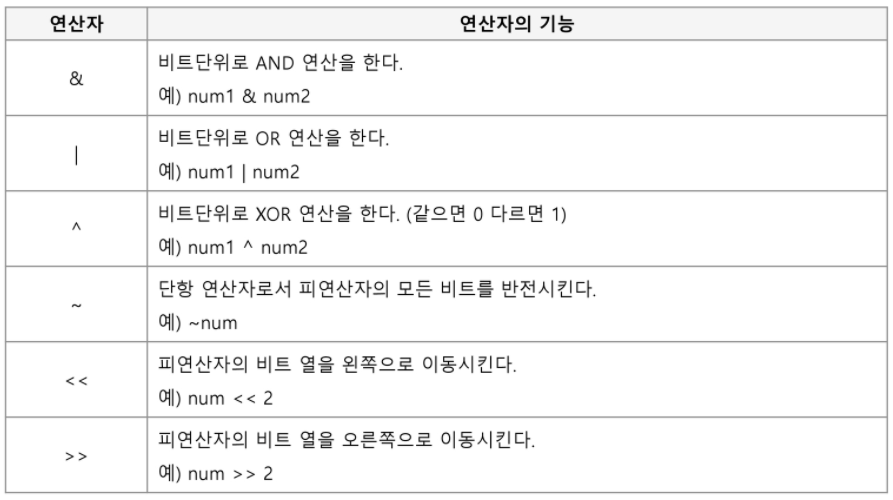

# 비트 연산자



`1<<n` : 내가 원하는 자리만 1 비트로 표현

`&` : 해당 비트 상태를 확인할 때 쓰임. `(flag & 1<<n) == 1<<n`

`|` : 해당 비트를 1로 마킹할 때 쓰임. `flag | 1<<n`

`^` : 원하는 비트의 값이 1일 때, 0으로 바꿀때 쓰임 . `flag ^ 1<<n`


## 비트마스킹을 통한 순열 생성

기존에는 해당 숫자가 선택됐는지 여부를 저장하는 `isSelected`라는 배열을 생성했다. 이 문제에선 `flag`라는 int형 변수가 배열을 대신한다.

```
nPn -> N개 원소로 만들 수 있는 모든 순열
input[] : 숫자 배열
numbers[] : 순열 저장 배열

perm(cnt, flag) 
// cnt : 현재까지 뽑은 순열 원소 개수, flag : 선택된 원소에 대한 비트정보를 표현하는 정수
	if cnt == N
		순열 생성 완료
	else
		for i from 0 to N-1
			if (flag & 1<<i) != 0 then continue
			numbers[cnt] <- input[i]
			perm(cnt+1, flag | 1<<i)
		end for
end perm()
```

만약 `flag = flag | 1<< i` 를 한 뒤에 `perm` 에 `flag`를 넣으면 `perm` 메소드가 끝난 뒤에 flag값을 원상복귀 시켜야하기때문에 `perm` 안에 `flag | 1<<i` 를 넣어준다. 