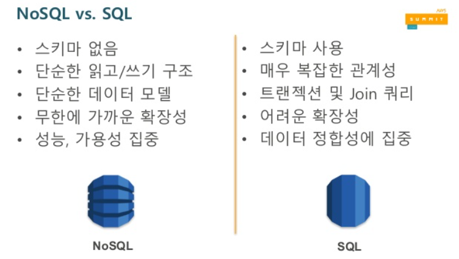
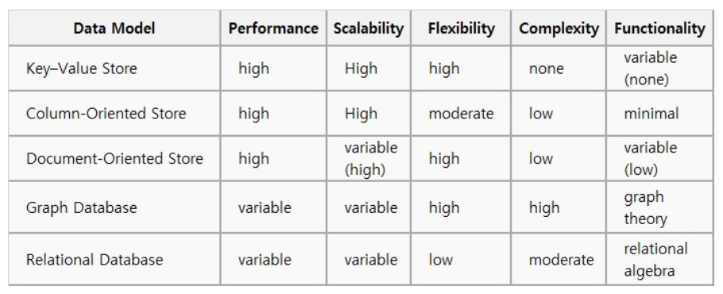

# 데이터베이스

[TOC]

## 데이터베이스 성능

데이터베이스 쿼리 튜닝은 랜덤 I/O 자체를 줄여 순차 I/O로 바꿔서 실행하는 것이 목적이다.

# 인덱스

DBMS의 인덱스는 항상 정렬된 상태다. 값을 탐색하는데는 빠르지만 새로운 값을 추가,삭제,수정하는 경우에는 쿼리문 실행 속도가 느려진다. 즉, 저장 성능을 희생해 읽기 속도를 높이는 기능이다.

## Index의 자료구조

- B+- Tree 인덱스 알고리즘

  일반적인 인덱스 알고리즘. 칼럼 값을 변형하지 않고 원래 값을 이용해 인덱싱하는 알고리즘

- Hash 인덱스 알고리즘

  칼럼 값으로 해시값을 계산해 인덱싱하는 알고리즘. 매우 빠른 검색을 지원한다. 대신 일부만으로 검색하고자할 때는 사용할 수 없다. 주로 메모리 기반의 DB에서 많이 사용한다.

## 고려사항

비효율적인 상황이 발생하기도 한다. 

- Insert : index에 대한 데이터도 추가된다.
- Delete : index에 존재하는 값은 삭제하지 않고 사용안한다는 표시로 남는다.
- Update : Delete + Insert. 삭제되지 않고 insert로 인한 split도 발생한다.

# View

View는 직접 테이블에 접근하는 것이 아니라 테이블에서 사용자가 필요로 하는 부분만 선택해 만들어놓는 데이터 집합이다. 원본 테이블에 직접 접근하지 않아도 사용자가 임의의 뷰를 구성해 별도의 이름을 붙이거나 접근 가능한 사람을 지정할 수 있다.

# 정규화

## 배경

한 릴레이션에 여러 엔티티의 애트리뷰트들을 혼합하게 되면 정보가 중복 저장되며, 저장 공간을 낭비하게 된다. 또 중복된 정보로 인해 갱신 이상이 발생한다. 이를 해결하기 위해 정규화 과정을 거친다.

> 갱신 이상 
>
> 삽입 이상(원하지 않는 자료 삽입, 자료가 부족해 삽입이 되지 않는 문제)
>
> 삭제 이상(하나의 자료만 삭제하고싶은데 여러개가 삭제돼 정보 손실)
>
> 수정 이상(정보가 모호해지거나 일관성이 없어져 정확한 정보 파악이 안되는 문제)

## 의미

관계형 DB에서 **중복을 최소화하기위해 데이터를 구조화하는 작업**이다. 불만족스러운 나쁜 릴레이션의 애트리뷰트를 나눠 좋은 작은 릴레이션으로 분해하는 작업이다. 정규화 과정에 따라 제 1 정규형, 제 2 정규형, 제 3 정규형 등이 존재한다.

엔티티를 구성하는 애트리뷰트 간에 함수적 종속성을 판단한다. 각각의 정규형마다 어떤 함수적 종속성을 만족하는지에 따라 정규형이 정의되고, 이를 만족하지 못하면 나쁜 릴레이션이다.

## 함수적 종속성

애트리뷰트 데이터들의 의미와 애트리뷰트들 간의 상호관계로부터 유도되는 제약조건의 일종이다. X,Y가 임의의 애트리뷰트 집합일 때 X의 값이 Y의 값을 유일하게 결정한다면 X는 Y를 함수적으로 결정한다라고 한다.

### 제 1 정규형

애트리뷰트의 도메인이 오직 원자값만을 포함한다. 비원자적인 애트리뷰트들을 허용하지 않는 릴레이션 형태를 말한다.

모든 행은 식별자로 완전하게 구분된다.

> ex. Order table을 Order, Order_detail로 나누는 것. Order에는 주문번호를 PK로, Order detail은 주문번호+상품코드를 PK로. 

### 제 2 정규형

모든 비주요 애트리튜브들이 주요 애트리뷰트에 대해 완전 함수적 종속이면 제 2 정규형을 만족한다고 본다. 

**완전 함수적 종속** : X -> Y 일때 X의 어떠한 애트리뷰트라도 제거하면 더이상 함수적 종속성이 성립하지 않는 경우

> ex. Order_detail에 상품코드랑만 관련있는 데이터/ 관련 없는 데이터로 구분하고, 관련 있는 데이터는 따로 Product로 빼준다. 상품명, 단위, 단가는 상품코드랑만 관련있으니 별도의 테이블 생성, 수량은 상품코드랑은 관련없으므로 주문상세에 남겨놓는다.

### 제 3 정규형

어떤 비주유 애트리뷰트도 기본키에 대해 **이행적으로 종속되지 않으면** 제3정규형을 만족한다고 볼 수 있다. 비주요 애트리뷰트가 비주요 애트리뷰트에 의해 종속되는 경우가 없는 경우다. 후보키가 아닌 속성이 후보키가 아닌 속성에 종속되는 경우가 없는 경우다.

**이행 함수적 종속** : X->Y, Y->Z일 때 추론되는 X->Z 

> Order에 회원번호, 회원명, 회원등급이라는 속성이 있는 경우 회원명, 회원등급은 회원번호에 종속이므로 이를 별도의 테이블로 빼낸다. 
>
> 학번, 단과대, 전공이 함께 있는 테이블일 경우 단과대와 전공은 종속 관계다. 전공만 남기고 전공,단과대는 별도의 테이블로 빼낸다. 기존 테이블에선 전공을 FK로 설정한다.

## 장단점

장점

- DB 변경시 이상 현상 제거. 
- DB 구조 확장시 디자인 최소화. 
- 현실에서 개념들과 관계를 테이블에 그대로 반영한다.

단점

- Join 연산이 많아지고 질의에 대한 응답시간이 느려질 수 있다. 정규화는 CUD 이상을 제거하는 것이다. 한 테이블의 데이터 용량이 최소화된다. 
- 조회를 많이 하는 SQL에선 오히려 성능저하가 나타나기도 해서 반정규화를 적용하는 전략이 필요하다.

## 반정규화

졍규화된 엔티티, 속성, 관계를 중복 통합, 분리 등을 수행하는 데이터 모델링 기법. Join 등을 사용할 때 효율이 떨어질 수 있다.

과도하게 적용하면 데이터 무결성이 깨질 수 있다. CUD에 대한 응답시간이 늦어질 수 있다.

### 방법

정규화된 데이터 모델을 통합,분할,중복 테이블 추가,중복 속성 추가 등이 있다.

테이블 통합은 테이블간 **조인이 많이 되는 경우** 합쳐 사용하는 것이 성능향상에 도움이 될 때 수행한다.

테이블 분할은 테이블을 수직 또는 수평으로 분할한다.

- 수평 분할 : 레코드별로 **사용 빈도의 차이가 큰 경우** 사용 빈도에 따라 테이블을 분할한다.

- 수직 분할 : 하나의 테이블에 **속성이 너무 많을 때** 속성 기준 분할 등 특정 속성을 분할한다.

중복 테이블 추가는 작업 효율성을 향상시키는 방법이다. 정규화로 인해 수행 속도가 느려지는 경우, 많은/특정 범위의 데이터만 자주 처리하는 경우. --> 집계 테이블을 추가하거나 진행 테이블을 추가하거나 특정 부분만 포함하는 테이블을 추가한다.

중복 속성 추가는 데이터를 조회하는 경로를 단축하기 위해 자주 사용하는 속성을 하나 더 추가한다.

# Transaction

**작업의 완전성을 보장**해주는 것. 작업의 논리적 단위(사용자 입장)이며 DB 상태를 접근 또는 변화시키는 프로그램의 단위. 꼭 필요한 최소의 코드에만 적용하는 것이 좋다. DB Connection의 개수는 제한적이기때문에 각 단위 프로그램이 커넥션을 소유하는 시간이 길어지면 여유 커넥션의 개수가 줄어든다.

## Lock

잠금(Lock)은 동시성 제어를 위한 기능이다. 여러 커넥션에서 동일한 자원(레코드나 테이블)을 요청할 경우 하나의 커넥션만 변경할 수 있게 해주는 역할을 한다. 

## 특성

ACID

1. Atomicity (원자성) : 한 덩어리로 움직여야한다.
2. Consistency (일관성) : 트랜잭션 완료된 상태에서도 트랜잭션 일어나기 전 상황과 동일하게 데이터의 일관성을 보장한다.
3. Isolation (고립성) : 트랜잭션끼리 간섭하지 않는다. 독립적으로 트랜잭션이 수행된다.
4. Durability (지속성) : 트랜잭션이 종료되면 영구적으로 DB에 작업결과가 저장된다.

## 상태

Active, Partially commited(commit 이전 sql문이 수행되고 commit만 남은 상태), commited, Failed, Aborted

## 교착상태

복수의 트랜잭션을 사용하다보면, 두 개 이상의 트랜잭션이 특정 자원의 잠금을 획득한 채 다른 트랜잭션이 소유하고있는 잠금을 요구하면 아무리 기다려도 상황이 바뀌지 않는 상태다.

기본적으로 갱신연산 실행 시 행 단위로 잠금을 얻는다. 

교착상태를 방지하기 위한 몇 가지 방법이 있다. 트랜잭션을 자주 커밋하기, 정해진 순서로 테이블에 접근하기, 읽기 잠금 획득의 사용을 피하기, 테이블 단위의 잠금을 획득하기.

# DB 비교

## MySQL

가장 일반적으로, DB기반 웹사이트 및 non-critical 애플리케이션에 사용되는 저가(무료)의 DB다. 

오픈소스 RDBMS. 

## Oracle

오라클은 충분한 큰 예산과 복잡한 비즈니스 요구와 기업 고객을 위해 설계됐다. 즉 대용량 DB에서의 가용성에서 차이가 있다. 대형은행, 대기업에서 대부분 오라클 DB를 쓰는데 Oracle이 적합한 성능과 기능을 제공하기때문이다. 안전성 또한 입증되어있다.

DB의 리플리케이션이나 클러스터링도 오라클이 우수하다.

# NoSQL

Not Only SQL. RDBMS가 갖고있는 특성뿐 아니라 다른 특성들을 부가적으로 지원한다는 의미다.

NoSQL은 RDB 모델을 지양한다. **대량의** 분산된 데이터를 저장하고 조회하는 데 특화돼있다. 

비정형데이터를 보다 쉽게 담아서 저장하고 처리할 수 있는 구조다.

## 특징

단순 검색 및 추가 작업에 있어 매우 최적화된 키 값 저장기법을 사용한다. 응답속도, 처리 효율 등에 있어 매우 뛰어난 성능.

- 스키마 없음
- 조인 기능 없음
- Non-SQL 인터페이스를 통한 데이터 액세스
- 여러 대의 DB 서버를 묶어(클러스터링) 하나의 DB 구성
- Transaction ACID 미보장 (대신 CAP 이론 적용)

 

## CAP Theorem

분산 시스템에서는 CAP 세 가지 속성 중 2가지만 만족할 수 있다.

- Consistency (일관성) - 모든 요청은 최신 데이터 또는 에러를 응답받는다. 다중 클라이언트에서 같은 시간에 조회하는 데이터는 항상 동일한 데이터다. (분산된 DB에서 하나의 특정 DB 데이터가 수정되면 나머지 DB에서도 수정된 데이터를 응답받는다.)
  - 분산 노드간 데이터 동기화를 위해 2가지 방법을 사용한다. 첫번째는 클라이언트에게 응답하기전 모든 노드에 데이터를 저장하는 동기식 방법. 두 번째는 메모리나 임시파일에 기록하고 먼저 응답한 다음 동기화하는 비동기식 방법.
- Availabilty (가용성) - 모든 요청은 정상 응답을 받는다. (특정 DB에 장애가 생겨도 서비스 가능)
  - 데이터 복제(Replication)를 이용해 동일한 데이터를 다중 노드에 중복 저장한다. 동일한 데이터를 가진 저장소를 하나 더 생성하는 Master-slave 방식, 데이터 단위로 중복 저장하는 Peer-to-Peer 복제 방식.
- Partitions Tolerance (분리 내구성) - DB간 통신이 실패해도 시스템은 정상 동작한다. 

## 종류

저장되는 데이터의 구조에 따라 아래처럼 분류할 수 있다.

- Key Value 모델 : Key와 Value의 쌍으로 데이터가 저장되는 가장 단순한 형태의 솔루션. DB마다 value 크기 제한이 있다. ex. DynamoDB, Redis
- Document 모델 : 문서를 json,xml같은 컬렉션으로 관리해 문서 저장과 동시에 문서 ID에 대한 인덱스를 생성한다. O(1) 조회. 읽기 쓰기 비율이 7대3 정도일때 가장 좋은 성능! ex. MongoDB
- Column Family 모델 : Key Value의 발전된 형태. 쓰기에 특화돼있다.  ex. Google BigTable, HBase, Cassandra
- Graph DB : Nodes, Relationship, Key-Value 데이터 모델. Entity와 Entity 사이의 관계를 저장하는 형태로, 대부분 분산DB가 아니다. RDB처럼 ACID를 지원한다. 

 

