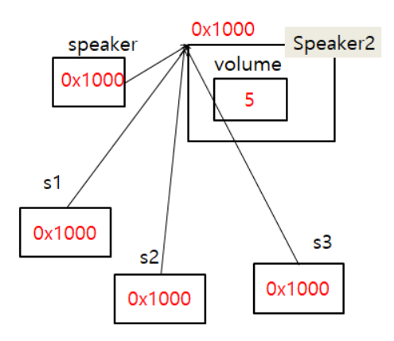
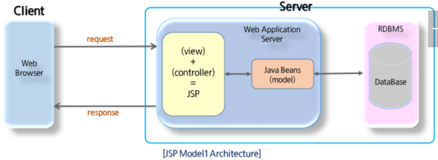
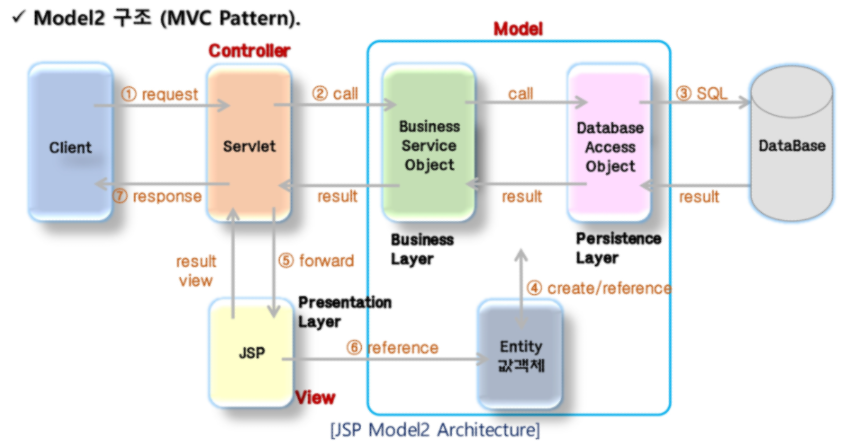

# Singleton Pattern

싱글턴 패턴은 `인스턴스가 오직 1개만 생성`되야 하는 경우에 사용되는 패턴이다.

객체를 여러 개 생성해도 그 객체들이 1개의 인스턴스만 가리키고싶을 때 사용한다. 객체를 new 로 생성하면 항상 새로운 주소공간을 할당하기때문에 객체가 여러개 생성되지만, 메소드를 이용해 객체를 한개만 생성할 수 있도록 컨트롤해주면 하나의 객체를 공유할 수 있다.


## 특징

1. private constructor
2. static method


## Example



```java
public class Speaker2 {
	private static Speaker2 speaker; // speaker 객체를 static 변수로 공유 
	private int volume;
	
    // private constructor
	private Speaker2() {
		volume=5;
	}
	
    // static method for control object. 여기가 핵심
	public static Speaker2 getInstance() {
		if(speaker==null) { // 한번도 speaker 객체가 생성된 적이 없다면
			speaker=new Speaker2(); // speaker 객체를 생성한다.
		}
		return speaker; // 공유되는, 한번만 생성되는 speaker를 반환
	}
	
	public int getVolume() {
		return volume;
	}

	public void setVolume(int volume) {
		this.volume = volume;
	}
}

```


# MVC

JSP를 이용해 구성할 수 있는 Web Application Architecture는 크게 model1, model2로 나뉜다.

JSP가 client 요청에 대한 logic 처리와 view(response page) 처리를 모두하면 model 1이고, view(response page)에 대한 처리만 하면 model 2다.

Model 2구조는 MVC Pattern을 web 개발에 도입한 구조다.


## Model 1

 

구조가 단순하고 직관적이다. 대신 JSP 코드 자체가 복잡해진다. JSP 코드에 FE/BE가 혼재한다.


## Model 2

Client 요청에 대한 처리는 servlet, Logic 처리는 java class(Service, Dao), Response page는 JSP가 담당한다. 이는 MVC pattern을 웹 개발에 도입한 구조며, 완전히 같은 형태를 보인다.


**Model** : Service, Dao, Java Beans. 

- Logic을 처리하는 모든것
- controller에서 넘어온 data를 이용해 일을 수행하고 그 결과를 다시 controller에 return한다.

**View** : JSP. 

- 모든 화면 처리 담당.
- 결과 출력을 위한 코드만 존재. java code는 없다. 

**Controller** : Servlet. 

- Client 요청을 분석해 Logic 처리를 위한 Model을 호출한다.
- return 받은 결과 data를 request, session등에 저장하고 redirect/forward 방식으로 jsp를 이용해 출력


 

