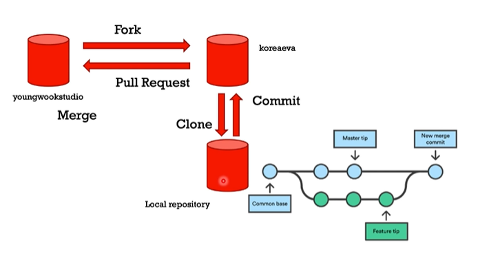

# Git

# 협업을 위한 기본 로직

 

1. fork : 다른 곳에 있는 저장소를 내 저장소로 가져온다.

2. edit, add, commit, push
3. pull request : 내 저장소의 커밋 내용을 원본 저장소에게 합쳐달라고 요청(pull request)한다.

4. 원본 저장소에서 확인 후, 승인하고싶으면 merge request를 누른다.