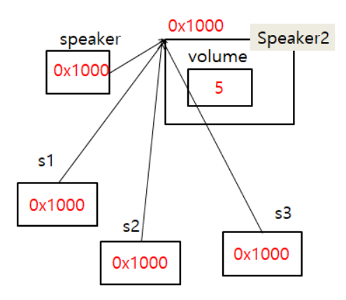
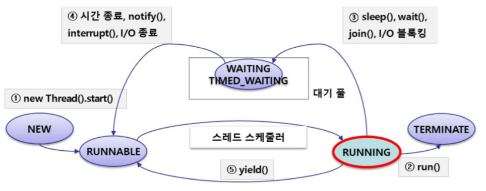

# Java

[TOC]

# Compile Language

컴파일 언어는 원시 코드(프로그래머가 작성한 소스코드)를 모두 기계어로 변환해 기계(JVM)에 넣고 기계어 코드를 실행한다. 소스코드를 기계어로 번역하는 빌드 과정에서는 인터프리터 언어에 비해 시간이 소요되지만, 런타임 시 이미 기계어로 모든 소스코드가 변환돼있기 때문에 빠르게 실행할 수 있다. 

> Java, C, C++


## 인터프리터 언어

원시코드를 기계어로 변환하는 과정없이 한 줄씩 해석해 바로 명령어를 실행하는 언어다.  

인터프리터가 직접 한 줄씩 읽고 따로 기계어로 변환하지 않기때문에 빌드 시간이 없다. Runtime 상황에서는 한 줄씩 실시간으로 읽어서 실행하기 때문에 컴파일 언어에 비해 속도가 느립니다.

실행속도는 느리지만 코드 변경시 빌드 과정 없이 바로 실행이 가능하다는 장점이 있다. 

> R, Python, Ruby


## 빌드 과정

소스파일을 실행파일로 생성하는 과정이다. 고급언어 --> 변환 --> 저급언어(기계어) 과정을 거쳐 실행 파일로 생성한다. 인터프리터 언어는 빌드과정 없이 바로 고급언어에서 한줄 씩 읽어서 실행한다.

컴파일 언어는 .class 파일을 생성해 실행한다.


# Operator

## 대입 연산자의 리턴값

```java
int a = 0;
System.out.println(a=3);
```

위의 코드를 실행하면 3이 출력된다. 즉, 대입 연산자에는 리턴값이 존재한다.

이를 이용해 LinkedList의 다음 노드를 계속 탐색할 수 있다.


```java
while ((nextNode = currNode.link) != null) { // nextNode = currNode가 가리키는 노드
    if (nextNode == target) { // 다음 노드가 target이라면
        return currNode; // 현재 노드 리턴
    }
    currNode = nextNode;
}

```


# JVM and Memory

OS에 의해 프로그램이 수행되면 JVM은 OS로부터 메모리 공간을 얻어내게 된다. 자바는 메모리를 크게 3개의 영역으로 나누어 사용한다. 실제로는 더 있는데, 이정도만 알고 넘어간다.

1. 메소드 영역
2. 힙 영역
3. 스택 영역


## 표

| 영역   | 내용                                                         | 생성                        | 소멸            |
| ------ | ------------------------------------------------------------ | --------------------------- | --------------- |
| method | global variable, method, static variable                     | 컴파일된 클래스파일 실행 시 | 프로그램 종료   |
| heap   | class object, array object, String object, new 연산자를 사용 | **new**                     | 자동 소멸 by GC |
| stack  | local variable, parameter                                    | 블럭 안에서 선언 시         | 블럭이 닫히면   |


## 예제

```java
class Test {
    int a; // 객체 생성 시, heap에 저장
    static int b; // 컴파일 시 method 영역에 저장
    
    public void view(int k){ // method 자체는 바이트 형태로 method 영역에 저장
        int s; // parameter(k)와 함께 stack에 저장
    } // method 호출 종료 시, s와 k 소멸
    
    public static void main(){
        Test ob = new Test(); // 객체는 heap에 저장
        ob = new Test(); // 이전에 생성된 객체는 추후 Garbage Collector에 의해 소멸
        ob.a = 10; // 객체의 값 heap에 저장
    }
}
```


# String

## String.format()

System.out.printf() 에서처럼 문자열에 formatting을 주고싶을 때 사용하는 메소드다. 

```java
String.format(" %.4f\n", 100*entry.getValue()/cnt) // 소수점 4자리까지 나오는 실수
```


## String, StringBuffer, StringBuilder

위의 3가지 클래스를 언제 사용하는지 정리하면 다음과 같다.

**String**          : 문자열 연산이 적고 멀티쓰레드 환경일 경우

**StringBuffer**   : 문자열 연산이 많고 멀티쓰레드 환경일 경우

**StringBuilder**  : 문자열 연산이 많고 단일쓰레드이거나 동기화를 고려하지 않아도 되는 경우


`String`은 불변(immutable)의 속성을 가진다. 때문에, String 클래스로 저장한 문자열에 문자열을 추가하면 새로운 String 인스턴스 생성하고, 처음에 선언했던 문자열은 GC에 의해 사라진다. 

반면 `StringBuffer`, `StringBuilder`는 가변(mutable) 속성을 가지기때문에 동일 객체 내에서 문자열을 변경하는 것이 가능하다.  `StringBuffer`는 동기화를 지원하여 멀티쓰레드 환경에서 안전하다(thread-safe). String도 불변성을 갖기때문에 thread-safe하다. 반면 `StringBuilder`는 멀티쓰레드 환경에서 사용하는것은 적합하지 않다. 하지만 단일쓰레드에서의 성능은 `StringBuffer`보다 뛰어나다.

`StringBuilder`의 뒤에 문자열을 추가하려면 `append(s)`, 앞에 추가하려면 `insert(0, s)`를 이용한다.


# Class

## 하나의 자바 파일에 여러 개의 클래스 정의

a.java라는 파일에 public class로 만들수 있는 클래스는 파일명과 동일한 `class a {}` 뿐이다. 이외의 클래스를 파일 안에 생성시, 컴파일하면 똑같이 메서드 영역에 내용이 올라간다. 단, public 형태로 클래스를 선언할 수 없다.


## abstract class

추상클래스란, 내용이 구현돼있지 않는 메소드가 존재하는 클래스다. 하위 클래스들이 특정 메소드를 반드시 Override하게 만들기 위해 사용한다. 이를 통해 메서드의 일관성을 유지할 수 있다.

추상메서드가 없어도 추상 클래스를 만들 수 있긴 하지만, 자기 자신으로 객체 생성을 할 순 없다.

추상클래스를 사용함으로서 **동적 바인딩**을 구현할 수 있다.

**사용방법** : 클래스 앞에 `abstract` 키워드를 붙인다. 추상 메소드에도 `abstract` 키워드를 붙인다. 


추상 클래스를 2개 이상 상속하기 위해 **inner class**를 사용하기도 한다. 이 때 컴파일을 하면 {outer}${inner}.class 형태로 파일 이름이 생성된다.


**final**

1. final 변수 : 변수를 immutable하게 만든다.
2. final 메서드 : 메서드를 더이상 오버라이드할 수 없게 만든다.
3. final 클래스 : 클래스를 상속할 수 없게 만든다. 


## Overload

같은 이름의 함수를 여러번 구현할수있다. 함수의 이름을 절약하기 위해 사용한다

1. 매개변수의 갯수가 다름
2. 매개변수의 자료형이 다름
3. 리턴타입은 오버로딩 성립에 영향을 주지 않는다


**Q**. `int add(int a){}`와 오버로딩이 되는 메소드는?

> 같은 함수 이름에 매개변수를 다르게 넣었을 때 다른 결과값을 얻기 위해 사용하는 것이다. 같은 타입, 같은 매개변수 개수를 넣었을 때 다른 리턴타입이 나오는 것은 불가능하기 때문에 아래 경우 가장 아래의 메소드는 오버라이딩이 가능한 메소드가 아니다.

    int  add(int a ,int b){}
    void  add(float  a, float b){}
    int add(char k){}
    --------------------
    void add(int k){} --> 오버로드 불가능


# Polymorphism

다형성 : 상속받은 것을 그대로 사용하지 않고 사용자 입맛에 맞게 바꿔 사용한다.

super(부모)클래스와 sub(자식)클래스에 동일한 이름의 함수가 **존재**(Overriding)할 경우 **super클래스의 참조변수로 sub클래스의 인스턴스를 참조할수 있다.** 

```java
class A {
    void m1(){} // A1
    void m2(){} // A2
}
class B extends A{
    @Override
    void m1(){} // B1
    void m3(){} // B3
    
    void main{
        A ob1 = new A();
        ob1.m1(); // A1
        ob1.m2(); // A2
        
        A ob2 = new B();
        ob2.m1(); // B1
        ob2.m2(); // A2
        ob2.m3(); // error
    }
}
```

객체 ob1을 생성하면 ob1은 A클래스에 있는 메소드만 사용할 수 있다. 

객체 ob2를 생성하면, ob2는 A클래스와 B클래스 영역이 함께 생긴 공간을 갖는다. A 클래스 영역에는 m1(), m2() 영역이 있고, A 영역의 m1()은 B 영역의 m1() 메소드를 가리키고 있다. 때문에 m1()을 실행하면 A 영역의 m1()을 거쳐 B 영역의 m1() 메소드를 실행시킨다. m3() 메소드는 A 영역에 없기때문에 에러가 발생한다.


**dynamic binding** 

동적 바인딩은 실행 시점에 호출 메서드를 결정한다. 컴파일 시점에 호출 메서드를 이미 알고있는 정적 바인딩(static binding)과 다르다.

```java
// 정적 바인딩
Dog ob1=null; Cat ob2=null; Duck ob3=null; Fish ob4=null;
switch(n) {
    case 1: ob1=new Dog();    ob1.speak();  ob1.walk();  break;
    case 2: ob2=new Cat();    ob2.speak();  ob2.walk();  break;
    case 3: ob3=new Duck();   ob3.speak();  ob3.walk();  break;
    case 4: ob4=new Fish();   ob4.speak();  ob4.walk();  break;
}

// 동적 바인딩
Animal ani = null;
switch(n) {
    case 1: ani=new Dog();    break;
    case 2: ani=new Cat();    break;
    case 3: ani=new Duck();   break;
    case 4: ani=new Fish();   break;
}
ani.speak();  ani.walk();  
```

자바는 컴파일 언어로, 기계어로 변환할 때 코드를 순서대로 변환한다. 때문에 아래 코드를 실행하면 `ani`라는 객체는 4개의 객체를 생성한다.


# this

`this`는 객체의 주소를 가리킨다. 메소드 호출 시, 실제로 선언된 메소드의 파라미터에 `this`라는 parameter가 추가된다. `this`는 메소드 내에서 첫번째 줄에서만 사용이 가능하고, 한 번만 사용할 수 있다.


## 용법

this의 용법은 크게 4가지다.

1. this() : 기본 생성자
2. this(variable) : 다른 생성자
3. this.variable : 자기 클래스의 변수 지칭
4. this.method() : 자기 클래스의 메서드 지칭


`super`를 이용하면 부모의 생성자/변수/메서드를 사용할 수 있다.


# Enum

Enum은 열거형 상수로, 서로 연관된 **상수**들의 집합이다. 어떤 클래스가 상수만으로 작성돼있으면 반드시 class로 선언할 필요없이 enum으로 선언한다. class로 선언된 부분에 enum이라고 선언하면 "이 객체는 상수의 집합이다"라는 것을 명시적으로 나타낸다.

```java
public enum DevType {
    MOBILE, WEB, SERVER
}

public class Developer {
    public String name;
    public int career;
    public DevType type;
    
    public static void main(String[] args){
        Developer developer = new Developer();
         
        developer.name = "홍길동";
        developer.career = 3;
        developer.type = DevType.WEB;
         
        System.out.println("이름 : "+ developer.name);   // 이름  : 홍길동
        System.out.println("경력 : "+ developer.career); // 경력  : 3
        System.out.println("직무 : "+ developer.type);   // 직무 :  WEB

    }
}
```

## 특징

- 선언된 순서에 따라 0부터 인덱스 값을 갖고, 순차적으로 증가된다.

- enum 열거형으로 지정된 상수들은 모두 대문자로 선언한다.

- 마지막 열거형 변수들을 선언한 후 세미콜론은 찍지 않는다. 단, 상수와 연관된 문자를 연결시킬 경우 찍는다.

- enum 타입은 고정된 상수들의 집합으로, 런타임이 아닌 컴파일타임에 모든 값을 알고 있어야 한다. 즉, 다른 패키지나 클래스에서 enum 타입에 접근해 동적으로 어떤 값을 정해줄 수 없다. 따라서 컴파일 시 타입안정성이 보장된다.


## 메소드

`values()` : enum의 요소들을 순서대로 enum타입의 배열로 리턴. static methods

```java
for(DevType type : DevType.values()){
    System.out.println(type); // MOBILE\n WEB\n SERVER\n
}
```


`ordinal()` : 원소에 열거된 순서를 정수 값으로 리턴. not static methods

```java
DevType tp = developer.type.SERVER;
System.out.println(tp.ordinal());   // 2 
```


`valueOf()` : 매개변수로 주어진 String과 열거형에서 일치하는 이름을 갖는 원소를 리턴. static

```java
// 상수("연관시킬 문자")
enum DevType{
    MOBILE("안드로이드"), WEB("스프링"), SERVER("리눅스");
}

class Developer {
    public String name;
    public int career;
    public DevType type;
     
    public static void main(String[] args){
        for(DevType type : DevType.values()){
            System.out.println(type.getName()); // 안드로이드\n 스프링\n 리눅스\n
        }
    }
}
```


실제 enum을 사용해 성능 개선 및 문제 해결한 예시는 다음 [링크](https://woowabros.github.io/tools/2017/07/10/java-enum-uses.html)를 통해 확인할 수 있다.


# Serialize

## 직렬화(Serialize)란

객체를 한 줄로 늘어선 바이트 형태로 만드는 것으로, 전송이 가능해진다.

- 자바 시스템 내부에서 사용되는 객체나 데이터를 외부의 자바 시스템에서도 사용할 수 있도록 **byte 형태**로 데이터를 변환하는 기술.
- JVM(Java Virtual Machine 이하 JVM)의 메모리에 상주(힙 또는 스택)되어 있는 객체 데이터를 바이트 형태로 변환하는 기술
- 파일 또는 네트워크를 통해 송수신(스트림)이 가능하게 만들어주는 기술


### 사용방법

1. 클래스 생성 시, `Seriazliable` 인터페이스를 implements한다.

   ```java
   public class User implements Serializable {//객체직렬화
       // 구현해야할 메서드가 없다.
   } 
   ```

2. `ObjectOutputStream` 클래스를 이용해 직렬화를 진행한다.

   ObjectOutputStream 클래스는 객체들을 출력하는 기능을 제공해 주고,출력 스트림에 출력하기 전에 직렬화를 수행한다. 

   Serializable 인터페이스를 앞에서 Implements 안해주면, NotSeriazliableException 발생

   ```java
   public static void main(String[] args) {
       User ob1=new User("민들레",20,89.5);
       User ob2=new User("개나리",22,73.5);
   
       //IO Stream(직렬화)
       try {
           ObjectOutputStream oos = new ObjectOutputStream(new FileOutputStream("storage/user.txt")); // 파일로 저장
           oos.writeObject(ob1);
           oos.writeObject(ob2);
   
           System.out.println("저장 되었습니다");
           oos.close();
       } catch (FileNotFoundException e) {
           e.printStackTrace();
       } catch (IOException e) {
           e.printStackTrace();
       }
   }
   
   ```


## 역직렬화(Deserialize)

- byte로 변환된 Data를 원래대로 객체나 데이터로 변환하는 기술을 역직렬화(Deserialize)라고 부릅니다.
- 직렬화된 바이트 형태의 데이터를 객체로 변환해서 JVM으로 상주시키는 형태.


### 사용방법

```java
//IO Stream(역직렬화)
try {
    ObjectInputStream oos= new ObjectInputStream(new FileInputStream("storage/user.txt"));
    User ob1=(User)oos.readObject();
    User ob2=(User)oos.readObject();

    ob1.disp();
    ob2.disp();

    oos.close();

} catch (FileNotFoundException e) {
    e.printStackTrace();
} catch (IOException e) {
    e.printStackTrace();
} catch (ClassNotFoundException e) {
    e.printStackTrace();
}

```

[참고한 블로그](https://nesoy.github.io/articles/2018-04/Java-Serialize)


# Lambda

람다식은 간단히 말해 함수를 변수처럼 사용할수 있는 개념이다.

자바람다식은 사실 완벽한 함수형 프로그래밍방식이라고 할 수는 없다. 자바 람다식은 함수형에 대해서 새로 정의한 것이 아니고, 기존에 존재하는 Interface의 형태를 빌어 람다식을 표현하기 때문이다. 그러므로 함수형 프로그래밍의 장점을 완전히 가지지는 못한다. 


## 형식

- ( parameters ) -> { expression body }
- ( parameters ) -> expression body
- () -> { expression body }
- () -> expression body    


## 사용

람다는 함수가 1개만 있는 인터페이스를 구현할때만 사용가능하다. (`@FunctionalInterface`)

클래스 생성 부분의 클래스명을 생략하고, 메소드명을 생략한다. 자료형을 알 수 있다면 자료형을 생략하고, return을 `->`로 표현한다.

**calc**

> `@FunctionalInterface`를 사용하면, 인터페이스에 메소드 1개만 있는데 구현할 때마다 다른 식으로 사용할 수 있다.


```java
@FunctionalInterface
interface Calc{
	public double calc(int a, int b);
}

public class LambdaEx3 {
	public static void main(String[] args) {
		// Calc ob = (int a, int b) -> return a+b;
		Calc ob1 = (a, b) -> a+b;
		Calc ob2 = (a, b) -> a-b;
		Calc ob3 = (a, b) -> a*b;
		Calc ob4 = (a, b) -> a/b;
			
		System.out.println(ob1.calc(2,5));
		System.out.println(ob2.calc(2,5));
		System.out.println(ob3.calc(2,5));
		System.out.println(ob4.calc(2,5));
	}
}
```


**sort**

sort할 때 `Comparator`라는 인터페이스를 구현해야한다. 이 부분을 람다식을 이용해 처리했다.

```java
public static void main(String[] args) {
    List<Student> list = new ArrayList<>();
    list.add(new Student("kim", 100));
    list.add(new Student("lee", 70));
    list.add(new Student("park", 85));
    list.add(new Student("hong", 60));
    list.add(new Student("kang", 95));

    System.out.println("*** 정렬 전 *** ");
    // void java.lang.Iterable.forEach(Consumer<? super String> action)
    list.forEach((m) -> System.out.println(m.getName() + " " + m.getTot()));

    // 정렬 2가지 방법
    System.out.println("*** 이름 오름차순 정렬 후 *** ");
    // 1. Collections
    Collections.sort(list, new Comparator<Student>() {
        @Override
        public int compare(Student o1, Student o2) {
            return o1.getName().compareTo(o2.getName());
        }
    });
    list.forEach((m) -> System.out.println(m.getName() + " " + m.getTot()));

    // 2. list.sort -> String
    System.out.println("*** 이름 내림차순 정렬 후 *** ");
    list.sort((m1,m2)->m2.getName().compareTo(m1.getName()));
    list.forEach((m) -> System.out.println(m.getName() + " " + m.getTot()));

    // 3. list.sort -> int
    System.out.println("*** 점수 오름차순 정렬 후 *** ");
    list.sort((m1,m2)->m1.getTot() - m2.getTot());
    list.forEach((m) -> System.out.println(m.getName() + " " + m.getTot()));
}
```


# Stream

컬렉션의 객체에 사용되며, 객체를 stream으로  얻어온 후 원하는 연산을 간략하게 구현하기 위한 API이다. 컬렉션의 객체를 일반 stream으로 리턴받는다.  

```java
Arrays.asList(1,2,3,4,5,6).stream();
```

또다른 컬렉션의 객체 및 메소드를 통해 추출 후 출력 할 수 있다.


## 주요 API

- forEach :stream의 요소를 순회해야 한다면 forEach를 활용할 수 있음

- map : stream의 개별 요소마다 연산을 할 수 있음

- limit : stream의 최초 요소부터 선언한 인덱스까지의 요소를 추출해 새로운 stream을 만듬

- skip : stream의 최초 요소로부터 선언한 인덱스까지의 요소를 제외하고 새로운 stream을 만듬

- filter : stream의 요소마다 비교를 하고 비교문을 만족하는 요소로만 구성된 stream을 반환

- flatMap : stream의 내부에 있는 객체들을 연결한 stream을 반환

- reduce : stream을 단일 요소로 반환

- collect : 각각의 메소드로 콜렉션 객체를 만들어서 반환

```java
// forEach
Arrays.asList(1,2,3,4,5,6).stream().forEach(System.out::println); //:: 스코프연산자

// map
Arrays.asList(1,2,3,4,5,6).stream()
.map(i -> i*i)
.forEach(System.out::println);

// limit
Arrays.asList(3,4,2,1,6,5).stream()
.limit(2) // maxSize
.forEach(System.out::println);

// skip
Arrays.asList(3,4,2,1,6,5).stream()
.skip(2)
.forEach(System.out::println);

// filter
Arrays.asList(1,2,3,4,5,6).stream()
.filter(i->i%2==0)
.forEach(System.out::println);   // 2 4 6

// filter를 다른방식으로
Arrays.asList(1,2,3,4,5,6).stream()
.forEach((i)-> {
    if(i % 2 == 0) System.out.println(i);
    });   // 2 4 6

// flatMap
Arrays.asList(Arrays.asList(1,2,3,4),Arrays.asList(5,6,7,8),Arrays.asList(9,10)).stream()
.flatMap(i->i.stream())
.forEach(System.out::println);		

// reduce
System.out.println(Arrays.asList(1,-2,3,-1,5).stream()
.reduce((a,b)->a-b)    // 1-(-2)=3-3=0-(-1)=1-5=-4
.get());

// collect
Arrays.asList(1,2,3,4,5).stream()
.collect(Collectors.toList()) // Collection으로 바꿔준다
.forEach(System.out::println);
```


# Singleton Pattern

싱글턴 패턴은 `인스턴스가 오직 1개만 생성`되야 하는 경우에 사용되는 패턴이다.

객체를 여러 개 생성해도 그 객체들이 1개의 인스턴스만 가리키고싶을 때 사용한다. 객체를 new 로 생성하면 항상 새로운 주소공간을 할당하기때문에 객체가 여러개 생성되지만, 메소드를 이용해 객체를 한개만 생성할 수 있도록 컨트롤해주면 하나의 객체를 공유할 수 있다.


## 특징

1. private constructor
2. static method


## Example



```java
public class Speaker2 {
	private static Speaker2 speaker; // speaker 객체를 static 변수로 공유 
	private int volume;
	
    // private constructor
	private Speaker2() {
		volume=5;
	}
	
    // static method for control object. 여기가 핵심
	public static Speaker2 getInstance() {
		if(speaker==null) { // 한번도 speaker 객체가 생성된 적이 없다면
			speaker=new Speaker2(); // speaker 객체를 생성한다.
		}
		return speaker; // 공유되는, 한번만 생성되는 speaker를 반환
	}
	
	public int getVolume() {
		return volume;
	}

	public void setVolume(int volume) {
		this.volume = volume;
	}
}

```


# Exception

예외처리란 비교적 가벼운 에러로 에러 발생할것을 미리 예측하여 처리하는것


1. Unchecked Exception : **런타임** 시 예외 발생. 필요한 경우 예외처리 수행

   ex) ArithmeticException, NullPointException, ArrayIndexOutOfBoundsException

2. Checked Exception : **컴파일** 시 예외 발생. 강제로 예외처리를 수행
	
	ex) IOException,FileNotFoundException


throws : 예외 객체를 양도한다.

try{} catch{} : 예외가 발생하면 예외 객체를 잡아내어 원하는 동작을 처리한다.

finally {} : 예외 발생여부와 상관없이 실행하는 부분이다.

throw : 예외를 강제로 발생시킨다.

또는 아래처럼 사용자 정의 예외를 만들 수 있다. throw를 이용해 사용자 예외를 발생시킬 수 있다.

```java
//사용자 정의 예외처리
class NotAlphabet extends Exception{
	public NotAlphabet(String str) {
		System.out.println(str);
	}
}
```


# Thread

Java의 Thread는 Concurrent Programming 방법 중 하나다. 

> Concurrent(병행) : 둘 이상의 일을 한꺼번에 행함. Multi-thread Programming
>
> Parallel(병렬) : 나란히 늘어섬. Multi-core


Thread를 사용하는 방법에는 2가지가 있다.

1. `extends Thread`

   `Thread`를 상속받은 클래스로 객체를 생성하면 쓰레드 객체가 된다. `start()`하면 `run()` 메소드를 실행한다.

2. `implements Runnable` -> @Override `run()`

   `Runnable`을 구현한 객체를 `Thread` 클래스 생성자의 parameter로 전달한다. 생성된 쓰레드 객체로 `start()`한다.


자바 파일 실행 시 main 함수를 실행하는데, 이 때 **Main Thread**가 생성되어 시작되는 것이다. 즉, 지금까지 단일 쓰레드를 이용해왔던 것이다. 만약 다중 스레드 환경이라면, main 스레드가 종료되더라도 다른 thread가 종료될때 까지 JVM이 실행된다.


Daemon thread를 설정하고싶으면 Thread 객체의 setDaemon(true) 메소드를 이용한다. 이렇게되면 쓰레드 객체가 보조 스레드인 데몬쓰레드로 설정된다.


## 쓰레드의 상태



Thread 객체는 start() 호출이 된다고 바로 실행되는 것은 아니다. 전체 쓰레드는 다양한 상태로 존재하고, JVM은 이 상태를 이용해 전체 Thread의 실행을 제어한다.


## 쓰레드의 활동 제어

### sleep()

sleep()은 static method로, `Thread.sleep(time)` 형태로 불러온다. 현재 스레드를 0.001 * time 초만큼 실행중지시킨다. 시간이 지나면 다시 Runnable 상태가 되어 바로 실행된다.

반드시 InterruptedException을 예외처리 해줘야한다. 

### join()

해당 쓰레드의 실행이 끝날때까지 다른 쓰레드를 대기시킬 때 사용한다.

```java
ob1.start();
try {
 ob1.join();   // ob1이 끝날때까지 ob2, ob3는 대기
} catch (InterruptedException e) {
 e.printStackTrace();
}
ob2.start();
ob3.start();
```

### interrupt()

쓰레드를 종료시키기 위해 InterruptedException을 발생시킨다. 또는 대기 풀에 있는 Thread 객체를 다시 runnable 상태로 이동시킨다. `th.interrupt()`

### yield()

`Thread.yield()`는 static method로, running중인 쓰레드를 호출하여 runnable 상태인 다른 쓰레드에게 수행을 양보한다. Wait 상태로 가지 않고 runnable 상태로 이동하여 언제든 다시 경쟁을 이기고 running 상태가 되면 yield() **호출 이후**의 코드를 이어서 수행한다.


## 공유하는 자원

여러 Thread들이 공유하는 자원에 대한 관리를 위해 Thread 동기화를 사용한다

### synchronized()

A 쓰레드가 공유자원 r에 접근하는 도중 B 쓰레드가 같은 자원에 접근할 때 문제가 생기는 경우가 있기때문에 A가 job을 수행하는 경우 다른 쓰레드의 접근을 제한해야한다. (ex. 잔액 확인 후 출금)

사용방법은 2가지로, 공유자원을 사용하는 **Method** 자체를 synchronized 하는 경우와 Method 내 특정 블럭(또는 자원 객체)을 synchronized 처리하는 경우다.

### wait(), notify()

synchronized로 독점하고있던 공유자원을 반납하기 위해 사용하는 메소드들이다. (deadlock 방지) 두 메소드는 상호보완적인 구조다.

`wait()` 을 사용하면, 공유자원(lock)을 갖고 있던 쓰레드가 lock을 반환하고 대기 POOL로 간다. `notify()` 메소드를 사용하면 waiting pool에서 대기중인 다른 쓰레드에게 공유자원이 준비되어있음을 알린다. `notifyAll()`은 전체에게, `notify()`는 (임의로) 1개에게 알린다.


# Network

## IP 

컴퓨터 간 통신을 위해 TCP/IP 프로토콜이 가장 많이 사용되고 있다. IP를 통해 다른 컴퓨터의 주소를 알 수 있고, 인터넷은 IP 대신 도메인(Domain)이라는 개념을 도입하여 서비스하고 있다. 


```java
InetAddress[] ias = InetAddress.getALLByName("naver.com");
for (InetAddress addr : ias) addr.getHostAddress(); // IP for naver.com

InetAddress localhost = InetAddress.getLocalHost(); // IP for localhost
```


## Socket

Port를 통해 다른 컴퓨터(호스트)의 특정 프로세스를 찾아갈 수 있다. 이 Port를 담당하는 프로그램 모듈을 Socket이라고 한다. 서버는 `ServerSocket`으로 소켓을 만들고, 클라이언트가 접속하면 `accept()` 호출되면서 Socket 객체를 전달해준다. 소켓 생성 시 포트 번호가 필요하다.

```java
ServerSocket serverSocket = new ServerSocket(port);
while(true)
{
    Socket socket = serverSocket.accept(); 
    // 클라이언트가 신호 보낼때까지 대기. 다음코드 실행안하고 기다린다.
    OutputStream output = socket.getOutputStream();   
}
```

클라이언트는 소켓 생성 시 서버의 IP address와 Port 번호가 필요하다. 서버에 접속되면 `socket` 객체로부터 IO stream을 얻어 통신한다. 두 소켓이 서로 통신한다.

```java
Socket socket = new Socket(host, port);
InputStream input = socket.getInputStream();
BufferedReader reader = new BufferedReader(new InputStreamReader(input));
```

클라이언트가 여러 개일 때, 쓰레드를 이용해 소켓을 여러 개 만든다. 추후에는 쓰레드 목록을 List로 관리한다. 만약 쓰레드 목록을 `ArrayList`로 관리할 경우 Thread-safe하지 않으므로, `synchronized` 를 걸거나 `Vector`를 사용한다.

```java
while (true) {
    Socket socket = serverSocket.accept();
    NetworkThread thread = new NetworkThread(socket);
    thread.start();
}
```


# XML

XML(eXtensible Markup Language)은 미리 정의된 tag도 없고, 표현에 의존적이지 않다. XML은 다음의 문법을 잘 따랐을 때 **Well formed**하다고 한다.

- Root element & Tree 구조
- 시작 및 종료 tag 존재 & 일치
- 대소문자 구별
- 주석은 `<!-- -->`
- white space 보존

XML은 tag와 namespace가 존재한다. 이 유효값을 별도의 문서로 구성한 후 명시적으로 지정해줘야 XML문서가 **Valid**해지는데, 이 때 필요한 파일을 **DTD**(Document Type Definition)라고 한다.


## XML Parser

xml에 사용된 tag를 구별하고 그 안에 있는 값들을 읽는 방법에는 2가지 방법이 있다. 문서를 한 번 쭉 읽으면서 tag의 발생별로 처리하는 방법(**SAX**)이 있고, 문서 구조 전체를 자료구조에 저장하여 탐색하면서 처리하는 방법(**DOM**)도 있다. SAX는 빠르고 DOM은 다양한 탐색을 가능하게 한다.


### SAX

SAX Parser는 tag를 만나면 실행되는 event 기반의 처리방식을 사용하므로 별도의 Handler를 둔다. 즉, XML 문서를 읽고 그것을 Handler를 통해 처리한다.

- Handler는 `DefaultHandler` class를 상속받는다. 
- `startElement()`는 시작 tag를 만나면 호출된다. 
- `endElement()`는 종료 tag를 만나면 호출된다. 
- `characters()` 는 tag 안의 text value를 만나면 호출된다. 미리 준비해둔 StringBuilder 객체에 전달되는 text value를 저장한다.


## UI

클라이언트의 UI를 위해 Java의 awt, Swing 같은 Library를 사용한다.


# Variable arguments

함수의 매개변수의 개수가 사용자의 쓰임에 따라 달라지는 것을 대비해, 자바는 매개변수의 개수를 동적으로 지정해줄 수 있게 됐다. (Since JDK1.5) 이 기능을 가변인자(Variable argument)라고 한다.


## 사용법

키워드 `...`을 사용한다. 빈 인자값이나 같은 타입의 배열도 인자값으로 줄 수 있다.

``` java
// ---- String ---- //
void sum(String...str) {
	for(String a:str)
    	System.out.println(a);
}

public static void main(String args[]) {
    Varargs v = new Varargs();
    v.sum("a","b","c");
    v.sum();
    v.sum(new String [2]);
}

// ---- DB close ---- //
public static void close(AutoCloseable... closeables) {
    for(AutoCloseable c : closeables) {
        if (c != null) {
            try {
                c.close();
            } catch (Exception e) {
                e.printStackTrace();
            }
        }
    }
}

```

가변인자는 내부적으로 배열을 생성해서 사용한다. 가변인자 외에도 다른 매개변수가 더 있다면 가변인자는 마지막에 선언해야된다.


## 오버로딩 시 주의점

컴파일러는 가변인자가 있는 두 개의 메소드를 구분할 수 없기때문에 컴파일 에러가 발생한다. 가능하면 가변인자를 사용한 메소드는 오버로딩을 하지 않는 것이 좋다.