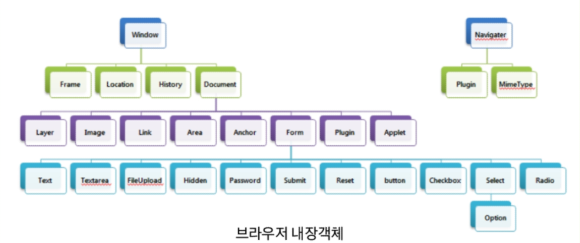

[TOC]


# Window 객체

Window 객체는 웹 브라우저에서 작동하는 JS의 최상위 전역 객체다. 브라우저와 관련된 여러 객체와 속성, 함수가 있다. BOM(Browser Object Model)으로 불리기도 한다.

 


## Window 객체 사용

**브라우저에서 제공하는 창 open**

`alert()` : 브라우저의 알림창

`confirm()` : 브라우저의 확인/취소 선택창

`prompt()` : 브라우저의 입력 창


**navigator** 객체 : **브라우저의 정보**가 내장

서로 다른 브라우저를 구분할 수 있고, 브라우저별로 다르게 처리할 수 있다. HTML5에서는 위치 정보를 알려주는 역할도 가능하다.


**location, history**

`location` : 현재 페이지 주소(URL)와 관련된 정보. `.href, .reload()`

`history` : 브라우저의 페이지 이력을 담는 객체 


**새 창** 

`window.open('url', '창이름', '창의 특성', 히스토리 대체 여부)`

`window.close()` : JS로 자체구현한 팝업에서 필요

```html
<button onclick="javascript:windowClose();">함수 이용해서 닫기</button>
<script>
function windowClose(){
    window.close();
}
</script>
```

**부모 창**

window 객체의 opener 속성을 이용해 부모 창(새 창을 연 창)을 컨트롤 할 수 있다. 즉, opener 객체는 부모 창의 window 객체다.


# DOM

DOM(Document Object Model)은 HTML과 XML문서의 구조를 정의하는 API 제공

문서 객체(Document Object) 계층 최상위에는 **document node**, 그 아래로 **element node**, **text node**가 있다.

text는 `innerHTML`, `innerText` 2가지 방법으로 삽입할 수 있다.

```javascript
window.onload = function(){
    // 생성
    var title = document.createElement('h2');
    var msg = document.createTextNode('Hello JS');
	
    // node 추가
    title.appendChild(msg);
    document.body.appendChild(title);
    
    // 속성
    var profile = document.createElement('img');
    profile.src = 'profile.png';
    
}
```

객체를 가져올 땐 `getElements` 또는 `querySelector`를 이용한다.

> `getElementsByTagName(tagname)`, `querySelectorAll(selector)`

삭제할 땐 `removeChild(childenode)`


# Event

웹 페이지에서 여러 종류의 상호작용이 있을때마다 이벤트가 발생한다. 이벤트는 일반적으로 함수와 연결되고, 이 함수는 이벤트가 발생되기 전에는 실행되지 않다가 이벤트가 발생할 경우 실행된다. 이를 이벤트 **핸들러(Handler)** 또는 이벤트 **리스너(Listener)**라 하며, 이 함수에 이벤트 발생시 실행해야하는 코드를 작성한다.

종류로는 마우스 이벤트, 키보드 이벤트, Frame(UI) 이벤트, 폼(Form) 이벤트가 있다.


## 이벤트 핸들러

이벤트를 감지하고 대응하는 작업을 등록하는 방법은 여러가지가 있다. 


**인라인 핸들러**

HTML 요소의 내부에서 직접 이벤트 핸들러를 등록한다. CBD(Component Based Development) 방식의 Angular, React, Vue.js같은 프레임워크에서 인라인방식으로 이벤트를 처리한다.

```html
<div onclick="javascript:alert('안녕');">클릭하기</div>
<div id="div1" onclick="msg1(); msg2();">클릭해보세요</div>
```


**이벤트 핸들러 프로퍼티 방식**

JavaScript에서 이벤트 핸들러를 등록하는 방법이다. HTML 코드와 JS 코드를 분리할 수 있다는 장점이 있다. 

이벤트 핸들러 프로퍼티에 1개의 이벤트 핸들러만 바인딩할 수 있다는 단점이 있다.

```html
<div id="div2">클릭해봐</div>
<script>
document.getElementById("div2").onclick= function(){
    alert('안녕');
};
</script>
```


**addEventListener 메소드 방식**

parameter 1 = 이벤트 이름, parameter 2 = 이벤트 핸들러, parameter 3 = 캡쳐링 여부.

이벤트 이름에는 'on' 을 제거한 이벤트 이름을 사용한다. 해당 이벤트가 발생했을 때 실행될 콜백함수를 커스텀할 수 있다.

하나의 이벤트에 하나 이상의 이벤트 핸들러를 추가할 수 있다.

```javascript
document.getElementById("div1").addEventListener("click", openAlert, false);
document.querySelector("#div2").addEventListner('click', function(){
    alert("안녕하세요");
});
```

