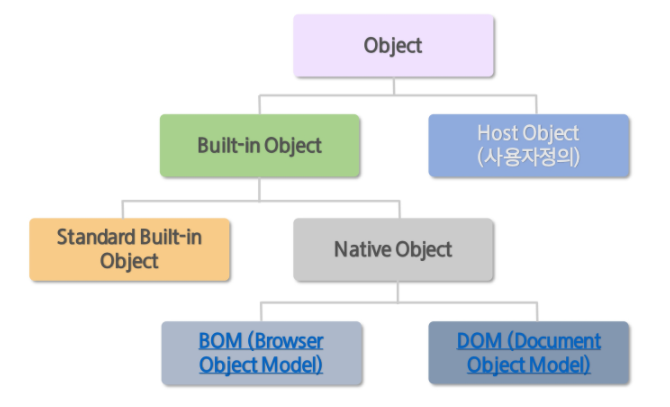

# JavaScript

[TOC]


# 변수

## Type

JavaScript는 동적타입(Dynamic / Weak Type) 언어. 변수의 타입 지정없이 값이 할당되는 과정에서 자동으로 변수의 타입이 결정된다. 같은 변수에 여러 타입의 값을 할당할 수 있다.

자료형에는 원시타입과 객체타입이 있고, 원시타입에는 number, string, boolean, undefined, null(object)이 있다. 나머지는 모두 객체 타입이다.

`var`로 선언하면 undefined상태고, 값을 할당을 해주면 변수의 타입이 결정된다.

값을 할당하지 않은 변수는 undefined (시스템 레벨), 코드에서 명시적으로 값이 없음은 null(프로그램 레벨)이다.

비어있는 문자열, null, undefined, 숫자 0 은 false다.


## 변수의 생성

1. 선언 단계  : 변수 객체에 변수 등록
2. 초기화 단계 : 등록된 변수를 메모리에 할당. undefined로 초기화
3. 할당 단계 : undefined로 초기화된 변수에 실제 값 할당


## 변수 호이스팅

var 키워드를 사용한 변수는 중복해서 선언이 가능하다.

호이스팅이란, var 선언문이나 function 선언문 등 모든 선언문이 해당 scope의 처음으로 옮겨진것처럼 동작하는 특성이다. JavaScript는 모든 선언문이 선언되기 이전에 참조될 수 있다.


## const, let

var 변수는 camelCase를 이용해 작성한다. 상수는 모든 문자를 대문자로 표기하고, 단어 사이는 `_`로 표기한다. ECMAScript6부터 `const` keyword를 이용해 상수를 사용할 수 있다.


let도 const와 마찬가지로 ECMAScript6부터 추가된 키워드로, let을 이용해 선언한 변수는 해당 스코프에만 존재하고, 재선언이 불가능하다.


## var, let, const

var, let, const의 차이점을 정리하면 아래와 같다.

| 키워드 | 재선언 | 구분                    | 선언위치                                     |
| ------ | ------ | ----------------------- | -------------------------------------------- |
| var    | 가능   | mutable                 | 함수 내에선 지역변수<br />나머진 전역 스코프 |
| let    | 불가능 | mutable                 | 해당 스코프                                  |
| const  | 불가능 | immutable (재할당 불가) | 해당 스코프                                  |


# 객체(Object)

객체는 이름과 값으로 구성된 프로퍼티의 집합이다. JavaScript의 객체는 키와 값으로 구성된 프로퍼티들의 집합이다. 

전역 객체를 제외한 JavaScript 객체는 프로퍼티를 동적으로 추가하거나 삭제할 수 있다.

JavaScript의 함수는 **일급 객체**이므로 값으로 사용할 수 있다. 즉, 프로퍼티의 값으로 함수를 사용할 수 있다.

```javascript
var student = {
    name: '김철수',
    area: '서울',
    classNum: 9,
    info: function () {
        console.log(this.name + '는 ' + this.area + this.classNum + '반');
    },
};
console.log(typeof student); // object
console.log(student); // {name: "김철수", area: "서울", classNum: 7, info: f}
student.info(); // 김철수는 서울 7반
```

JavaScript 객체는 프로토타입(prototype)이라는 특별한 프로퍼티를 포함하고있다.


> 일급 객체(first-class object)란 다른 객체들에 일반적으로 적용가능한 연산을 모두 지원하는 객체를 가리킨다.


## 생성

1. 객체 리터럴

   - 가장 일반적인 방법. {} 사용하여 객체 생성. 위의 코드가 객체 리터럴을 이용한 생성이다.

2. Object 생성자 함수

   - new 연산자와 Object 생성자 함수를 호출하여 빈 객체 생성. `new Object();`
   - 빈 객체에 프로퍼티 또는 메소드를 추가하여 객체를 완성

3. 생성자 함수

   - 생성자 함수를 이용해 템플릿(클래스)처럼 사용하여 프로퍼티가 동일한 객체 여러 개 생성

   ```javascript
   function Student(name, area, classNum){
       this.name=name;
       this.area=area;
       this.classNum=classNum;
       this.info = function(){
           console.log(this.name + '는 ' + this.area + this.classNum + '반');
       }
   }
   ```

   

## 참조

객체는 복사되지 않고 참조된다. 원시 데이터타입이 아닌 모든 값은 참조타입이다. 

> Object, Array, Date, Error 포함


## 분류

 


# 함수(function)

JS에서 함수는 일급(first-class) 객체로, 함수를 변수, 객체, 배열 등에 저장할 수 있다. 또한 다른 함수에 전달하는 전달 인자(callback 함수) 또는 return 값으로 사용가능하다.

```javascript
function f1(p1, p2){} // 함수 선언문
var f2 = function(p1,p2,p3){} // 함수 표현식
var f3 = new Function("p1","p2","p3","p4"); // Function 생성자 함수
f1(p1, p2); // 함수 호출
```


## 함수 호이스팅

JavaScript는 모든 선언(var, let, const, function)을 호이스팅한다.

함수 선언문으로 정의된 함수는 JS엔진이 스크립트 로딩시점에 이를 변수객체에 저장한다.

함수 표현식의 경우, 함수 호이스팅이 아니라 변수 호이스팅이 발생한다.


## Callback

Callback function은 함수를 명시적으로 호출하는 방식이 아니라, **특정 이벤트가 발생했을 때 시스템에 의해 호출되는 함수**다. 콜백함수는 일반적으로 **매개변수를 통해 전달**되고, 전달받은 함수의 내부에서 어느 특정시점에 실행된다.

콜백 함수는 주로 비동기식 처리 모델에서 사용된다.

### ex1

```html
<button id="btn">click</button>
<script type="text/javascript">
var btn = document.getElementById('btn');
btn.addEventListener('click', function(){
    console.log('Hello Javascript');
});

setTimeout(function(){
    console.log('3초 후 실행.');
})
</script>
```


### ex2

아래는 기존의 ajax 코드에서 비동기 처리 방식때문에 tableData가 받아지지 않는 문제를 callback 함수를 이용해 해결한 것이다.

```javascript
// callback 적용 전
function getData() {
	var tableData;
	$.get('https://domain.com/products/1', function(response) {
		tableData = response;
	});
	return tableData;
}

console.log(getData()); // undefined

// callback 적용 후 
function getData(callbackFunc) {
	$.get('https://domain.com/products/1', function(response) {
		callbackFunc(response); 
        // 서버에서 받은 데이터 response를 callbackFunc() 함수에 넘겨줌
	});
}

getData(function(tableData) {
	console.log(tableData); // $.get()의 response 값이 tableData에 전달됨
});
```


