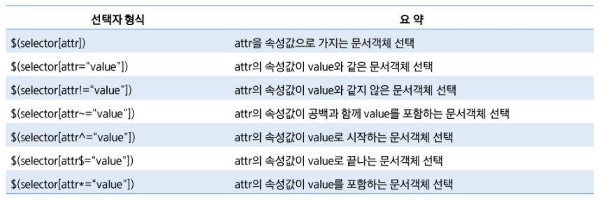
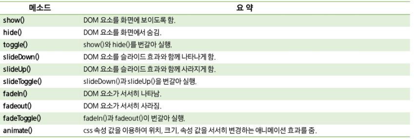
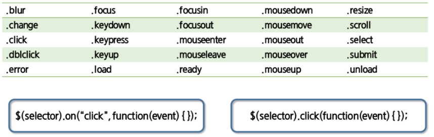

# jQuery

jQuery는 크로스브라우저를 지원하고, 다운받거나 CDN을 사용한다.


# 기본 구조

jQuery는 기본적으로 `$(selector).action()` 형태를 갖고 있다.

## 선택자

`$(selector)`는 탐색한 DOM 객체들을 담은 WrapperSet를 반환한다. 래퍼세트 객체를 통해 기능을 처리하는 `action()` 함수를 호출한다.

jQuery로 DOM을 탐색하기전에, 웹 브라우저에 문서가 로드돼있어야한다. jQuery는 document ready 이후 처리할 수 있는 두 가지 방법을 제공한다.

```javascript
$(document).ready(function(){
	// 방법1.
});
$(function(){
    // 방법2. 축약
});
```

### 요소 선택자

selector에는 document 외에 `*`, `#idName`, `.className` , `elementName` 이 들어갈 수 있다. 여러 개의 선택자를 넣을 수도 있다. 

### 계층구조 탐색

계층구조도 css와 동일하게 적용된다. `>` : 자식, `space` : 자손, `+` : 다음 형제, `~` : 모든 형제

```javascript
$("ul.site > li").css("border", "1px solid blue");
$("label + input").css("border", "2px solid steelblue") // 바로 다음 input 태그
$("#prev ~ div").css("color", "magenta").css("font-weight","bold"); // 뒤에 있는 모든 div 태그
```

### 속성 선택자

 

### 필터 선택자

그 외에도 DOM 요소를 탐색한 결과에서 원하는 요소를 걸러내기 위해 필터 선택자를 사용할 수 있다. 입력 폼 유형을 선택하는 필터 선택자, 요소의 특성으로 선택하는 필터 선택자, 위치 기반 필터선택자, 함수 기반 필터선택자가 있다.

```javascript
el:button // type이 button인 input요소 또는 button요소
el:checked // 체크된 입력 폼 선택
el:hidden // 감춰진 요소 선택

:first-child // 첫번째 자식요소 선택
:even // 짝수번째 요소 선택 $("domTable tr:odd")
:contains(str) // 텍스트 str을 포함하는 요소
:eq(n) // n번째로 일치하는 요소
```


## 메서드

jQuery는 선택자를 통해 탐색한 DOM 객체를 래퍼세트에 담아 반환한다. 이 래퍼세트 객체에는 내장된 DOM 객체를 처리하는 다양한 메소드가 있다.

### $.each()

```javascript
var outHtml = '';
$.each(array, function (index, item){
    // array에는 js배열이나 래퍼세트 객체
    // function() 에는 각 요소를 반복하면서 처리할 콜백함수를 정의
    // index : 배열 인덱스, item : 반복하는 요소 객체
    outHtml += item.name;
});
document.body.innerHTML = outHtml;

$(selector).each(function(index, item){
    // 유일한 인자 콜백함수
});
```


### $.filter()

```javascript
$("h2").filter(":even");
$(selector).filter(function(index, item){ 
});
```


이 외에도 `$(selector).add(element)`, `$(selector).not(element)`, `$(selector).is(function(index, item){})`, `$(selector).find(selector)` 등이 있다.


# DOM 객체

`$()` 함수는 선택자를 수행하는 기능뿐만 아니라, DOM 객체를 바로 생성하는 기능을 제공

```javascript
$("<h2>안녕하세요</h2>")
.css("color", "steelblue")
.appendTo("body");

$("<a/>")
.attr("href", "https://www.naver.com")
.text("네이버")
.appendTo("body");
```

## 삭제

객체 삭제에는 `remove()`와 `empty()`가 있다. remove는 해당 래퍼세트를 삭제. empty는 해당 래퍼의 하위 자식요소들을 모두 삭제.

## 추가

```javascript
$(Target).append(B); // 하위 자식 요소로 맨뒤에 B 추가
$(Target).prepent(B);// 하위 자식 요소로 맨앞에 B 추가
$(Target).after(B);  // 바로 이전 요소로 B 추가
$(Target).before(B); // 바로 이후 요소로 B 추가

// appendTo, insertBefore 등은 Target과 B의 순서가 바뀐다.
```


## Effect 메소드

jQuery로 사용자가 직접 애니메이션 효과를 만들 수 있다.

 

위의 메소드들은 공통적으로 speed, easing, callback 매개변수를 갖고 있다.

```javascript
$(selector).method();
$(selector).method(speed);
$(selector).method(speed, callback);
$(selector).method(speed, easing, callback); // plugin 없이는 linear, swing 가능

$(document).ready(function(){
    $("div").click(function(){
        $(this).animate({ // animate는 첫번째 파라미터로 object를 넣는다.
            width: "+=50",
			height: "+=50"
        }, "slow");
    })
})
```


# jQuery Event


## bind(), unbind()

`bind(eventType, data, listener)` : 선택된 DOM 객체의 이벤트에 지정한 핸들러를 연결하는 함수

`unbind(eventType, handler)` : eventType에서 handler 삭제 

```javascript
// eventType : 핸들러를 할당할 이벤트 타입의 이름
// data : 핸들러 함수에서 사용할 데이터, 이벤트 인스턴스에 data라는 프로퍼티로 제공된다. 생략 시, 두번째 인자는 listener
// listener : 이벤트 발생시 수행되는 핸들러함수.


$("#bound").bind("click", function() {
    $("#show").bind("click", function() {
        $("p").show();
    });
    $("#hide").bind("click", function() {
        $("p").hide();
    });
});

$("#unbound").bind("click", function() {
    $("#show,#hide").unbind("click");
});

```


## on(), off()

`on()` : DOM 객체에 이벤트핸들러를 연결한다.동적으로 생성한 DOM 객체에도 적용이 가능하다.

이벤트 연결에 가장 기본이 되는 함수로 권장하고 있다. 

```javascript
$('h2').on('click', function () {
    $(this).html(function (index, html) {
        return html + '*';
    }); // 클릭할때마다 html 뒤에 *이 1개씩 추가된다.
});
```
off() : 는 DOM 객체의 이벤트를 제거한다. 


## Simple Event Bind

jQuery는 이벤트를 간단하게 연결할 수 있는 다양한 함수를 제공한다.

 

이외에도 마우스, 키보드, 윈도우, Input 이벤트등이 있다. 