# MySQL

[TOC]


# Case When

```mysql
select employee_id, last_name,
case when salary < 10000 then '초급'
	 when salary < 20000 then '중급'
	 else '고급'
end as '구분'
from employees
```


# 내장함수

## 숫자

- abs(n) : 절대값
- ceiling(n) : 정수 올림 
- floor(n) : 정수 내림
- round(n, 자릿수) : 반올림

- truncate(n, 자릿수) : 버림

- pow(x,y) or power(x,y) : x**y
- mod(a,b) : a % b
- greatest(a,b,c,...) : 가장 큰 수
- least(a,b,c,...) : 가장 작은 수

```mysql
select ceil(12.2) from dual;
-- dual은 계산을 위한 가상의 테이블 이름
```


## 문자

- ASCII(a) : 아스키코드값
- concat(a,b,c) : 문자열 결합
- insert(a,start,length, new) : a의 start 위치부터 length만큼 new로 대치
- replace(a,b,c) : a의 b를 c로 변경
- instr(a,b) : a에서 b의 위치 리턴
- mid(a, b, count) : a에서 b부터 count개만큼 리턴
- substring(a,b,count) : a중 b부터 count개만큼 리턴
- ltrim(a), rtrim(a), trim(a) : 공백 제거

- lcase(a) or lower(a) : 소문자
- ucase(a) or upper(a) : 대문자
- left(a, count) : 문자열 중 왼쪽에서 count개 추출
- right(a, count) : 문자열 중 오른쪽에서 count개 추출

- reverse(a): 반대로 나열


## 날짜

- now(), sysdate(), current_timestamp() : 현재 날짜와 시간
- curdate(), current_date() : 현재 날짜
- curtime(), current_time() : 현재 시간

- date_add(date, interval) : 날짜에서 기준값 더하기
- date_sub(date, interval) : 날짜에서 기준값 빼기
- year(date) /month(date) : 연/월 리턴
- monthname(date) : 날짜의 월을 영어로 리턴
- dayname(date) : 날짜의 요일을 영어로 리턴

- dayofmonth(date) : 월별 날짜 리턴
- dayofweek(날짜) : 날짜의 주별 일자 리턴 (1~7)
- weekday(날짜) : 날짜의 주별 일자 리턴 (0~6)
- dayofyear(날짜) : 365일중 몇번째일
- week(날짜) : 일년중 몇번째주
- from_days(days) : 0년0월0일부터 days만큼 경과한 날의 날짜
- to_days(date) : 0년0월0일부터 date까지 일자 수
- date_format(date, format) : 날짜를 형식에 맞게 리턴

### 날짜 형식

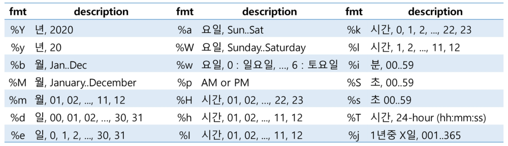 


## 논리

- if(bool, a, b) : bool이 참이면 a 거짓이면 b 리턴
- ifnull(a,b) : a가 null이면 b로 대치
- nullif(a,b) : a==b 면 null, 그렇지 않으면 a


## 그룹

count(col), sum(col), avg(col), max(col), min(col)


## Transaction

- Start Transaction : commit, rollback이 나올때까지 실행되는 모든 sql
- commit : 모든코드 실행
- rollback : start transaction 실행 전 상태로 되돌림 (savepoint 이용해서 저장)


# JOIN

둘 이상의 테이블에서 데이터가 필요한 경우 사용한다. 일반적으로 각 테이블의 PK 및 FK로 구성된다. EQUI JOIN이라고도 부른다.

INNER JOIN, OUTER JOIN(LEFT, RIGHT)이 있고, JOIN 조건의 명시에 따라 NATURAL JOIN / CROSS JOIN(FULL, CARTESIAN)이 있다.


**최적화**

INNER JOIN의 경우, 어느 테이블을 먼저 읽어도 결과가 달라지지 않기때문에 MySQL 옵티마이저가 조인의 순서를 조절해 다양한 방법으로 최적화를 수행한다.

OUTER JOIN의 경우, 반드시 OUTER가 되는 테이블을 먼저 읽기때문에 옵티마이저가 조인 순서를 선택할 수 없다.


## INNER JOIN

교집함. N개의 테이블 조인 시, N-1개의 조인 조건이 필요하다.


```mysql
select alias1.col1, alias1.col2, alias2.col3
from table1 as alias1 
inner join table2 as alias2
on alias1.col4 = alias2.col5 -- join 조건 : on
where alias1.col2 = 100 -- 일반 조건 : where
;

-- using. ANSI 표준. where 이용하면 그냥 sql 
select e.employee_id, e.first_name, d.department_name
from employees e 
join departments d
using (department_id) -- 공통 column. alias 명시 X
where e.employee_id = 100
;

-- natural join
select e.employee_id, e.first_name, d.department_name
from employees e 
natural join departments d -- 같은 column 있으면 알아서 join 해준다. 같은 column이 여러개 있으면 문제 발생할 수 있음.
where e.employee_id = 100
;

```


## OUTER JOIN

LEFT, RIGHT, FULL OUTER JOIN으로 구분된다. MySQL은 FULL OUTER 지원하지 않는다.

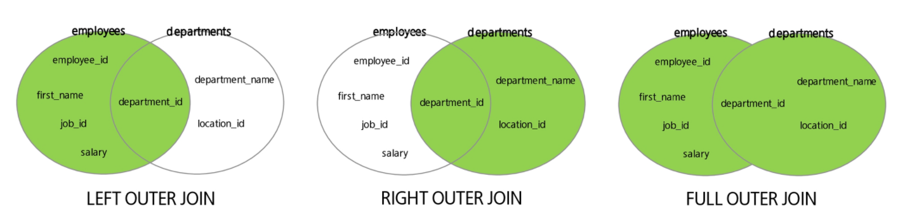 

```mysql
select e.employee_id, e.first_name, d.department_name
from employees e
left outer join departments d
using (department_id)
;
```


## SELF JOIN

같은 테이블끼리 JOIN한다.

```mysql
select e.employee_id, e.first_name, m.employee_id, m.first_name
from employees e 
inner join employees m
on e.manager_id = m.employee_id
;

```


## None-Equi JOIN

PK,FK가 아닌 일반 column을 join 조건으로 지정

```mysql
select e.employee_id, e.first_name, e.salary, s.grade
from employees e
join salgrades s
where e.salary >= s.losal
and e.salary <= s.hisal
;
```


# Subquery

다른 쿼리 내부에 포함돼있는 select문으로, 괄호로 감싸져야한다.

사용가능한 곳 : select, from, where, having, order by, insert의 values, update의 set


## 중첩 서브쿼리 

where 문에 작성하는 서브쿼리

- 단일 행 : =, >, <
- 복수(다중) 행 : in, any, all
- 다중 컬럼 : `where (salary, department_id) in (select salary, department_id from bla)`

## 인라인 뷰 

from 문에 작성하는 서브쿼리. DB에는 저장되지 않는 임시 View

**TopN query**

한 페이지당 5명 출력할 때, 3페이지를 출력하라.

```mysql
-- Oracle 등등은 아래처럼 사용
set @pageno = 3; -- 변수 설정 방법. pageno에 3 할당

select b.rn, b.employee_id, b.first_name, b.salary
from (
	select @rownum := @rownum + 1 as rn, a.* -- rn : auto increment로 rownum 부여
    from (
    	select employee_id, first_name, salary
        from employees
        order by salary desc
    ) a, (select @rownum := 0) tmp -- rownum 0으로 초기화
) b

where b.rn > (@pageno * 5 - 5) and b.rn <= (@pageno * 5)
;

-- MySQL은 limit 이용해 쉽게 가능!
select employee_id, first_name, salary
from employees
order by salary desc
limit 10, 5;

select a.*
from (
	select @rownum := @rownum + 1 as rn, employee_id, first_name, salary
    from employees e, (select @rownum := 0) tmp
    order by salary desc
) a
limit 10, 5;
```


## 스칼라 서브쿼리 

select 문에 작성하는 서브쿼리, 1개의 행만 반환한다.

```mysql
select e.employee_id, e.first_name, job_id,
	(select department_name from departments d
     where e.department_id = d.department_id) as department_name
from employees e
where job_id = 'ITPROG'
;
```


# Group By

쿼리된 테이블의 행을 그룹으로 묶는다. 각 그룹에 대해 단일결과 행을 반환한다.

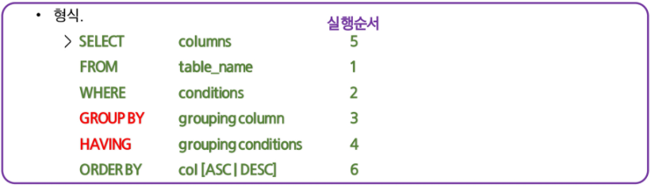 

MySQL은 group by를 안해줘도 aggregate 함수가 적용되는데, 아래 옵션을 적용하면 에러를 반환한다.

```mysql
select @@sql_mode;

set session sql_mode = 'STRICT_TRANS_TABLES,NO_ENGINE_SUBSTITUTION,ONLY_FULL_GROUP_BY';
```


aggregate 조건은 having 절에 작성한다.

```mysql
select department_id, avg(salary)
from employees
group by department_id
having avg(salary) > 7000
;
```


## ROLL UP

ROLL UP을 활용하면 GROUP BY에서 선택한 기준에 따라 합계가 구해진다.

```MYSQL
SELECT country, product, sum(profit) 
FROM sales 
GROUP BY country, product WITH ROLLUP;
```


 

## SET

모든 집합연산자는 동일한 우선순위를 갖는다. select 절에 있는 column의 개수와 type이 일치해야한다.

MySQL에서는 UNION, UNION ALL을 사용할 수 있다.

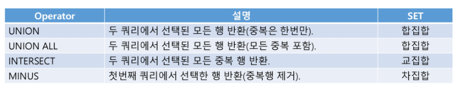 

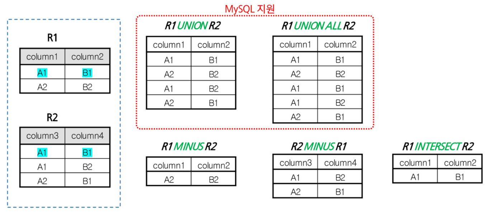 


# Database Modeling

데이터 모델링 순서는 다음과 같다.

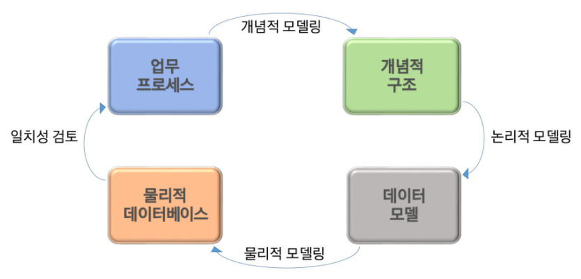 

## 개념적 모델링

Entity-Relationship Diagram 기호

 

**Entity** (개체) : 사용자와 관계가 있는 주요 객체. 반드시 Attribute 가져야한다. 명사적 표현

**Attribute** (속성) : 저장할 필요가 있는 실체에 관한 정보. 컬럼으로 활용.

- 기초 속성 : 원래 갖고있는 속성. 현업에서 기본적으로 사용
- 추출 속성 : 기초 속성으로부터 계산에 의해 얻어질 수 있는 속성
- 설계 속성 : 실존하지 않으나 시스템 효율성 도모를 위해 설계자가 임의로 부여하는 속성

**Key** (식별자)

- 후보키 : 기본키가 될 수 있는 후보속성
- 기본키 : 인스턴스를 유일하게 식별하는데 가장 적합한 Key
- 대체키 : 후보키 중 기본키가 아닌것
- 복합키 : 둘 이상의 컬럼을 묶어 식별자로 정의
- 대리키 : 인위적으로 추가할 식별자.

**Relationship** (관계)

1. 두 실체를 실선으로 연결하고 관계 부여
2. 관계차수 표현 -> 차수성(cardinality) 정의. 1, N
3. 선택성 표시 -> optional or mandatory

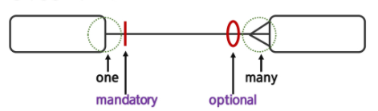 

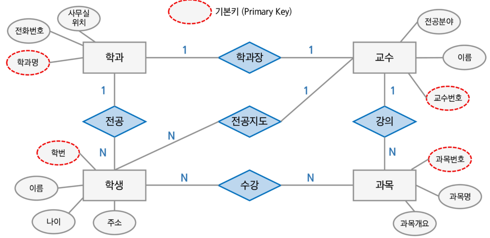 


## 논리적 모델링

개념적 모델링단계에서 정의된 ER Diagram을 Mapping Rule을 적용하여 관계형 데이터베이스 이론에 입각한 스키마를 설계 + 정규화

기본키 (Primary Key) : Not Null, Unique

참조키, 이웃키 (Foreign Key) : 관계를 맺는 두 entity에서 서로 참조하는 릴레이션의 attribute로 지정되는 키

### Mapping Rule

개념적 모델링에서 도출된 개체 타입과 관계 타입의 테이블 정의

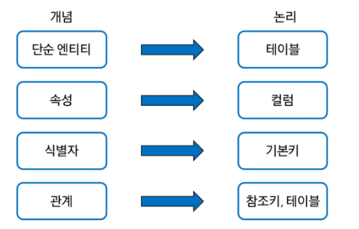 

1:1, 1:N일 땐 FK로 column을 추가하면 되는데, M:N일땐 별도의 테이블을 하나 생성한다.

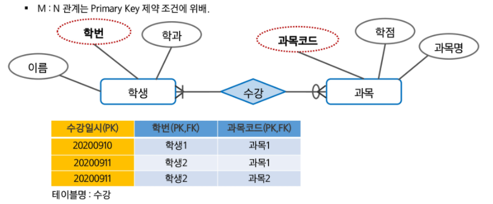 


### 정규화

Attribute간에 존재하는 함수적 종속성을 분석해 관계형스키마를 더 좋은 구조로 정제해나가는 일련의 과정. 중복을 제거하고 속성들을 본래의 제자리에 위치시키는 것이다.


**정규화 전**

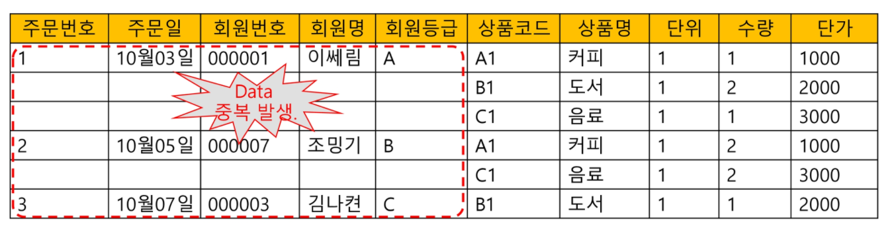

**제1정규화** 

모든 속성값이 원잣값. 최대한 쪼갠다. 반복되는 그룹 속성을 제거한 뒤 기본테이블의 기본키를 추가해 새로운 테이블을 생성하고, 기존의 테이블과 1:N의 관계를 형성.

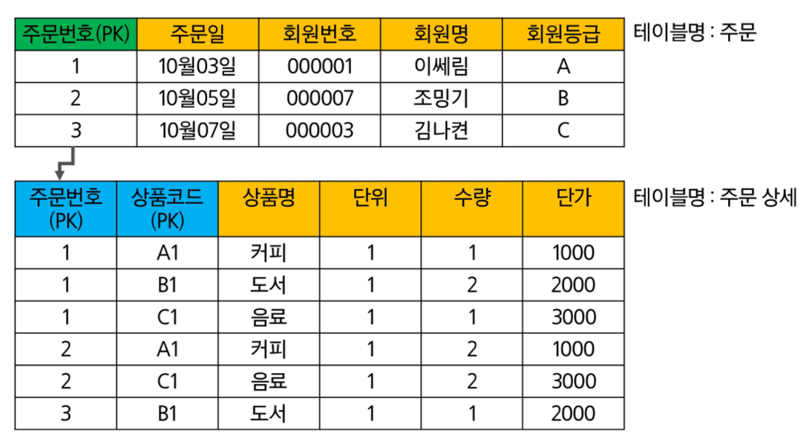 

주문 상세 테이블을 나눴다.


**제2정규화** 

키가 여러 컬럼으로 구성된 경우 제2정규화의 대상이다.

복합키(Composite Primary Key)의 일부분에 의해 종속되는 것을 **부분적 함수 종속관계**라 하며, 이를 제거하는 작업.

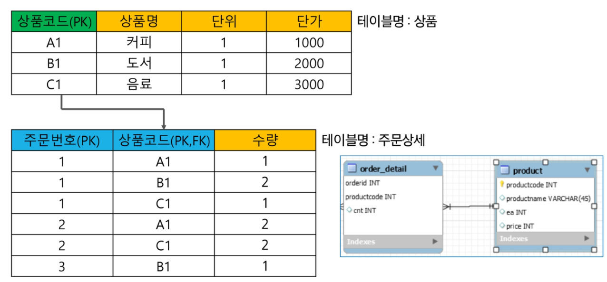 

주문 상세 테이블을 나눴다.


**제3정규화** 

기본키가 아닌 일반 컬럼에 의존하는 컬럼들을 제거한다. **이행적 함수 종속관계**를 갖는 컬럼 제거

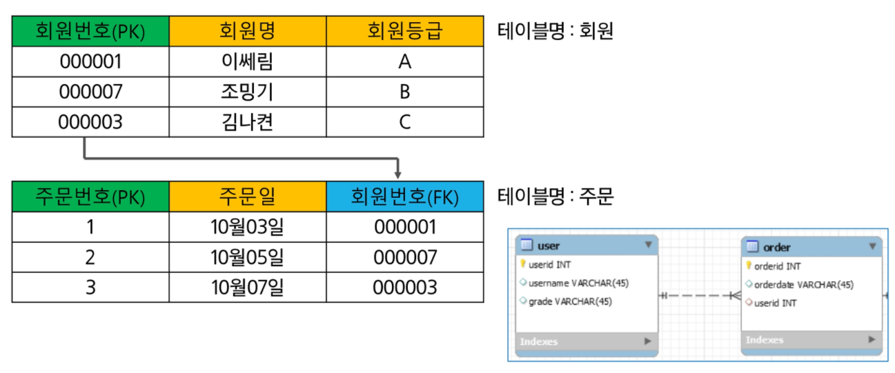 

주문 테이블을 나눴다.


## 물리적 모델링

Data Type (Column의 domain 설정)을 정의하고, 데이터 사용량 분석과 업무 프로세스 분석을 통해 보다 효율적인 DB가 될 수 있도록 효과적인 **인덱스**를 정의하고, 상황에 따른 **역정규화** 작업을 수행한다.

### 역정규화

Denomalization. 시스템 성능을 고려해 기존 설계를 재구성한다.

데이터 중복. 컬럼 역정규화 (join 잦은 경우), 파생 컬럼 생성 (연산이나 데이터 조작을 통해 조회할 때 새로운 정보를 보여주는 경우. 판매금액 / 총점 / 평균)

- 테이블 분리 : column 기준으로 분리 / record 기준으로 분리
- 요약 테이블 생성 : summary table. 요약된 정보 저장
- 테이블 통합 : 시스템 성능 고려