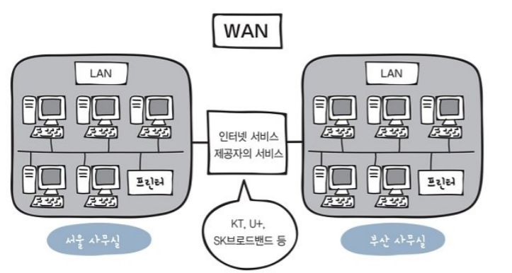
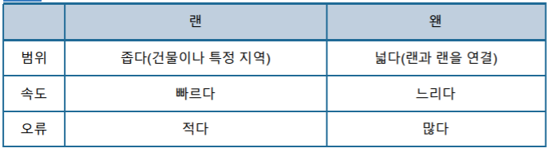
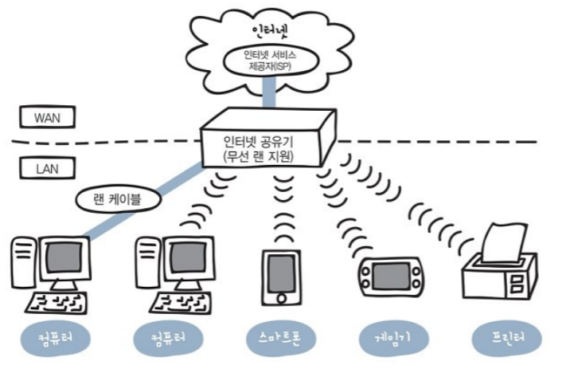
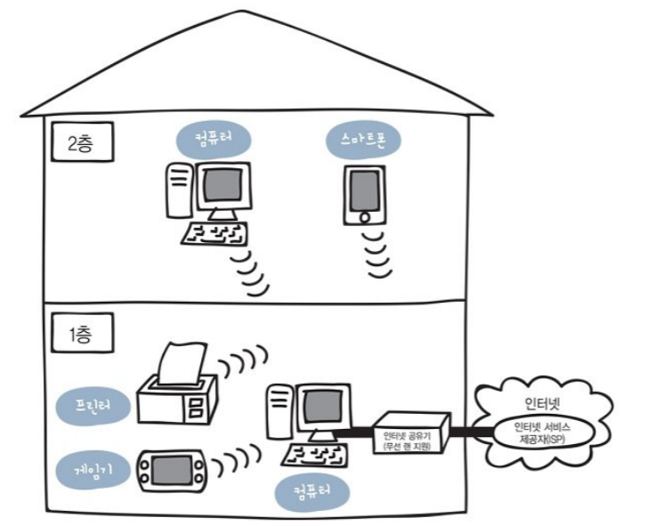
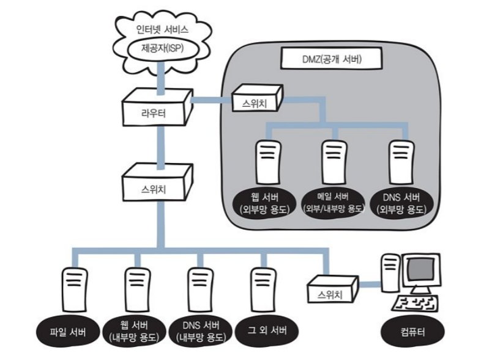
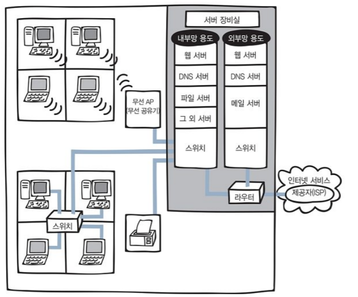

# 네트워크

정리한 책 : 모두의 네트워크

등장인물

시폰 교수(교수), 마론 군(학생), 미미 양(조교)

# 1. 네트워크 첫걸음

목표

- 네트워크란 무엇인가
- 패킷이란
- LAN, WAN 

계층 구조

## 1. 네트워크의 구조

### 컴퓨터 네트워크

컴퓨터 간의 연결을 컴퓨터 네트워크라 한다. 네트워크를 통해 컴퓨터들이 데이터를 서로 주고받는다.

인터넷은 전 세계의 큰 네트워크부터 작은 네트워크까지를 연결하는 거대한 네트워크.

### 패킷

패킷은 데이터를 주고받기 위한 규칙으로, 네트워크를 통해 전송되는 데이터의 작은 조각이다. 

큰 데이터를 그대로 보내면 네트워크의 대역폭(bandwith)을 너무 많이 차지(점유)해서 다른 데이터의 흐름을 막을 위험이 있다. 그래서 작은 패킷으로 분할한다.

대역폭 : 일반적으로 네트워크에서 이용가능한 최대 전송 속도로 정보를 전송할 수 있는 단위시간당 전송량

목적지에서는 원래대로 되돌리는 작업을 해야한다. 그래서 송신측에서 수신측으로 패킷을 보낼때 패킷에 순서대로 번호를 붙여서 보낸다. 그러면 순서대로 도착하지 않아도 정렬해서 원래대로 만들 수 있다.

## 2. 정보의 양을 나타내는 단위

### 비트와 바이트

디지털 데이터 = 컴퓨터가 다루는 숫자 0과 1의 집합

0과 1의 정보를 나타내는 최소 단위 = bit

숫자 8개 모으면 byte

문자 코드(character code) : 숫자와 문자의 대응표

ASCII : 기본적인 문자코드. 알파벳, 기호, 숫자 등

네트워크에 데이터를 전송하는 경우에는 비트 정보를 전기신호로 변환하기때문에 실제로는 네트워크에 전기신호가 전송된다.

## 3. LAN과 WAN

### LAN vs WAN

LAN (Local Area Network) : 건물 안이나 특정 지역을 범위로 하는 네트워크

가정이나 빌딩 안에 있는 사무실같이 **지리적으로 제한**된 곳에서 컴퓨터와 프린터를 연결할 수 있는 네트워크. 

WAN (Wide Area Network) : 지리적으로 넓은 범위에 구축된 네트워크

인터넷 서비스 제공자(ISP, Internet Service Provider)가 제공하는 서비스를 사용하여 구축된 네트워크. 랜과 랜을 연결. 

LAN은 연결하는 거리가 짧은만큼 신호가 약해지거나 오류가 발생할 확률도 낮다. 반면 WAN은 멀리 떨어져있는 LAN과 연결돼있어 신호가 약해지거나 오류가 발생할 확률이 더 높아진다. 또한, 거리가 멀어지는만큼 속도가 떨어진다.(WAN)

## 4. 가정에서 하는 랜 구성

### 가정에서 네트워크 구성

인터넷을 사용(개통)하려면 먼저 **ISP**와 **인터넷 회선**을 결정해야한다. 인터넷 회선은 2018년 6월 기준으로 광랜을 사용하는 사람이 많다.

가정에서 네트워크를 구성하려면, 인터넷 서비스 제공자와 네트워크를 연결하기위해 필요한 장비가 바로 **인터넷 공유기**다. 

영어로 broadband router라고 하는 인터넷 공유기는 가정이나 소규모 기업에서 인터넷에 접속할 때 쓰인다. 가정용으로 만든 라우터인데 최근에는 허브, 스위칭허브, 방화벽 기능도 제공한다.

선 연결 여부에 따라 2가지 접속 방식(유선 랜, 무선 랜)이 존재한다. 

## 5. 회사에서 하는 랜 구성

### 소규모 회사의 네트워크 구성

SOHO(Small Office/Home Office) 기업에서는 가정용과 다르게 DMZ 네트워크 영역이 존재한다. DMZ는 **서버**를 외부에 공개하기 위한 네트워크로 주로 웹 서버, 메일 서버, DNS 서버를 공개한다. (DeMilitarized Zone, 공개 서버)

웹사이트를 불특정 다수의 외부사용자에게 공개할 때 웹서버를 공개하고, 외부 사용자와 메일을 주고받을 때 메일서버를 공개하고, 외부에서 도메인이름을 사용하여 회사의 서버에 접속하려면 DNS서버를 외부에 공개한다. 

직원수가 많을 수록 스위치와같은 장비가 늘고 랜 케이블의 배선도 늘어난다.

서버가 사내에 있지 않고 데이터센터나 클라우드에 존재할 수 있다. 참고로 사내, 데이터센터에 서버를 두는 경우를 온프레미스(on-premise)라고 부른다.아래는 사내에 서버를 두고 운영하는 그림이다. 사내에서 운영하는 경우는 서버 장비실을 두고 랙(선반)을 설치한다.

무선 랜 기능이 있는 라우터를 사용하는 경우가 많은데, 프린터 연결 등을 편리하게 할 수 있기 때문이다.

# 2. 네트워크의 기본 규칙

목표

- 프로토콜 이해
- OSI, TCP/IP 이해
- 캡슐화, 역캡슐화 이해

## 6. 네트워크의 규칙