# 네트워크

정리한 책 : 모두의 네트워크

[1. 네트워크 첫걸음](#1.-네트워크-첫걸음)

[2. 네트워크의 기본 규칙](#2.-네트워크의-기본-규칙)

[3. 물리 계층 : 데이터를 전기 신호로 변환하기](#3.-물리-계층--데이터를-전기-신호로-변환하기)

[4. 데이터 링크 계층 : 랜에서 데이터 전송하기](#4.-데이터-링크-계층--랜에서-데이터-전송하기)

[5. 네트워크 계층 : 목적지에 데이터 전달하기](#5.-네트워크-계층--목적지에-데이터-전달하기)

[6. 전송 계층 : 신뢰할 수 있는 데이터 전송하기](#6.-전송-계층--신뢰할-수-있는-데이터-전송하기)

[7. 응용 계층 : 애플리케이션에 데이터 전송하기](#7.-응용-계층--애플리케이션에-데이터-전송하기)

[8. 네트워크의 전체 흐름 살펴보기](#8.-네트워크의-전체-흐름-살펴보기)

[9. 무선 랜 이해하기](#9.-무선-랜-이해하기)

# 1. 네트워크 첫걸음

목표

- 네트워크란 무엇인가
- 패킷이란
- LAN, WAN 

계층 구조

## 1. 네트워크의 구조

### 컴퓨터 네트워크

컴퓨터 간의 연결을 컴퓨터 네트워크라 한다. 네트워크를 통해 컴퓨터들이 데이터를 서로 주고받는다.

인터넷은 전 세계의 큰 네트워크부터 작은 네트워크까지를 연결하는 거대한 네트워크.

### 패킷

패킷은 데이터를 주고받기 위한 규칙으로, 네트워크를 통해 전송되는 데이터의 작은 조각이다. 

큰 데이터를 그대로 보내면 네트워크의 대역폭(bandwith)을 너무 많이 차지(점유)해서 다른 데이터의 흐름을 막을 위험이 있다. 그래서 작은 패킷으로 분할한다.

대역폭 : 일반적으로 네트워크에서 이용가능한 최대 전송 속도로 정보를 전송할 수 있는 단위시간당 전송량

목적지에서는 원래대로 되돌리는 작업을 해야한다. 그래서 송신측에서 수신측으로 패킷을 보낼때 패킷에 순서대로 번호를 붙여서 보낸다. 그러면 순서대로 도착하지 않아도 정렬해서 원래대로 만들 수 있다.

## 2. 정보의 양을 나타내는 단위

### 비트와 바이트

디지털 데이터 = 컴퓨터가 다루는 숫자 0과 1의 집합

0과 1의 정보를 나타내는 최소 단위 = bit

숫자 8개 모으면 byte

문자 코드(character code) : 숫자와 문자의 대응표

ASCII : 기본적인 문자코드. 알파벳, 기호, 숫자 등

네트워크에 데이터를 전송하는 경우에는 비트 정보를 전기신호로 변환하기때문에 실제로는 네트워크에 전기신호가 전송된다.

## 3. LAN과 WAN

### LAN vs WAN

LAN (Local Area Network) : 건물 안이나 특정 지역을 범위로 하는 네트워크

가정이나 빌딩 안에 있는 사무실같이 **지리적으로 제한**된 곳에서 컴퓨터와 프린터를 연결할 수 있는 네트워크. 

WAN (Wide Area Network) : 지리적으로 넓은 범위에 구축된 네트워크

인터넷 서비스 제공자(ISP, Internet Service Provider)가 제공하는 서비스를 사용하여 구축된 네트워크. 랜과 랜을 연결. 

LAN은 연결하는 거리가 짧은만큼 신호가 약해지거나 오류가 발생할 확률도 낮다. 반면 WAN은 멀리 떨어져있는 LAN과 연결돼있어 신호가 약해지거나 오류가 발생할 확률이 더 높아진다. 또한, 거리가 멀어지는만큼 속도가 떨어진다.(WAN)

## 4. 가정에서 하는 랜 구성

### 가정에서 네트워크 구성

인터넷을 사용(개통)하려면 먼저 **ISP**와 **인터넷 회선**을 결정해야한다. 인터넷 회선은 2018년 6월 기준으로 광랜을 사용하는 사람이 많다.

가정에서 네트워크를 구성하려면, 인터넷 서비스 제공자와 네트워크를 연결하기위해 필요한 장비가 바로 **인터넷 공유기**다. 

영어로 broadband router라고 하는 인터넷 공유기는 가정이나 소규모 기업에서 인터넷에 접속할 때 쓰인다. 가정용으로 만든 라우터인데 최근에는 허브, 스위칭허브, 방화벽 기능도 제공한다.

선 연결 여부에 따라 2가지 접속 방식(유선 랜, 무선 랜)이 존재한다. 

## 5. 회사에서 하는 랜 구성

### 소규모 회사의 네트워크 구성

SOHO(Small Office/Home Office) 기업에서는 가정용과 다르게 DMZ 네트워크 영역이 존재한다. DMZ는 **서버**를 외부에 공개하기 위한 네트워크로 주로 웹 서버, 메일 서버, DNS 서버를 공개한다. (DeMilitarized Zone, 공개 서버)

웹사이트를 불특정 다수의 외부사용자에게 공개할 때 웹서버를 공개하고, 외부 사용자와 메일을 주고받을 때 메일서버를 공개하고, 외부에서 도메인이름을 사용하여 회사의 서버에 접속하려면 DNS서버를 외부에 공개한다. 

직원수가 많을 수록 스위치와같은 장비가 늘고 랜 케이블의 배선도 늘어난다.

서버가 사내에 있지 않고 데이터센터나 클라우드에 존재할 수 있다. 참고로 사내, 데이터센터에 서버를 두는 경우를 온프레미스(on-premise)라고 부른다.아래는 사내에 서버를 두고 운영하는 그림이다. 사내에서 운영하는 경우는 서버 장비실을 두고 랙(선반)을 설치한다.

무선 랜 기능이 있는 라우터를 사용하는 경우가 많은데, 프린터 연결 등을 편리하게 할 수 있기 때문이다.

# 2. 네트워크의 기본 규칙

목표

- 프로토콜 이해
- OSI, TCP/IP 이해
- 캡슐화, 역캡슐화 이해

## 6. 네트워크의 규칙

네트워크에서 통신하기 위한 규칙을 프로토콜이라고 한다.

## 7. OSI 모델과 TCP/IP 모델

### OSI 모델

ISO라는 국제표준화기구가 OSI 모델이라는 표준 규격을 제정했다.

> ISO : International Organization for Standardization

OSI 모델은 네트워크 기술의 기본이 되는 모델로, 컴퓨터에서 컴퓨터로 데이터를 전송할 때 진행되는 일을 7개 계층(Layer)으로 나눈 것이다.

위의 OSI 모델은 7계층인데, 이를 4계층으로 바꾼 모델이 TCP/IP 모델이다. OSI 모델의 응용, 표현, 세션 계층이 TCP/IP 모델에서 응용 계층으로 합쳐져있다. 또 데이터링크, 물리 계층이 네트워크 접속 계층으로 합쳐져있다.

### TCP/IP 모델

현재는 TCP/IP 모델을 사용하고 있다. 응용, 전송, 인터넷, 네트워크 접속 계층으로 4계층이다.

## 8. 캡슐화와 역캡슐화

### 캡슐화와 역캡슐화

컴퓨터에서 컴퓨터로 데이터를 보낼 때 데이터의 앞부분에 전송하는데 필요한 정보를 붙여서 다음 계층으로 보내야한다. 이 정보를 **헤더**라 하고, 헤더에는 데이터를 전달받을 상대방에 대한 정보도 포함돼있다.

이처럼 헤더를 붙여나가는걸 **캡슐화**라 하고, 데이터를 받는 쪽에서 헤더를 하나씩 제거하는 것을 **역캡슐화**라고 한다.

1. 응용 계층에서 웹 사이트를 접속하기 위한 요청 데이터가 만들어진다.

2. 전송 계층으로 데이터가 전달되고, 전송계층에서 신뢰할 수 있는 통신이 이루어지도록 응용계층에서 만들어진 데이터에 헤더를 붙인다.

3. 다른 네트워크와 통신하기 위해 네트워크계층에서 헤더를 붙인다.

4. 물리적인 통신채널을 연결하기 위해 데이터 링크 계층에서 헤더와 **트레일러**를 붙인다.

   > 트레일러란, 데이터를 전달할 때 데이터의 마지막에 추가하는 정보다.

5. 데이터는 최종적으로 전기신호로 변환되어 수신측에 도착한다.

이렇게 필요한 데이터를 추가해나가는 것을 **캡슐화**라고 한다. 역캡슐화 과정에서는 헤더를 붙인 순서의 역순으로 헤더를 제거한다.

### VPN

VPN(Virtual Private Network)은 가상 사설망으로, **가상 통신 터널**을 만들어 기업 본사나 지사와 같은 거점 간을 연결해 통신하거나 외부에서 인터넷으로 사내에 접속하는 것을 말한다.

VPN은 인터넷 VPN과 IP-VPN으로 구성돼있다. 

- 인터넷 VPN : 거점간 접속과 원격 접속 연결이 있다. 거점간 접속은 IPsec이라는 **암호 기술 프로토콜**을 사용해 접속한다. 반면 원격 접속 연결은 외부에서 사용하는 컴퓨터와 사내 네트워크를 연결하기때문에 **암호화된 통신로**를 만든다. 아래 그림은 인터넷 VPN의 개요를 나타내고 있다.
- 

- IP-VPN : MPLS라는 기술을 사용해 인터넷망이 아닌 통신 사업자 전용 폐쇄망을 사용한다. 폐쇄망을 사용하기때문에 제삼자에 의한 해킹이나 데이터 변조의 위험이 없어 암호화가 필요하지 않다.

# 3. 물리 계층 : 데이터를 전기 신호로 변환하기

OSI 모델의 1계층인 물리 계층을 알아본다.

- 전기 신호, 랜 케이블, 리피터, 허브를 이해한다.

## 9. 물리 계층의 역할과 랜 카드의 구조

### 전기 신호

0,1로 이루어진 비트열을 전기신호로 변환하려면 물리 계층의 기술이 필요하다. (OSI 모델의 1계층)

전기 신호는 아날로그 신호와 디지털 신호가 있다.

아날로그 신호는 전화 회선이나 라디오 방송에 사용된다. 

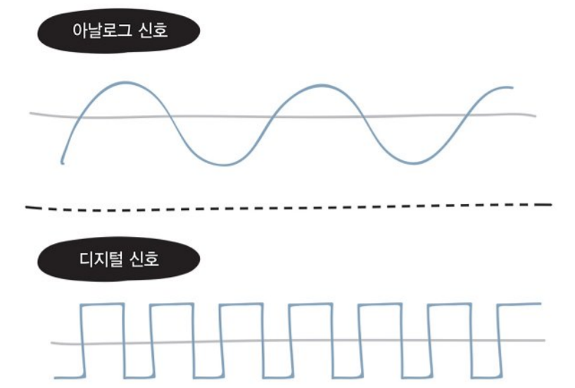

데이터 송신 측 컴퓨터가 전송하는 0과 1의 비트열 데이터는 전기 신호로 변환되어 네트워크를 통해 수신 측 컴퓨터에 도착한다. 수신측 컴퓨터에선 전기신호를 0과 1의 비트열 데이터로 복원한다.

### 랜 카드

컴퓨터는 네트워크를 통해 데이터를 송수신할 수 있도록 랜 카드가 메인 보드에 포함돼있는 내장형 랜 카드나 별도의 랜 카드를 갖고 있다. 0과 1의 정보가 컴퓨터 내부에 있는 랜 카드로 전송되고 **랜 카드는 0과 1을 전기 신호로 변환한다.**

이처럼 물리 계층은 컴퓨터와 네트워크 장비를 연결하고 컴퓨터와 네트워크 장비간에 전송되는 데이터를 전기 신호로 변환하는 계층이다.

## 10. 케이블의 종류와 구조

유선 전송매체로 사용되는 네트워크 케이블 커넥터에 대한 이해하기

### 트위스트 페어 케이블

네트워크 전송매체란 **데이터가 흐르는 물리적인 선로**로, 크게 유선과 무선으로 나뉜다.

**유선**에는 트위스트 페어 케이블, 광케이블 등이 있고 **무선**에는 라디오파, 마이크로파, 적외선 등이 있다. 이 중 **트위스트 페어 케이블**이 가장 많이 사용되는데, UTP 케이블과 STP 케이블 2가지 종류로 나뉜다.

UTP(Unshielded Twist Pair) 케이블은 비차폐 연선으로, 구리 선 8개를 2개씩 꼬아 만든 네 쌍의 전선으로, 실드(shield)로 보호돼있지 않은 케이블이다. **실드**는 금속 호일이나 금속의 매듭과 같은 것으로 외부에서 발생하는 노이즈를 막는 역할을 한다.

STP(Shielded Twist Pair) 케이블은 차폐 연선으로, 2개씩 꼬아 만든 선을 실드로 보호한 케이블로 비싸다. 

>  노이즈는 케이블에 전기 신호가 흐를 때 발생하는 것으로, 노이즈의 영향을 적게 받기위해 구리 선 2개를 비틀어 꼬아 케이블을 만드는 것이다.
>
>  UTP 케이블의 경우 데이터 전송 품질에 따라 여러 종류가 있기 때문에 구입할 때 주의해야한다.

트위스트 페어 케이블은 일반적으로 랜 케이블(LAN cable, 랜선)이라고 한다. 랜 케이블의 양쪽 끝에 **RJ-45**라고 부르는 커넥터가 붙어있어, 이 커넥터를 컴퓨터의 랜 포트나 네트워크 기기에 연결한다.

### 다이렉트 케이블, 크로스 케이블

다이렉트 케이블은 구리 선 8개를 같은 순서로 커넥터에 연결한 케이블, 크로스 케이블은 한쪽 커넥터의 1,2번 구리선을 다른 쪽 커넥터의 3,6번과 연결한 케이블이다. 두 케이블 모두 4,5,7,8번 케이블은 사용하지 않는다.

다이렉트 케이블은 컴퓨터와 스위치를 연결할 때 사용하고, 크로스 케이블은 컴퓨터 간에 직접 랜 케이블로 연결할 때 사용한다. 양쪽 컴퓨터가 모두 1,2번으로 데이터를 전송하면 충돌이 발생하기때문이다.

## 11. 리피터, 허브

### 리피터

전기 신호를 정형(일그러진 전기 신호를 복원)하고 증폭하는 기능을 가진 네트워크 중계 장비다. 통신하는 상대방이 멀리 있을 때 리피터를 사용한다. 요즘은 다른 네트워크 장비가 리피터 기능을 지원해서 보기 힘들고 앞으로도 사용될 일이 적은 장비다.

### 허브

허브는 포트를 여러개 갖고 있고 리피터 허브라고도 부른다. 리피터는 1대1 통신만 가능하지만 허브는 포트를 여러개 갖고있어서 컴퓨터 여러 대와도 통신할 수 있다. 허브는 전기신호를 정형하고 증폭하는 기능을 한다. 노이즈의 영향으로 파형이 변경될 때 허브가 파형을 정상으로 되돌리는 기능을 한다.

그런데 허브는 어떤 특정 포트로부터 데이터를 받으면 나머지 모든 포트에게 데이터를 전송하는 특징이 있다. 이런 특징때문에 **더미(dummy) 허브**라는 이름으로도 불린다. 이 단점을 보완하기 위해 스위치라는 네트워크 장비가 등장한다.

### auto MDIX

auto MDIX(auto Medium-Dependent Interface crossover) 는 다이렉트 케이블과 크로스 케이블을 자동으로 판단하는 기능이다. 컴퓨터나 라우터의 인터페이스는 MDI, 스위치나 허브의 인터페이스는 MDI-X라고 한다.

일반적으로 MDI와 MDI-X를 연결할 때는 다이렉트 케이블을 사용하고, MDI끼리나 MDI-X끼리 서로 연결할 때는 크로스 케이블을 사용한다. 하지만 최근에는 MDI, MDI-X의 차이를 자동으로 판단하여 연결신호를 전환하는 기능을 가진 스위치나 허브를 많이 사용하기때문에, 허브를 통한 연결을 한다면 케이블의 차이를 고려하지 않아도 된다.

# 4. 데이터 링크 계층 : 랜에서 데이터 전송하기

- 이더넷 이해
- CSMA/CD방식 이해
- MAC 주소 이해
- 스위치 이해
- 충돌 도메인 이해
- 이더넷 표준 이해

## 12. 데이터 링크 계층의 역할과 이더넷

OSI 2번째 계층인 데이터 링크 계층은 **네트워크 장비 간에 신호를 주고받는 규칙**을 정하는 계층이다. 즉 LAN에서 적용되는 규칙으로, 가장 많이 사용되는 규칙이 **이더넷(Ethernet)**이다.

이더넷은 데이터 충돌을 막기 위한 규칙으로 CSMA/CD(Carrier Sense Multiple Access with Collision Detection, 반송파 감지 다중 접속 및 충돌 탐지) 방식을 사용한다. 

> CS는 케이블에 신호가 흐르고있는지 확인하는 규칙, MA는 케이블에 데이터가 흐르지 않으면 데이터를 보내도 된다는 규칙, CD는 충돌이 발생하는지 확인하는 규칙

## 13. MAC 주소의 구조

MAC 주소는 Media Access Control Access(물리 주소)의 약어로, 랜 카드에게 주어지는 중복없는 48비트 숫자다. 앞쪽 24비트(16진수 6자리)는 제조사 번호, 뒤쪽 24비트는 랜카드에 붙인 일련번호다.

데이터 링크 계층 (OSI 모델), 네트워크 계층(TCP/IP 모델)에서 **이더넷 헤더**와 트레일러를 붙인다. 

이더넷 헤더의 이더넷 유형은 이더넷으로 전송되는 상위 계층 프로토콜의 종류다. 트레일러는 FCS(Frame Check Sequence)라고도 불리며, 데이터 전송 중 오류 점검용으로 사용한다. 이렇게 이더넷 헤더와 트레일러가 추가된 데이터를 **프레임**이라고 한다.

이렇게 보내는 측의 데이터 링크 계층에서 프레임을 만들고, 물리 계층에서 이 프레임 비트열을 전기 신호로 변환하여 네트워크를 통해 전송한다. 수신 측의 MAC 주소가 데이터의 목적지와 같다면 역캡슐화가 일어난다. 

## 14. 스위치의 구조

스위치는 데이터 링크 계층에서 동작하고, 레이어 2 스위치 또는 스위칭 허브라고도 불린다. 스위치 내부에는 MAC 주소 테이블이 있는데, 스위치의 포트 번호와 해당 포트에 연결돼있는 컴퓨터의 MAC 주소가 등록되는 데이터 베이스다. 브리지 테이블(bridge table)이라고도 한다.

컴퓨터에서 프레임이 전송되면, MAC 주소 테이블을 확인하고 출발지 AMC 주소가 등록돼있지 않으면 **출발지** MAC 주소를 포트와 함께 등록한다. 이를 **MAC 주소 학습 기능**이라고 한다.

하지만 목적지 MAC주소가 MAC 주소 테이블에 등록돼있지 않아, 송신 포트 외의 수신포트 모두로 데이터가 전송되는데 이런 데이터(프레임) 전송을 **플러딩**(flooding)이라고 한다. 

목적지 MAC 주소가 MAC 주소 테이블에 등록돼있다면 목적지 주소에 해당하는 컴퓨터로만 데이터가 전송된다. 이렇게 MAC 주소를 기준으로 목적지를 선택하는 것을 **MAC 주소 필터링**이라고 한다.

## 15. 데이터가 케이블에서 충돌하지 않는 구조

전이중 통신 방식은 데이터의 송신과 수신을 동시에 수행하는 통신 방식이다. (동시에 수행할 수 있는) 컴퓨터 2대를 직접 랜 케이블로 연결하면 8개의 선을 모두 사용하여 전이중 통신 방식이 된다.

반이중 통신 방식은 회선 한 개로 송신과 수신을 번갈아가며 수행하는 통신방식이다. 충돌로 인해 네트워크 지연이 발생하기때문에 효율이 낮다.

데이터 충돌이 발생하고 그 충돌 영향이 미치는 범위를 충돌 도메인이라고 한다. 허브의 충돌 도메인은 허브에 연결된 모든 컴퓨터고, 스위치의 충돌 도메인은 포트에 연결된 컴퓨터 하나다.

ARP(Address Resolution Protocol)는 목적지 컴퓨터의 IP주소를 이용해 MAC 주소를 찾기 위한 프로토콜이다. 네트워크 계층 주소와 데이터 링크 계층 주소 사이의 변환을 담당한다.

## 16. 이더넷의 종류와 특징

주요 이더넷 규격에는 10BASE5, 10BASE2, 10BASE-T, 100BA SE-TX, 1000BASE-T, 10GBASE-T가 있다. 앞의 숫자는 Mbps 단위의 통신속도고, BASE는 `BASEBAND`라는 전송 방식을 나타낸다. 뒤에는 케이블 길이 또는 케이블 종류를 나타낸다.

# 5. 네트워크 계층 : 목적지에 데이터 전달하기

OSI 3계층인 네트워크 계층!

- IP, IP 주소 이해
- 라우터, 라우팅 이해
- 서브넷 이해

## 17. 네트워크 계층의 역할

네트워크 간의 통신을 가능하게 하는 것이 네트워크 계층의 역할이다. 이 계층을 통해 다른 네트워크로 데이터를 전송하려면 라우터라는 네트워크 장비가 필요하다. 

라우터는 데이터의 목적지가 정해지면, 해당 목적지까지 어떤 경로로 가는 것이 좋은지 알려주는 기능을 한다. 다른 네트워크로 데이터를 보낼 때는 **IP 주소**가 필요하다. IP 주소는 어떤 네트워크의 어떤 컴퓨터인지 구분할 수 있도록 하는 주소다. 그리고 라우터는 어떤 경로로 보낼지 결정하는데, 이를 **라우팅**이라고 한다. 라우터에는 **라우팅 테이블**이 있어 경로 정보를 등록하고 관리한다.

네트워크 계층의 대표적인 프로토콜에는 IP가 있는데, 이 계층에서 캡슐화가 이루어질 때 IP 헤더를 붙인다. 여러 헤더 정보가 있는데 그 중 출발지 IP 주소와 목적지 IP 주소가 있다. 이렇게 완성된 데이터를 **IP 패킷**이라고 한다.

## 18. IP 주소의 구조

데이터를 다른 네트워크로 전달하려면 IP 주소가 필요하다. IP 주소는 인터넷 서비스 공급자(ISP)에게 할당받을 수 있다. IPv4의 IP 주소는 32비트, IPv6의 IP 주소는 128비트로 구성되어 있다. 

IP 주소의 종류에는 공인 IP 주소와 사설 IP 주소가 있다. IPv4의 경우 주소가 고갈되고 있어, 인터넷에 직접 연결되는 컴퓨터나 라우터에는 공인 IP 주소를 할당하고 회사나 가정의 랜에 있는 컴퓨터는 사설 IP 주소를 할당하는 정책을 사용하고 있다. 네트워크 관리자가 자유롭게 사설 IP 주소를 할당하거나 DHCP(Dynamic Host Configuration Protocol) 기능을 사용한다.

IPv4 주소는 4개의 옥텟으로 이루어져있고, 현재는 IPv6 네트워크가 보급되면서 2^128 개의 IP 주소를 사용할 수 있게 됐다.

## 19. IP 주소의 클래스 구조

IP 주소는 네트워크 ID와 호스트 ID로 나누어진다. 네트워크 크기에 따라 네트워크 ID를 크게 만든다. A~C 클래스로 나뉘고, 각 클래스가 사용할 수 있는 네트워크 ID는 각각 8비트, 16비트, 24비트다. 아래는 각 클래스에서 사용할 수 있는 공인 IP와 사설 IP다.

## 20. 네트워크 주소와 브로드캐스트 주소

네트워크 주소는 전체 네트워크에서 작은 네트워크를 식별하는데 사용된다. 호스트 ID가 0이고, 전체 네트워크의 **대표 주소**다. 브로드캐스트 주소는 네트워크에 있는 컴퓨터나 장비 **모두에게 한 번에 데이터를 전송**하는 데 사용되고, 호스트 ID가 255다. 

네트워크 주소와 브로드캐스트 주소는 자신의 IP 주소로 설정하면 안된다.

## 21. 서브넷의 구조

네트워크를 **분할**하는 것을 **서브넷팅**이라고 하고 분할된 네트워크를 서브넷이라고 한다. 

서브넷팅되면 구성이 `네트워크 ID + 호스트 ID`에서 `네트워크 ID + 서브넷 ID + 호스트 ID`로 변경된다. 

**서브넷 마스크**는 네트워크 주소와 호스트 주소를 식별하는 값이다. C클래스의 호스트 ID를 4비트 빌려오면 네트워크 ID가 24비트, 서브넷 ID가 4비트, 호스트 ID가 4비트가 된다.이 때 서브넷 마스크는 255.255.255.240이고, 프리픽스 표기법으로 바꾸면 /28 이다.

## 22. 라우터의 구조

서로 다른 네트워크와 통신하려면 라우터가 필요하다. 라우터는 네트워크를 **분할**할 수 있지만 스위치(레이어 2)와 허브는 분할할 수 없다. 

컴퓨터에서 다른 네트워크로 데이터를 전송하려면 라우터의 IP 주소를 설정해야한다. **네트워크의 출입구**를 설정하는 것으로 **기본 게이트웨이**라고 한다. 일단 라우터로 데이터를 전송하는 것이다. 

**라우팅**은 경로 정보를 기반으로 현재의 네트워크에서 다른 네트워크로 최적의 경로를 통해 데이터를 전송하는 방식이다. **경로 정보**가 등록되어 있는 테이블을 **라우팅 테이블**이라고 한다. 

라우터 간에 라우팅 정보를 서로 교환하기 위한 프로토콜을 라우팅 프로토콜이라고 한다. RIP, OSPF, BGP 등이 있다.

# 6. 전송 계층 : 신뢰할 수 있는 데이터 전송하기

OSI 모델 4계층인 전송 계층!

- 전송 계층의 역할
- 연결형 통신과 비연결형 통신
- TCP/UDP 이해

## 23. 전송 계층의 역할

물리 계층, 데이터 링크 계층, 네트워크 계층의 3계층이 있으면 목적지에 데이터를 보낼 수 있다. 하지만 데이터가 손상되거나 유실되더라도 이들 계층에서는 아무것도 해 주지 않는다.

전송 계층은 **목적지에 신뢰할 수 있는 데이터를 전달**하기 위해 필요하다. 이를 위해 2가지 기능이 있는데, 오류 점검 기능과 목적지가 어떤 어플리케이션인지 식별하는 기능이 있다.

전송 계층은 신뢰성과 효율성 중 어느 것을 중요시하는지에 따라 2가지 통신 방법이 있다. 연결형 통신(신뢰성) 프로토콜으로는 TCP(Transmission Control Protocol), 비연결형 통신(효율성) 프로토콜에는 UDP(User Datagram Protocol)이 사용된다.

## 24. TCP의 구조

연결형 통신 프로토콜 TCP는 TCP 헤더를 붙여 **세그먼트**라는 데이터를 만든다. 

TCP에서 데이터를 전송하려면 먼저 가상의 독점 통신로 **연결**(connection)을 확립해야한다. 이를 위해 TCP 헤더에 있는 코드 비트를 사용한다. 코드 비트 중 ‘SYN’은 연결 요청, ‘ACK’는 연결 응답, ‘FIN’은 연결 종료를 뜻한다. 

 

**연결 확립**을 위해 패킷 교환을 세 번 하는데 이를 **3-way 핸드셰이크**라고 한다. 

1. 컴퓨터 1은 컴퓨터 2에게 연결 확립 허가를 받기 위한 요청(SYN)을 보낸다.
2. 컴퓨터 2는 컴퓨터 1에게 요청을 허가한다는 연결 확립 응답(ACK)과 연결 확립 요청(SYN)을 보낸다. 
3. 컴퓨터 1은 컴퓨터 2에게 연결을 허가한다는 연결 확립 응답(ACK)을 보낸다.

연결을 확립할 때는 ‘SYN’과 ‘ACK’를 사용하고, 연결을 종료할 때는 ‘FIN’과 ‘ACK’를 사용한다.

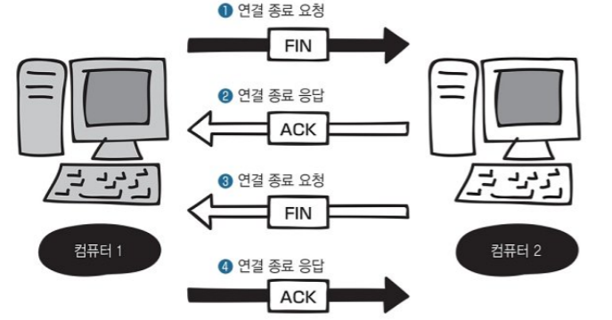

## 25. 일련번호와 확인 응답 번호의 구조

### 일련번호와 확인 응답 번호

3-way 핸드셰이크 이후 데이터를 전송할 때는 TCP 헤더의 **일련 번호**와 **확인 응답 번호**가 사용된다. 일련번호는 데이터가 몇 번째 데이터인지, 확인 응답번호는 몇 번째 데이터를 수신했는지 알려주는 역할로, 다음 데이터로 받았으면 하는 데이터의 첫 번째 바이트 번호를 보낸다.

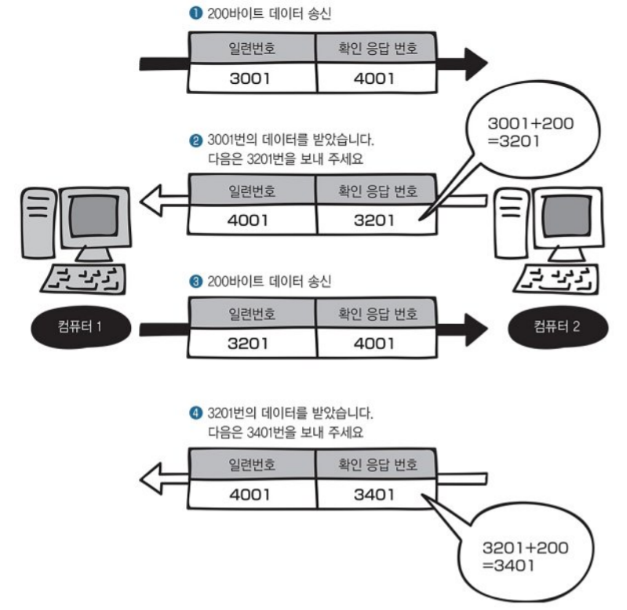

이 때, 데이터가 손상되거나 유실된 경우 데이터를 재전송하고, 이것을 **재전송 제어**라고 한다. 

### 윈도우 크기

세그먼트를 1개씩 보내면 비효율적이므로 세그먼트를 연속해서 보낸다. 수신한 세그먼트(데이터)를 일시적으로 저장하는 장소를 **버퍼**라고 한다. 데이터 크기가 버퍼 크기를 넘어서는 것을 오버플로라하고, 이를 막기 위해 버퍼의 한계 크기(버퍼 용량의 크기)인 **윈도우 크기**를 알아야한다. 때문에 3-way handshake때 윈도우 크기를 판단한다. 이렇게 윈도우 크기를 알면 데이터를 연속해서 보낼 수 있다.

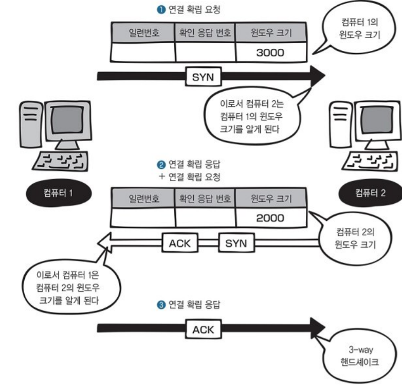

## 26. 포트 번호의 구조

**포트 번호**는 어떤 애플리케이션인지 구분하는 역할을 한다. 

포트 번호는 0~65535번을 사용한다. 0~1023번은 잘 알려진 포트(well-known ports)라고 하고 1025번 이후는 랜덤 포트라고 한다.

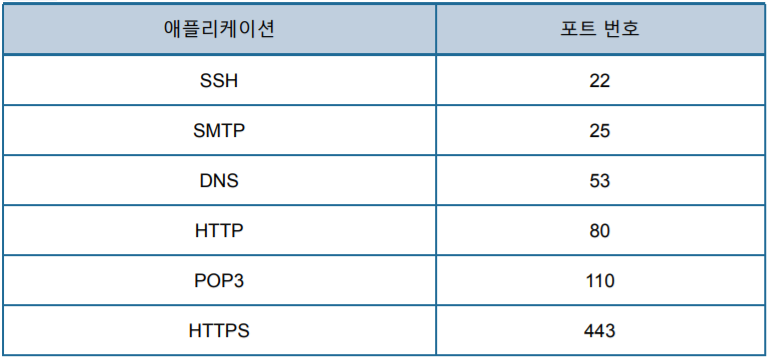

## 27. UDP의 구조

**UDP**는 데이터를 효율적이고 빠르게 보낼 때 사용되는 프로토콜로, 비연결형 통신이다.

UDP 헤더는 출발지 포트 번호, 목적지 포트 번호, 길이, 체크섬에 대한 정보를 갖고 있다. UDP 헤더가 있는 데이터를 **UDP 데이터그램**이라고 한다. 

UDP는 랜에서 불특정 다수에게 브로드캐스트로 데이터를 일괄 전송한다

# 7. 응용 계층 : 애플리케이션에 데이터 전송하기

OSI 7계층인 응용계층 이해하기

- 응용 계층의 역할
- 웹 서버의 구조
- DNS 이름 해석 구조
- 메일의 송수신 구조

## 28. 응용 계층의 역할

애플리케이션은 클라이언트(서비스를 요청하는 측), 서버(서비스를 제공하는 측)로 분류할 수 있다. 웹 브라우저, 메일 프로그램은 클라이언트, 웹 서버나 메일 서버 프로그램은 서버다. 이러한 애플리케이션들이 응용 계층에서 동작한다. 

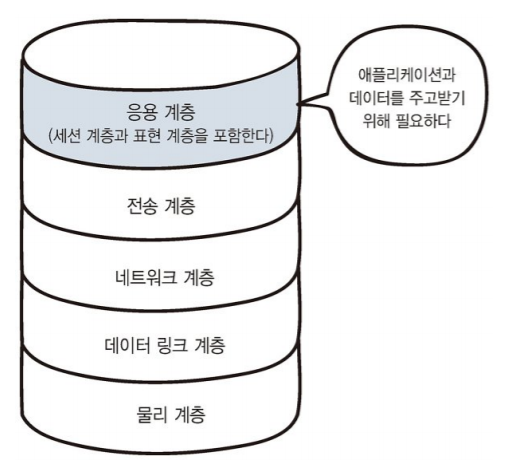

응용 계층에서는 클라이언트의 요청을 전달하기 위해 서버가 이해할 수 있는 메세지(데이터)로 변환하고 전송계층으로 전달하는 역할을 한다. 두 애플리케이션이 통신하려면 응용 계층의 프로토콜을 사용해야한다. 

- HTTP : 웹 사이트를 볼 때 사용. HyperText Transfer Protocol

- FTP : 파일을 전송할 때. File Transfer Protocol
- SMTP : 메일을 보낼 때. Simple Mail Transfer Protocol
- POP3 : 메일을 받을 때. Post Office Protocol version
- DNS : 이름 해석(name resolution, 컴퓨터나 네트워크 장비의 이름을 기반으로 IP 주소를 알아내는 것)을 위해. Domain Name System

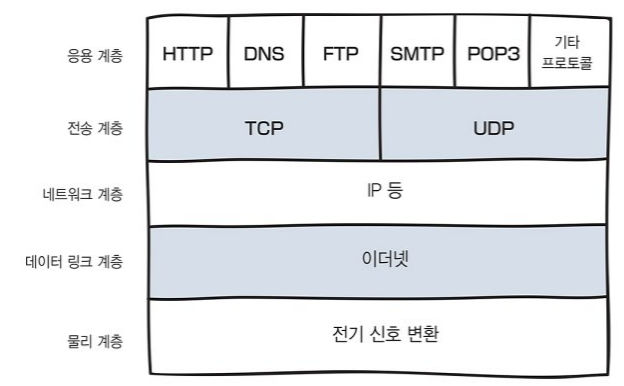

## 29. 웹 서버의 구조

웹(WWW)은 HTML, URL(Uniform Resource Locator), HTTP 라는 3가지 기술이 사용된다. HTML은 하이퍼텍스트(문자와 이미지 표시, 하이퍼링크 사용)를 작성하는 마크업 언어다.

HTTP 통신을 위해 클라이언트는 **서버의 80번 포트**를 사용한다. 클라이언트가 데이터를 요청할 때 GET이라고 하는 요청정보, 파일이름, 버전 등을 전송한다. 그러면 서버는 응답으로 OK라는 정보를 반환한다.

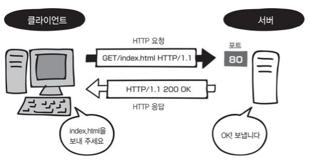

HTTP/1.0 버전에서는 요청을 보낼때마다 연결 수립, 연결 끊기를 반복했다. 

HTTP/1.1 버전에서는 **keepalive** 기능이 추가됐다. 한 번 연결을 수립하면 데이터 교환을 마칠 때까지 유지하고, 데이터 교환을 모두 끝내면 연결을 끊는 구조다. 

HTTP/2 버전은 1.1 버전의 단점을 보완했는데, 요청을 보낸 순서대로 응답을 반환하지 않아도 된다. 그래서 콘텐츠를 빠르게 표시할 수 있다. 아래는 HTTP/2 의 연결을 나타낸 그림이다.

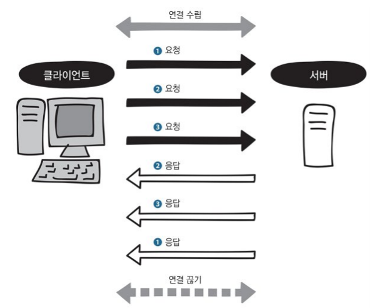

## 30. DNS 서버의 구조 (이름 해석)

DNS는 URL을 IP 주소로 변환하는 서비스(시스템)이다.

컴퓨터나 네트워크를 식별하기 위해 붙여진 이름을 **도메인 이름**이라 하고, 도메인 이름 앞에 있는 www는 **호스트 이름**(서버 이름)이다. 컴퓨터와 DNS 서버 사이의 통신 교환은 아래 순서와 같다.

1. 컴퓨터가 도메인의 IP 주소를 DNS 서버에게 묻는다.
2. DNS 서버는 해당 요청에 해당하는 도메인 이름의 IP 주소를 컴퓨터에게 알려준다.
3. 컴퓨터는 IP 주소로 서버에 접속한다.

DNS 서버는 전 세계에 흩어져있고, 모두 계층적으로 연결돼있다. 때문에 DNS 서버가 해당 도메인 이름의 IP 주소를 모르면 다른 DNS 서버에게 요청한다. 

## 31. 메일 서버의 구조 (SMTP, POP3)

SMTP는 메일을 보낼 때 사용하는 프로토콜로, 포트 번호 25번을 사용한다. 

POP3은 메일을 받는 데 사용되는 프로토콜로, 포트 번호 110번을 사용한다.

컴퓨터가 메일 서버를 이용하기 위해선 메일 프로그램에 **메일 서버의 호스트 이름**을 설정하면 된다.

SMTP 프로토콜에서 컴퓨터는 메일 서버에게 6가지 동작을 순서대로 진행한다. 메일 서버1도 메일 서버2에게 같은 방식으로 메일을 전송한다.

1. 세션 시작을 통지
2. 송신자의 메일 주소 통지
3. 목적지 메일 주소 통지
4. 메일 본문 전송 통지
5. 메일 본문 송신
6. 세션 종료 통지

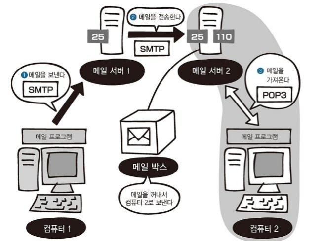

메일 서버에는 **메일 박스**라는 기능이 있다. 메일 서버는 POP3을 사용해 메일 서버의 메일 박스에서 메일을 가져와 컴퓨터에게 전송한다. 메일 수신할 때는 사용자 이름과 비밀번호를 이용한 **사용자 인증**이 필요하다.

1. 세션 시작 통지
2. 수신자의 사용자 이름 통지. 확인 응답 반환
3. 수신자의 비밀번호 통지. 확인 응답 반환
4. 메일 확인
5. 메일 전송 요청
6. 세션 종료 통지

### ping 명령

ICMP(Internet Control Message Protocol)라는 프로토콜을 사용하여 목적지 컴퓨터에 ICMP 패킷을 전송하고 **패킷에 대한 응답이 제대로 오는지 확인**하는 명령이다. ping 명령이 정상으로 실행되면 네트워크 연결이 정상이라고 판단할 수 있으므로 문제를 확인할 때 자주 사용한다.

# 8. 네트워크의 전체 흐름 살펴보기

총 정리다.

## 32. 랜 카드에서의 데이터 전달과 처리

OSI 7계층을 다음의 5개의 계층으로 나타낼 수 있다.

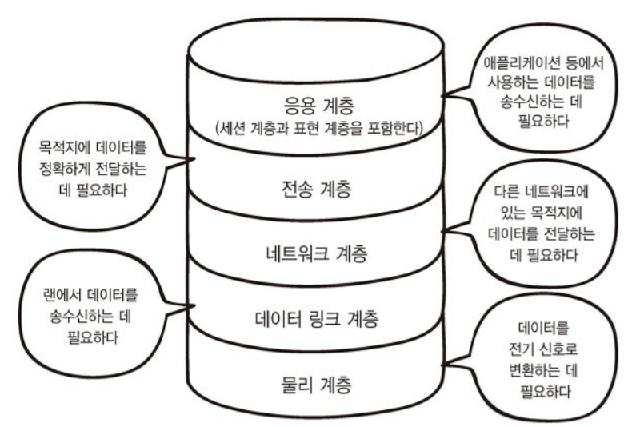

Chapter 8에서는 아래의 그림에서 네트워크 흐름을 분석할 것이다. 아래 그림에서 네트워크는 총 3개다. 

- 192.168.1.0/24
- 172.16.0.0/16
- 192.168.10.1/24

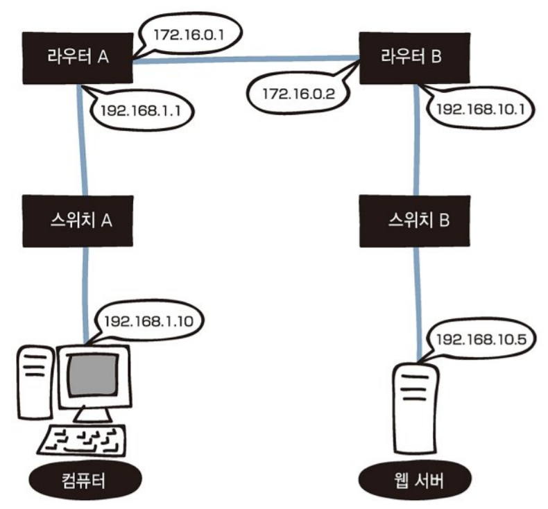

데이터가 위의 6개의 기계를 모두 거쳐가는 모습을 OSI 모델로 나타내면 아래와 같은 흐름이다. 3-way handshake는 이미 완료되어 연결이 확립됐다고 가정한다. 

컴퓨터뿐만 아니라 스위치, 라우터도 각각 OSI 계층이 있다. 7계층이 모두 있지 않을뿐이다.

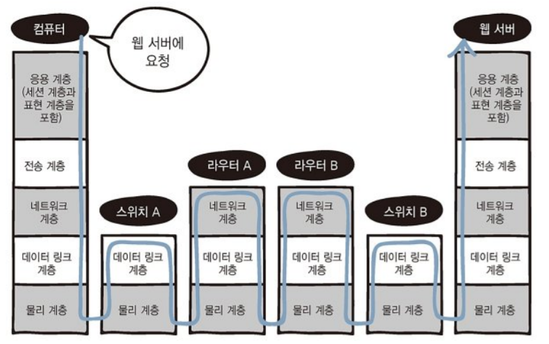

### 컴퓨터의 데이터가 전기신호로 변환

웹 서버에 요청을 보낼 때 HTTP를 사용한다.

`GET /index.html HTTP/1.1` 같은 메세지를 보낸다.

전송 계층에서 TCP헤더를 붙여 세그먼트를 만든다.

네트워크 계층에서 IP헤더를 붙여 IP 패킷을 만든다.

데이터링크 계층에서 이더넷 헤더와 트레일러(FCS)를 붙여 이더넷 프레임을 만든다.

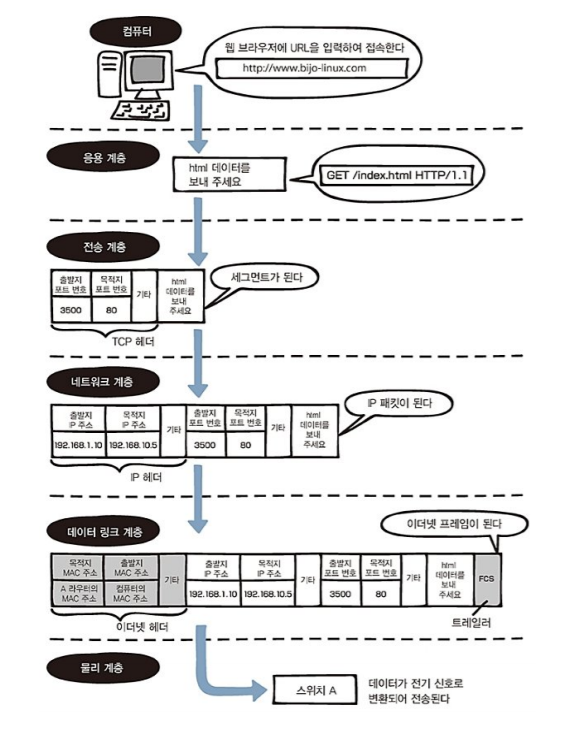

## 33. 스위치와 라우터에서의 데이터 전달과 처리

### 전기신호가 스위치를 거쳐서 나온다.

그냥 거쳐간다.

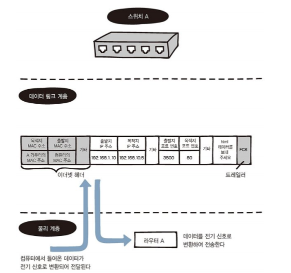

### 스위치에서 온 데이터가 라우터를 거쳐간다.

라우터A는 데이터 링크 계층에서 이더넷 프레임의 목적지 MAC 주소와 자신의 MAC 주소를 비교한다. 주소가 같으면 이더넷 헤더와 트레일러를 분리한다(역캡슐화). 

다음으로 네트워크 계층에서 자신의 라우팅 테이블과 목적지 IP주소를 비교한다. 이를 바탕으로 라우팅을 할 수 있다.

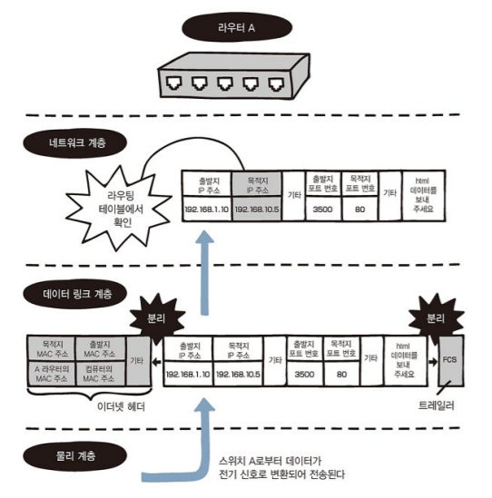

라우팅을 할 때는 출발지(컴퓨터 A) IP 주소를 라우터의 외부 IP 주소로 변경한다.

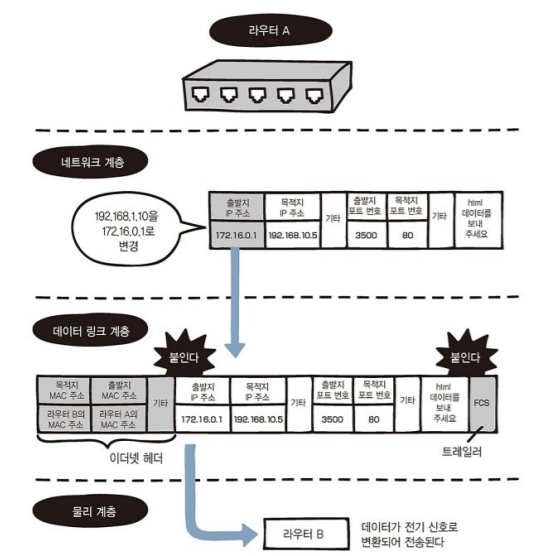

이제 라우터 B는 이더넷 프레임의 목적지 MAC 주소와 자신의 MAC 주소를 비교한다. 주소가 같으면 이더넷 헤더와 트레일러를 분리하고(역캡슐화), 네트워크 계층으로 전달되면 자신의 라우팅 테이블과 목적지 IP 주소를 비교한다. 

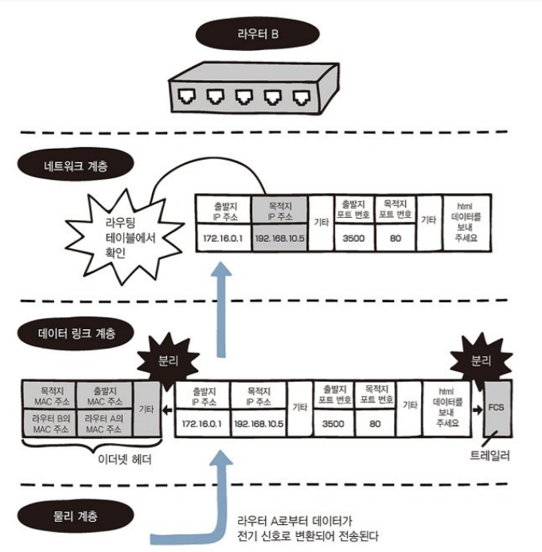

라우터 B의 라우팅 테이블을 확인하면 목적지 IP 주소의 경로를 알 수 있어 라우팅할 수 있다. 

출발지(라우터 A) IP 주소를 라우터 B의 내부(LAN 측)  IP주소인 192.168.10.1로 변경한다. 

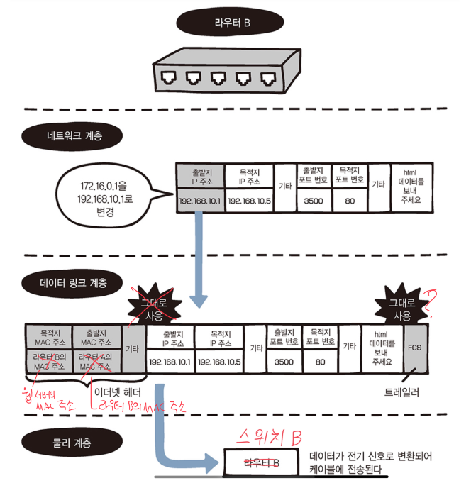

스위치 B에서는 전기 신호를 데이터 링크 계층에서 처리하고 웹 서버에 데이터를 전기신호로 전달한다.

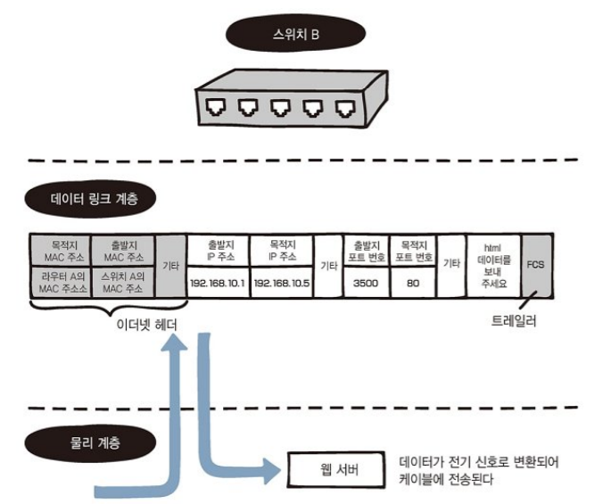

## 34. 웹 서버에서의 데이터 전달과 처리

웹 서버는 데이터 링크 계층에서 이더넷 프레임의 목적지 MAC 주 소와 자신의 MAC 주소를 비교한다. 주소가 같으면 이더넷 헤더와 트레일러를 분리하고 네트워크 계층에 전달한다.

네트워크 계층에서는 목적지 IP 주소와 웹서버의 IP 주소가 같으면 IP 헤더를 분리한다.

전송 계층에서는 목적지 포트 번호를 확인하여 어떤 애플리케이션으로 전달할지 판단하고, TCP 헤더를 분리해 응용 계층에 전달한다.

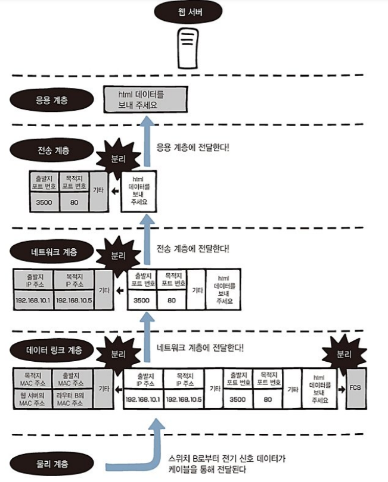

### 정적 라우팅과 동적 라우팅

**정적 라우팅**

관리자가 미리 라우팅 테이블에 경로를 수동으로 추가하는 방법이다. 목적지까지 경로를 고정하거나 경로가 하나로 한정되는 경우에 사용한다. 경로의 모든 목적지 네트워크의 정보를 라우터에 알려줘야하기때문에 소규모 네트워크에 적합하다. 보안 유지에 좋고 네트워크 장애에 취약하다.

**동적 라우팅**

네트워크 변경을 자동으로 감지하여 라우팅 테이블을 업데이트하고, 네트워크 장애시 최적의 경로로 전환하는 기능이 있다.  대규모 네트워크에 적합하다.

# 9. 무선 랜 이해하기

- 무선 랜의 연결 및 통신 구조
- 무선 액세스 포인트와 무선 클라이언트의 관계
- 무선 랜의 연결 형태
- 무선 랜의 규격
- 채널

## 35. 무선 랜의 구조

무선 랜을 사용하면 편리하지만 속도가 불안정하고 보안에 취약하다. 때문에 암호화나 인증 설정을 해둬야한다. 무선 랜은 **무선 액세스 포인트**(Wireless Access Point, WAP)와 **무선 클라이언트**(컴퓨터, 스마트폰 등)로 구성된다. 

컴퓨터가 무선 액세스 포인트와 통신하려면 **무선 랜 칩**과 **무선 랜 어댑터**가 필요하다. 무선 랜 어댑터에는 **USB 메모리 방식** 어댑터와 **컴퓨터 카드 방식** 어댑터가 있다.

보통 무선 공유기에 무선 액세스 포인트 기능이 포함돼있다. 기업같이 여러 층에 전파가 전달돼야하는 곳은 무선 액세스 포인트를 여러 대 설치한다.

무선 랜을 연결하는 방식은 2가지로 **인프라스트럭쳐(infrastructure)** 방식과 **애드혹(Ad Hoc)** 방식이 있다. infrastructure 방식은 무선 액세스 포인트를 통해 통신하는 방식이다.

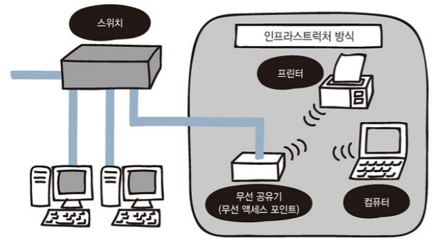

Ad Hoc 방식은 무선 클라이언트끼리 직접 통신하는 방식이다. 일반적으로는 인프라스트럭처 방식을 사용한다.

### 무선 랜 규격

무선 랜은 **IEEE802.11** 규격을 준수하는 기기로 구성돼있다. 미국기술 표준화 단체인 IEEE에서 승인한 무선랜의 표준화 기술로, 다양한 규격이 있다. (11ad/ac/n/a/g/b) 공유기와 클라이언트가 같은 규격을 지원해야 그 규격으로 통신할 수 있다. 무선 랜을 구성하는 장비 중, **무선 액세스 포인트**를 **무선 공유기** 또는 **무선 AP**라고 부른다.

## 36. SSID의 구조

무선 액세스 포인트와 무선 클라이언트를 연결하려면 혼선을 피하기 위해 SSID(Service Set IDentifier)라는 **액세스 포인트의 고유 이름**을 사용한다. 그리고 네트워크 이름, 인증, 암호화, 암호화 키를 설정해야한다. 그래야 무선 클라이언트가 자동으로 무선 액세스 포인트를 찾아 통신할 수 있다.

무선 액세스 포인트는 비컨(beacon)이라는 신호를 네트워크에 있는 모든 기기에 주기적으로 전송한다. 무선 클라이언트는 신호를 받아 자신의 SSID와 같은지 무선 액세스포인트에 문의한다. SSID를 서로 확인하고 인증설정이 완료되면, 클라이언트는 WAP에 연결을 요청한다.  

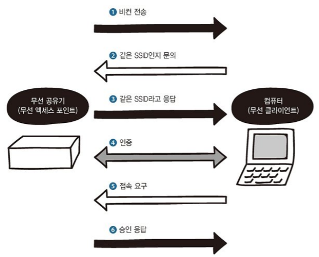

### 채널

WAP과 클라이언트가 멀어지는 것을 방지하기 위해 WAP를 여러 대 설치해야한다. 무선 랜은 여러 기기를 동시에 연결할 수 있도록 주파수 대역을 분할하는데, 그 주파수 대역을 **채널**이라고 부른다.

전파가 겹치는 무선 공유기들이 같은 채널로 설정돼있으면 주파수가 겹치면서 **전파 간섭**이 생겨 통신 속도가 느려진다. 

전파가 겹치는 WAP에 서로 다른 채널을 설정하면 문제가 없다. 같은 채널을 사용하면서 전파를 겹치지않게 하려면 거리를 떨어트려 설치해야한다. 

>  다른 규격이 다른 채널을 사용하더라도 간섭이 생길 수 있다. IEEE802.11b와 IEEE802.11g

WAP가 알아서 최적의 채널을 찾아준다. 무선 공유기의 설정은 웹브라우저로 확인할 수 있다.

