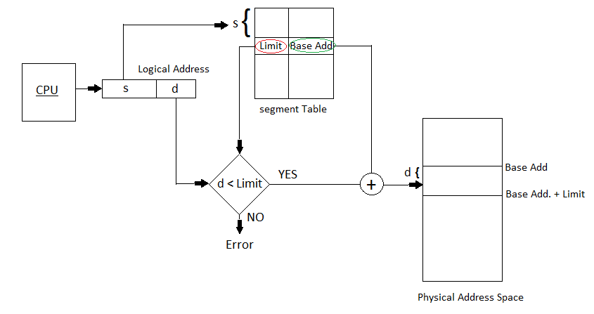

# Memory Management

[toc]

프로세스는 메모리에 올라갈 때 주소공간을 얻는다. 메모리상 실제 주소는 **Physical address**고, 프로세스마다 독립적으로 갖는 (0부터 시작하는) 주소 공간을 **logical address**(=virtual address)라고 하며, CPU는 이 logical address를 바라본다. 

프로세스의 물리적 주소가 결정되는 시점에 따라 3가지 방법이 존재한다. 

Compile time binding : 코드 컴파일 시 physical address가 결정된다. **absolute code**

Load time binding : 프로세스가 Loading될 때 물리적 메모리 주소를 부여한다. **relocatable code**

Execution time binding (=Runtime binding) : 프로세스 수행이 시작된 이후에도 프로세스의 메모리상 위치를 옮길 수 있다. CPU가 주소를 참조할 때 마다 binding을 점검(=주소 변환)한다. 이 때 MMU의 지원이 필요하다. 

## Memory-Management Unit (MMU)

MMU는 CPU 코어 안에 탑재되어 logical address를 physical address로 매핑해주는 하드웨어 디바이스다. 

연속 할당 방법을 사용할 때 MMU는 2개의 register를 갖고 있다.

- base register (=relocation register)
  - 프로세스의 physical memory의 시작 위치를 저장한다.
- limit register
  - 프로세스의 크기를 담고 있다. (에러 방지 기능)

> CPU가 프로세스의 346번지를 가리키면 MMU는 relocation register가 갖고있는 값 + 346에 해당하는 physical memory를 가리킨다. 만약 346이 limit register가 갖고있는 값보다 크면 trap 발생 (=error)

사용자 프로세스 영역을 메모리에 할당하는 방법은 크게 2가지로 분류된다.

# 연속 할당 (Contiguous allocation)

각각의 프로세스가 메모리에 **연속적인 공간에 적재**되도록 하는 것이다.

고정 분할 : 물리적 메모리를 partition으로 나눈다. 파티션마다 내부 단편화가 발생한다.

가변 분할 : 프로그램의 크기를 고려해 할당한다. 프로그램이 끝나면 그 자리에 외부 단편화 발생

가변분할 시 새로운 프로세스 요청이 들어오면, hole(가용 메모리 공간)중에서 어디에 넣는지 결정하는 문제를 dynamic storage-allocation problem이라고 한다.

## Dynamic Storage-Allocation Problem

First-fit : 크기가 맞는 hole중 처음 발견된 hole.

Best-fit : 크기가 맞는 hole중 프로그램의 크기와 가장 근접한 hole.

Worst-fit : 가장 큰 hole.

위처럼 발생한 외부 단편화 문제를 해결하는 방법으로 Compaction이 있다. 사용중인 메모리 영역을 한 군데로 몰고, hole들을 다른 한 곳으로 몰아 큰 block을 만드는 것이다. 비용이 많이 드는 작업으로, 디스크 조각 모음이 바로 compaction이다.

# 비연속 할당 (Non-contiguous allocation)

하나의 프로세스가 메모리의 여러 영역에 분산되어 올라가도록 할당하는 방법이다.

## Paging

프로세스의 가상 메모리를 동일한 사이즈의 page 단위로 나눠 일부는 backing storage, 일부는 physical memory에 저장한다. page table을 이용해 logical address를 physical address로 변환할 수 있다. 

외부 단편화가 발생하지 않는다! 하지만 프레임(주기억장치의 메모리 조각)을 채우지 못하는 내부 단편화는 여전히 발생할 수 있다. 

> 페이지 : 프로세스를 나눈 것. 프레임 : 메모리를 나눈 것. 페이지가 프레임에 들어간다. 

### Page table

메인 메모리에 상주한다. 배열로 구현돼있으며 index로 접근한다. 각 인덱스별로 물리적 주소 내 페이지의 위치가 존재한다. 

모든 메모리 접근연산에는 2번의 메모리 접근이 필요하다. (1. page table에 접근, 2. data instruction에 접근) 이렇게 2번 접근하면 속도가 느리기때문에 속도 향상을 위해 **associative register** (TLB)라는 고속의 하드웨어 캐시를 이용한다.

### TLB

Translation Look-aside Buffer (=Associative Registers). 주소변환을 위한 캐시메모리에 상주하고, page table중 일부만 존재한다. 

![빽 투더 기본기 [OS 7편]. 메모리 관리 2](images/img.jpg) 

Hit ratio(α)가 높을수록 Effective Access Time (EAT)가 낮아진다.

> EAT = (1+e)α + (2+e)(1-α) = 2 + e - α
>
> 여기서 e는 캐시메모리에 접근 + 탐색하는 시간으로, 매우 작은 값이다. 

## Segmentation

프로그램을 의미있는 단위로 자른다. 작게는 함수별, 크게는 프로그램 전체를 세그먼트로 정의한다. 일반적으로는 code, data, stack 영역으로 나눈다.

아래의 정보들을 이용해 세그멘테이션을 한다.

logical address : segment-number, offset. (몇 번째 세그멘트인지와 해당 세그멘트 안에서 변위 저장)

segment table : 각 entry의 base(physical address 시작위치)와 limit(segment 길이).

 

### 특징

Protection : 각 세그먼트별로 protection bit를 부여해 권한을 설정할 수 있다.

Sharing : segment는 의미 단위이기때문에 공유와 보안에 있어 paging보다 훨씬 효과적이다.

Allocation : segment의 길이가 동일하지않아 가변분할 방식에서와 동일한 문제점들이 발생한다. 

## Paged Segmentation

paging과 segmentation의 장점을 혼합해 1개의 segment를 여러 개의 page로 나누는 것이다. 메모리에 올라갈 때는 페이지 단위로 올라가 Allocation 문제가 생기지 않고, 의미 단위로 공유, 보안을 할 수 있다. 

## Demand Paging

Demand Paging이란, 페이지가 실제로 필요할 때 메모리에 올리는 것이다. 메모리의 사용량을 감소시키고, 빠른 응답시간이라는 장점을 얻을 수 있다.

물리적 메모리(Physical memory)에 페이지가 올라와있지 않는 경우를 **page fault**라고 한다. 이 때 OS에게 I/O 요청을 해(trap) Disk에서 페이지를 가져온다. 

## page fault

invalid page(물리적 메모리에 존재하지 않는 페이지)에 접근하면 MMU가 page fault trap을 발생시킨다. 커널모드에서는 다음과 같은 순서로 page fault를 처리한다.

1. 잘못된 접근이면 abort process. (bad address, protection violation)
2. 빈 프레임을 찾는다. (없으면 replace. 교체 알고리즘 적용)
3. 해당 페이지를 disk에서 찾아 메모리로 읽어온다.
   1. disk I/O가 되는동안 프로세스는 CPU를 선점(preempt)당한다. 즉, block 상태가 된다.
   2. 디스크 read가 끝나면 invalid를 valid로 표시한다.
   3. ready queue에 프로세스를 넣어준다. 
4. 프로세스가 CPU를 다시 얻어 running상태가 된다.
5. 중단됐던 instruction을 재개한다.

page fault시 엄청난 시간이 걸리기때문에 최대한 page fault가 적게 일어나도록 하는것이 중요하다.

# Page Replacement

위의 page fault 처리과정 중, free frame이 없는 경우 메모리의 프레임중 어떤 프레임을 빼앗아올지 결정해야한다. page-fault rate를 최소화하기 위한 다양한 페이지 교체 알고리즘들이 있다.

## Optimal

미래에 참조될 페이지를 알고있다는 가정 하, 가장 먼 미래에 참조되는 페이지를 쫓아내는 것이 가장 이상적이다. 

## FIFO

선입 선출. 먼저 들어온 것을 먼저 내쫓는다. 특이한 이상 현상이 존재하는데, 페이지 수를 늘렸는데 오히려 성능이 나빠지는 현상이다.

> Input : 1,2,3,4,1,2,5,1,2,3,4,5
>
> 3page -> 4page. 
>
> page faults : 9 -> 10

## LRU (Least Recently Used)

가장 오래전에 참조된 것을 지운다. 

Cache를 구현하기 위해 `HashMap<Integer, Node>` 과 `DoublyLinkedList<Node>`를 이용한다. HashMap의 크기를 저장하는 변수와 캐시의 최대 용량을 저장하는 변수도 이용하면 모든 작업을 O(1) 안에 처리할 수 있다. 

## LFU (Least Frequently Used)

가장 적게 참조된 페이지를 지운다. 참조 횟수가 기준이다.

LRU에 비해 page의 인기도를 반영한다는 장점이 있지만 참조 시점의 최근성을 반영하지는 못한다. LRU보다 구현이 복잡하다.

 `HashMap<Integer, Node>`와 `Heap<Node>`을 이용한다. Node에 조회된 횟수까지 저장해, 최소 힙에서 조회된 횟수가 적은 노드가 최상단에 위치하도록 만든다.

그런데!

운영체제는 커널모드로, 각 페이지 조회에 성공했을 때는 호출되지 않는다. 오직 page fault가 발생했을 때만 trap이 발생해 운영체제가 알기때문에, 그 전에 어떤 페이지들이 얼마나 호출됐었는지 정확히 알 수 없다. 그래서 위의 방법들을 대신하는 알고리즘들이 있다.

## Clock Algorithm

LRU Approximation Algorithm, NUR (Not Used Recently), NRU (Not Recently Used) 알고리즘으로도 불린다. 

Reference bit가 있는 circular list에서 교체 대상 페이지를 선정한다.

1. 어떤 페이지가 참조되면 reference bit를 0에서 1로 변경한다. (하드웨어가 해준다.)
2. 교체가 필요할 때 포인터가 움직이면서 reference bit를 하나씩 검사한다.
3. reference bit가 0인 것을 찾을 때까지 포인터를 이동시킨다. 이동 중 reference bit가 1인 것은 0으로 변경한다.
4. 0인 것을 찾으면 그 페이지를 교체한다.

# Page Frame Allocation

각 프로세스에 얼마만큼의 page frame을 할당하는지에 대한 문제다. 명령어 수행을 위해 최소한 할당돼야하는 frame의 수가 있다. 

Allocation 방법으로는 Equal allocation, proportional allocation (프로세스 크기에 비례해 할당), Priority allocation 등이 있다.

## Global, Local Replacement

프로세스마다 할당된 페이지가 있는데, 다른 프로세스가 그 페이지를 빼앗아올 수 있는지 여부에 따라 Global replacement, local replacement로 나뉜다. 

local replacement의 경우, FIFO, LRU, LFU 등의 알고리즘을 process별로 운영하고, global replacement의 경우에는 Working set, PFF를 고려한다.

Global replacement를 하다보면 thrashing이 발생할 수 있다.

## Thrashing

thrashing : 프로세스에게 page가 적게 할당돼 page fault rate가 증가되는 경우. CPU utilization이 낮아진다. 

CPU utilization이 낮아지면 OS는 CPU를 효율적으로 사용하기 위해 multiprogramming degree(MPD)를 높이는데, MPD가 어느 정도를 넘어가면 프로세스당 할당된 frame의 수가 더욱 감소되어 swap in/swap out 작업의 비율이 증가하고, MPD는 계속 증가하는 악순환이 반복된다. 

## Working Set

프로세스는 지역성(locality)이라는 특징이 있는데, 특정 시간동안 일정 장소만 집중적으로 참조하는 특징이다. 집중 참조되는 페이지들의 집합을 locality set이라고 한다. 

> 지역성에는 시간 지역성, 공간 지역성이 있다.

Locality에 기반해, 프로세스가 일정시간동안 원활하게 수행되기 위해 한꺼번에 메모리에 올라와있어야 하는 페이지들의 집합을 working set이라고 한다.

working set 모델에서는 프로세스의 워킹 셋 전체가 메모리에 올라와있어야 수행되고, 그렇지 않을 경우 모든 프레임을 반납하고 swap out된다.

## Working set Algorithm

working set을 결정하기 위해 working set window를 이용한다. window size = n, 시간 t에서 working set W(t)는 [t-n,t] 사이에 참조된 서로 다른 페이지들의 집합이다. 이 working set에 속한 page는 메모리에 유지하고, 속하지 않은 것은 버린다.

## Page Fault Frequency

Page fault를 많이 내는 프로그램에게 frame을 더 많이 주기 위해 page fault rate를 직접 본다. 반대로 page fault rate가 너무 안생기는 프로세스에서는 frame을 빼앗아간다. 