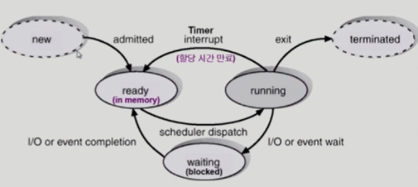
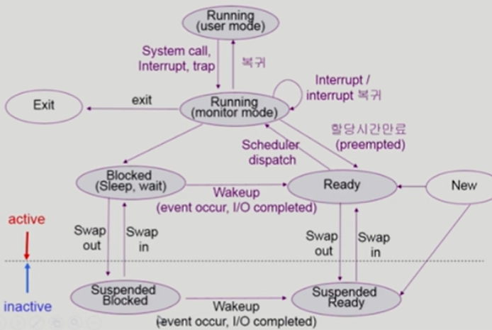
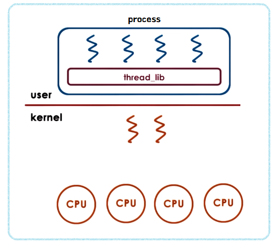

[toc]

# 프로세스

## 주소 공간

프로그램이 CPU에 의해 실행되면 프로세스가 생성되고, 메모리에 프로세스 주소 공간이 할당된다.

code : 소스 코드 자체를 구성하는 메모리 영역

data : 전역변수, 정적변수, 배열 (초기화된 데이터)

heap : 동적 할당 시 사용 (`new()`, `malloc()` 등)

stack : 지역변수, 매개변수, 리턴 값 (임시 메모리 영역)

프로세스는 적어도 1개의 Thread를 가진다.


## Context

프로세스의 문맥(context)은 프로세스에 대한 정보로, 하드웨어 문맥(Program Counter, register), 프로세스의 주소공간(code,data,stack), 프로세스 관련 커널 자료 구조(PCB, kernel stack)를 포함하고 있다.

PCB는 프로세스를 관리할 필요가 있는 정보를 포함하는 운영체제 커널의 자료구조다. 운영체제가 프로세스를 관리하기 위해 유지하는 프로세스의 정보다. 프로세스 생성 시 PCB가 생성되고, 프로세스가 완료되면 제거된다.


## 상태

프로세스는 상태가 변경되며 수행된다.

 

New : 생성중

Ready : CPU를 기다리는 상태. 메모리에 프로세스를 올려놓고 CPU가 instruction을 바로 실행할 수 있게 대기중.

Running : CPU를 잡고 instruction을 수행중인 상태.

> Running에서 빠져나오는 방법은 3가지다. I/O, Timer, Exit

Blocked(=wait, sleep) : I/O같은 오래 걸리는 작업을 하고 있어 CPU를 얻어도 소용없는 상태다. 프로세스가 요청한 이벤트가 즉시 만족되지않아 이를 기다리는 상태다.

Suspended(=stopped) : 외부적인 이유로 프로세스 수행이 정지된 상태. 디스크에 swap out된다. blocked는 event를 만족하면 ready가 되지만 suspended는 외부에서 resume해줘야 active된다. 

Terminated : 수행이 끝난 상태

 


## Context Switching

프로세스의 상태 정보를 저장하고 복원하는 일련의 과정.

즉, 동작 중인 프로세스가 대기하면서 해당 프로세스의 상태를 PCB에 보관하고, 대기하고 있던 다음 순번의 프로세스가 동작하면서 이전에 PCB에 보관했던 프로세스 상태를 복구하는 과정을 말한다.

> 프로세스는 각 독립된 메모리 영역을 할당받아 사용되므로, 캐시 메모리 초기화와 같은 무거운 작업이 진행되었을 때 오버헤드가 발생할 문제가 존재한다.


"프로세스 A -> 시스템콜 -> 프로세스 A" 의 경우, PCB에 프로세스 문맥을 저장하지만 context switching은 발생하지 않는다. "프로세스 A -> kernel mode -> 프로세스 B"의 경우는 문맥 교환이 발생해 오버헤드가 커진다. (cache memory flush 등)


# 프로세스 스케줄링

프로세스는 프로세스 큐들을 왔다갔다하면서 (놀이동산에서 놀이기구 줄 서듯이) 줄을 선다. 이 큐들은 커널의 data 영역에 존재하고, 프로세스 상태에 따라 CPU를 주거나 주지 않는다. 큐의 종류는 Ready Queue, Device Queues, Resource Queue 등이 있다. 

위의 큐에 존재하는 프로세스들의 작업 순서를 정해주는 일(스케줄링)이 필요한데 이 작업을 스케줄러가 해준다.

## 스케줄러

**Short-term scheduler** : CPU scheduler. 어떤 프로세스를 다음번에 running시킬지 결정한다. 

**Long-term scheduler** : Job Scheduler. New 상태의 프로세스를 ready queue로 보낼지 결정한다. (admit) 프로세스에 메모리를 주는 문제를 해결하고, 메모리에 프로그램을 몇 개 올릴 지 제어하는 역할을 한다. 근데 요즘(보통, time-sharing system)은 무조건 ready 상태로 보낸다. 

**Medium-term scheduler** : swapper라고도 불리며, 여유 공간 마련을 위해 프로세스를 통째로 메모리에서 디스크로 쫓아낸다. 


# 쓰레드

동일한 일을 하는 프로세스가 여러 개 있으면 메모리 낭비가 발생한다. 이 때 하나의 메모리를 띄우고, 프로세스마다 다른 부분의 코드를 실행하면 효율적인데 이 개념을 도입한게 thread다. 

**CPU 스케쥴링의 기본 단위**!!

프로세스의 주소공간 (stack, data, code) 중 data, code를 공유하고 stack만 따로 쓴다.

PCB에서 program counter와 register만 별도로 유지하고, 다른 부분을 공유한다.


## 특징

장점

1. 하나의 서버 스레드가 blocking 상태인 동안에도 동일한 태스크 내의 다른 스레드가 실행되어 빠른 처리가 가능하다.
2. 다중 스레드가 협력하여 높은 처리율과 성능 향상을 얻을 수 있다.


# PCB vs TCB

## PCB

PCB는 Process의 정보를 갖고 있는 자료구조다. Process ID와 상태, 우선순위, 메모리 정보 등을 저장한다. 멀티스레드가 아닌 멀티프로세스 환경에서는 PCB가 PC와 Register Set 정보도 포함한다. 

OS의 스케줄러에 의해 Context Switching되는 프로세스의 정보 단위다. 


## TCB

TCB는 PCB보다 적은 데이터를 가지는 자료구조이다. 해당 Thread에 대한 정보만 저장하면 되기 때문이다. Thread별로 존재하는 자료구조로, PC, Register Set, PCB Pointer를 갖고 있다.


[출처 : Teraphonia](https://teraphonia.tistory.com/802)


# Kernel Thread vs User Thread

아래 그림은 커널 쓰레드와 유저 쓰레드가 혼합된 모델이다. 아래의 커널 스레드마다 1개의 경량 프로세스(LWP, Light Weight Process)가 매핑돼있다.

  


## User Level Thread

사용자 레벨 스레드(User Thread)는 우리가 흔히 프로그래밍 과정에서 스레드를 코드에 적는 것을 말한다. (ex. Java의 Thread) 위 그림에서 프로세스에 4개의 쓰레드를 만든 것이 User Thread다. 

쓰레드 라이브러리의 스케줄러가 User Thread를 관리한다. 커널 쓰레드가 변경되지 않으면서 User Thread가 변경되는 일을 담당하고, 이 때는 쓰레드간 전환이 일어날때마다 커널 스케줄러를 호출할 필요가 없어 오버헤드가 적다. 

프로세스 1개(사용자 스레드 N개) 당 커널 스레드 1개가 할당된다. PCB는 커널에서 관리하고, **TCB는 프로세스 내에 저장**된다. 

User Level Thread만 사용할 경우, 동작중인 스레드가 시스템 콜을 하면 해당 프로세스 내 모든 스레드가 멈춘다. 프로세스 단위로 CPU가 할당되므로, 다중 CPU 환경에서 한 프로세스 내 쓰레드들을 동시에 실행할 수 없다. 

운영체제에 따른 영향을 덜 받기 때문에 이식성이 좋다.


## Kernel Level Thread

커널에서 멀티쓰레드 환경이라는 것을 인지하고, 쓰레드를 관리한다. System call이 발생해도 해당 thread만 block되어 wait_queue에 들어간다. 위 그림에서 2개의 커널 쓰레드가 생성된 것을 볼 수 있다.

OS 스케줄러는 커널 레벨 쓰레드를 관리한다. 각 커널 쓰레드가 어떤 쓰레드의 작업을 진행할 지 결정해주는 것이다. 

프로세스 내의 사용자 스레드 1개당 커널 스레드 1개가 할당된다. 

커널이 전체 TCB와 PCB를 관리한다. 이로 인해 시스템 콜 시, 커널이 모든 TCB와 PCB를 관리해야하므로 오버헤드가 크다.


## JVM에서 Thread

JVM은 User Level Thread를 이용하며, 내부적으로는 Kernel Level Thread로 1대1 매핑을 한다. 


# Thread-safe

쓰레드 안전은 멀티 쓰레드 프로그래밍에서 일반적으로 어떤 함수나 변수, 객체가 여러 쓰레드의 동시 접근이 이뤄져도 프로그램 실행에 문제가 없음을 뜻한다. 동일한 함수를 여러 쓰레드가 동시에 함께 실행해도 각 쓰레드에서의 함수 수행결과가 올바르게 나오는 것으로 정의한다.


보장 방법

1. Re-entrancy : 어떤 함수가 한 스레드에 의해 호출돼 실행중일 때, 다른 스레드가 그 함수를 호출해도 그 결과가 각각에게 올바르게 주어진다.
2. Thread-local storage : 공유 자원의 사용을 최대한 줄여 각각의 스레드에서만 접근 가능한 **저장소들**을 사용함으로써 동시 접근을 막는다. 
3. Mutual exclusion : **세마포어, 락** 등을 사용
4. Atomic operations : **원자적**으로 정의된 접근 방법을 사용함으로서 상호 배제를 구현한다.


# 프로세스 관리

## 생성

프로세스는 생성 시 자식이 부모의 공간을 복사한다. 자식은 그 공간에 새로운 프로그램을 올린다. 자원공유 형태에 따라 3가지로 나뉘는데, 부모와 자식이 모든 자원을 공유하는 모델, 일부 공유, 공유하지 않는 모델이 있다.

프로세스는 자원을 필요로하기 때문에 운영체제로부터 자원을 받고 부모와 이를 공유한다.


## 종료

프로세스는 자발적 종료와 강제 종료가 있다. 마지막 명령을 수행한 후, 운영체제에게 이를 알려주는 것(exit)이 자발적 종료다. 각종 프로세스의 자원들이 운영체제에게 반납된다. 부모 프로세스가 자식의 수행을 종료시키는 것(abort)이 강제 종료다. 


## 시스템 콜

1. fork()

2. exec()

3. wait()

4. exit()


**fork()**

프로세스는 fork에 의해 생성된다. 부모가 fork를 통해 자식 프로세스를 생성한다. 자식은 부모의 문맥을 그대로(fork()를 실행했다는 문맥까지) copy한다.

fork()의 결과값이 pid에 들어간다. 자식 프로세스는 fork()의 결과값이 0이다.

```c
int main(){
    int pid;
    pid = fork();
    if(pid==0) /* this is child*/
        // child logic
    else if(pid > 0) /* this is parent */
        // parent logic
}
```

똑같은 주소공간을 가진 2개의 프로세스가 생기는데, 실제로는 다른 프로그램을 실행할 수 있어야하는데 그래서 존재하는 것이 exec()이다.


**exec()**

exec() 시스템 콜에 의해 프로세스는 다른 프로그램을 실행할 수 있다. 프로세스를 새로 태어나게 만들어준다. 위의 `child logic` 부분에 아래 코드를 작성한다.

```c
execlp("/bin/date", "/bin/date", (char *) 0);
```

execlp 함수는 exec() 시스템 콜을 해준다. 부모가 자식을 만들어준다음 `/bin/date`라는 프로그램으로 덮어씌우는 과정이다. 


**wait()**

wait() 시스템 콜을 호출하면 자식이 종료될때 까지 기다린다.

1. 부모 프로세스를 sleep시킨다. (block)
2. child process가 종료되면 부모 프로세스를 깨운다. (ready)

 위의 `parent logic` 부분에 `wait()`을 작성한다.


**exit()**

호출 시 프로세스를 종료한다. 자발적 종료 시 사용된다. 


# IPC (Inter Process Communication)

프로세스는 다른 프로세스에게 영향을 받지 않고 독립적으로 실행된다. 프로세스 간의 통신을 해야하는 상황에 이를 돕는 것이 IPC 통신이다. 

프로세스는 커널이 제공하는 IPC 설비를 이용해 프로세스간 통신을 할 수 있게 된다.


1. 익명 PIPE : 통신할 프로세스를 명확히 알 수 있는 경우, 두 개의 프로세스를 연결하는 파이프를 이용한다. 하나의 프로세스는 데이터를 쓰기만, 하나는 읽기만 할 수 있다. 단순한 데이터 흐름에서 효율적이다.
2. Named PIPE : 전혀 모르는 상태의 프로세스들 사이 통신에 사용한다. 
3. Message Queue : 메세지 큐는 메모리 공간이다. 파이프처럼 데이터 흐름이 아니기때문에 여러 프로세스가 동시에 데이터에 번호로 접근할 수 있다.
4. 공유 메모리 : 데이터 자체를 공유하도록 지원하는 설비다. 프로세스간 메모리 영역을 공유해 사용할 수 있도록 허용해준다. IPC중에서 가장 빠르게 작동한다.
5. 메모리 맵 : 메모리를 공유하는 방식으로, 열린 파일을 메모리에 맵핑시켜 공유하는 방식이다. 
6. 소켓 : 클라이언트와 서버가 소켓을 통해 통신하는 구조로, 원격에서 프로세스간 데이터를 공유할 때 사용한다.

