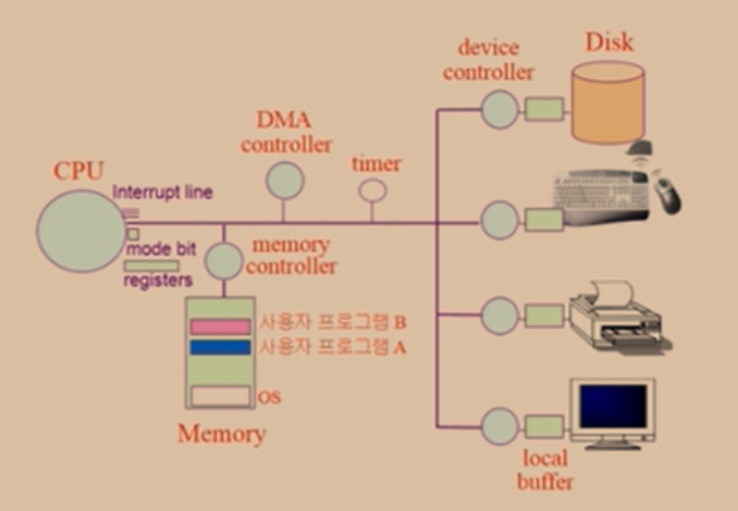

# 운영체제

일반적으로  `하드웨어를 관리하고, 응용 프로그램과 하드웨어 사이에서 인터페이스 역할을 하며 시스템의 동작을 제어하는 시스템 소프트웨어`라고 정의한다.

1. CPU, 프로세서, 기억장치, 입출력 장치 등을 효율적으로 관리한다. (하드웨어 관리)
    - 사용자 간의 형평성 있는 자원 분배
    - 주어진 자원으로 최대한의 성능 내기
    - 사용자 및 운영체제 자신의 보호
    - 프로세스, 파일, 메세지 관리

2. 컴퓨터시스템을 편리하게 사용할 수 있는 환경 제공 (인터페이스 역할, 시스템의 동작 제어)
   - 여러 사용자, 프로그램들이 각각 독자적 컴퓨터에서 수행되는것 같은 환상을 제공
   - 하드웨어를 직접 다루는 복잡한 부분을 대행

# 컴퓨터 시스템 구조

CPU

- CPU는 1개다. 누구한테 줄 지 CPU 스케줄링을 통해 결정한다.

- 매 클럭마다 메모리에서 instruction을 하나씩 읽고 실행한다.
- 매번 프로그램 카운터가 가리키고있는 곳의 명령을 수행한 뒤, 다음 명령을 수행하기 직전에 interrupt line이 세팅되었는지 체크한다.

메모리

- CPU가 잘 처리할 수 있게 준비하는 곳. 
- 한정된 메모리를 분배하는 것이 중요하다.

디스크

- 파일 관리. 파일을 어떻게 보관할지, 어떻게 파일을 빨리 읽을지 고민한다.

Device Controller

- 키보드, 디스크 등 메모리가 아닌 곳에서 CPU에게 요청하기 위해 디바이스마다 device controller가 존재한다. 해당 device가 일을 다하면 CPU에게 interrupt를 날린다.
- device controller가 작업하는 공간, 즉 device마다 존재하는 별도의 작업공간이 local buffer다.

Interrupt Line

- 각종 interrupt들이 기록돼있다. 
- CPU는 작업중인 instruction이 끝날때마다 interrupt line을 확인하고, interrupt가 있으면 OS에게 CPU 제어권을 넘긴다. 
- 이 때 mode bit 값이 변환된다. (0 : kernel mode, 1 : user mode)

Timer

- 프로그램들에게 시간을 할당해준다. CPU가 독점되는것을 방지한다. 
- Timer도 Interrupt line에게 신호를 보낸다.

DMA (Direct Memory Access)

- CPU에게 interrupt가 너무 많이 들어와 overhead가 크기때문에, 중간에서 interrupt를 한 번 실행해 메모리에 올려놓는다.
- local buffer에서 쌓인 작업량이 어느정도 채워지면 그 때 메모리로 보내고 interrupt를 날린다.
- 메인메모리에 DMA와 CPU 둘 다 접근할 수 있기 때문에, 메모리 컨트롤러는 CPU와 DMA 사이의 교통정리 역할을 한다.

# 동기 vs 비동기

동기 (Synchronous)

동시에 일어난다는 뜻으로, 요청과 그 결과가 동시에 일어난다는 약속이다. **동시에**라는 말은, 실행됐을 때 값이 반환되기 전까지 block 돼있다는 것을 의미한다. 바로 요청을 하면 시간이 얼마가 걸리던지 요청한 자리에서 결과가 주어져야 한다. 결과가 주어질 때까지 아무것도 못하고 대기해야한다.

내가 직접 빨래를 마치고, 이후에 설거지 끝낸 뒤 청소를 한다.

비동기 (Asynchronous)

동시에 일어나지 않는다는 의미다. 요청과 결과가 동시에 일어나지 않을 것이라는 약속이다. 요청한 그 자리에서 결과가 주어지지 않는다. 비동기의 경우 block되지않고 이벤트 큐에 넣거나 백그라운드 스레드에게 해당 task를 위임하고 다음 코드를 실행한다. 방식은 더 복잡하지만 자원을 효율적으로 사용할 수 있다.

빨래는 빨래 업체에, 설거지는 설거지 대행 업체에, 청소는 청소 대행 업체에 맡겼기때문에 어떤 것이 먼저 완료될지는 모른다. 다른 업체에 맡겼으니 그동안 나는 다른 작업을 할 수 있다. 

# 인터럽트

CPU에게 어떤 사실을 알려주거나 CPU의 서비스를 요청해야할 경우, CPU 내에 있는 interrupt line을 세팅하여 인터럽트를 발생시킨다. 

1. 하드웨어 인터럽트
   - 하드웨어 컨트롤러가 CPU의 서비스를 요청하기 위해 발생시키는 인터럽트
2. 소프트웨어 인터럽트 (Trap)
   - 예외 상황
   - 시스템 콜 : 사용자 프로세스가 OS의 서비스를 요청하기 위해 커널의 함수를 호출하는 것

인터럽트 처리 과정

CPU가 실행중인 A 프로그램이 인터럽트를 발생시키면 A는 현재 수행중인 명령의 위치를 저장한다. 이 때 A 프로세스의 정보를 PCB(Process Control Block)에 저장한다. 인터럽트 처리가 끝나면 프로그램 A의 PCB에 저장된 주소를 복원시킨다.

# 멀티프로세스와 멀티쓰레드

# 프로세스 주소 공간

code

data

stack

# Context Switching

PCB에 프로세스 정보 저장

오버헤드 : 캐시 메모리

# 시스템 콜 함수

fork()

exec()

wait()

exit()

# IPC (Inter Process Communication)

---

참고자료

- [반효경 교수님의 운영체제 강의 정리](https://www.notion.so/yyj/OS-103231d659124eabaad0346c0a0613e3)

- [WooVictory Github](https://github.com/WooVictory/Ready-For-Tech-Interview)

- [gyoogle Github](https://github.com/gyoogle/tech-interview-for-developer)

