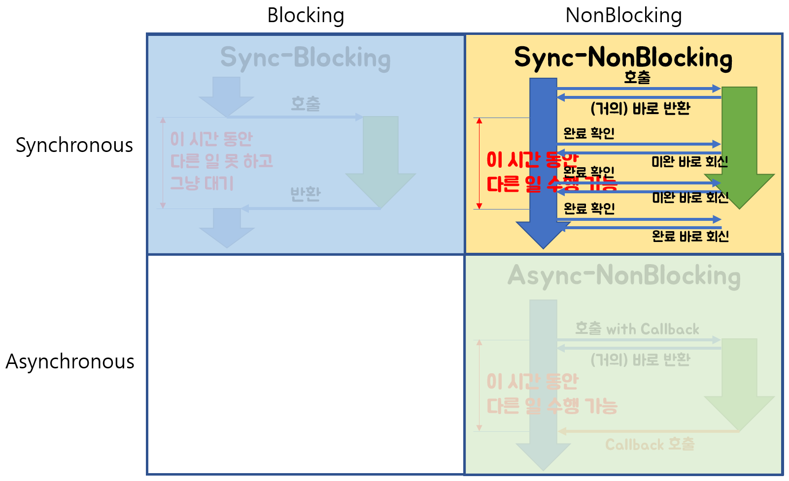

[toc]


# 운영체제

일반적으로  `하드웨어를 관리하고, 응용 프로그램과 하드웨어 사이에서 인터페이스 역할을 하며 시스템의 동작을 제어하는 시스템 소프트웨어`라고 정의한다.

1. CPU, 프로세서, 기억장치, 입출력 장치 등을 효율적으로 관리한다. (하드웨어 관리)
    - 사용자 간의 형평성 있는 자원 분배
    - 주어진 자원으로 최대한의 성능 내기
    - 사용자 및 운영체제 자신의 보호
    - 프로세스, 파일, 메세지 관리

2. 컴퓨터시스템을 편리하게 사용할 수 있는 환경 제공 (인터페이스 역할, 시스템의 동작 제어)
   - 여러 사용자, 프로그램들이 각각 독자적 컴퓨터에서 수행되는것 같은 환상을 제공
   - 하드웨어를 직접 다루는 복잡한 부분을 대행


# 인터럽트

CPU에게 어떤 사실을 알려주거나 CPU의 서비스를 요청해야할 경우, CPU 내에 있는 interrupt line을 세팅하여 인터럽트를 발생시킨다. 

1. 하드웨어 인터럽트
   - 하드웨어 컨트롤러가 CPU의 서비스를 요청하기 위해 발생시키는 인터럽트
2. 소프트웨어 인터럽트 (Trap)
   - 예외 상황
   - 시스템 콜 : 사용자 프로세스가 OS의 서비스를 요청하기 위해 커널의 함수를 호출하는 것


## 인터럽트 처리 과정

CPU가 실행중인 A 프로그램이 인터럽트를 발생시키면 A는 현재 수행중인 명령의 위치를 저장한다. 이 때 A 프로세스의 정보를 PCB(Process Control Block)에 저장한다. 인터럽트 처리가 끝나면 프로그램 A의 PCB에 저장된 주소를 복원시킨다.


# 커널

프로그램이 실행되면 프로세스가 생성되고 메모리를 얻고, 프로그램이 종료되면 메모리에서 사라진다. 다른 프로세스들과 달리 **커널 영역**은 항상 메모리에 상주해있다. 

## 주소 공간

커널 주소 공간은 code, data, stack으로 구성돼있다.

code : 커널 코드 (시스템콜, 인터럽트 처리 코드 / 자원 관리 코드 등)

data : PCB 등.

stack : 프로세스들의 커널 스택


# 캐시

캐시는 CPU 칩 안에 들어가는 작고 빠른 메모리다. 캐시에 자주 사용하는 데이터를 담아두고, 프로세서가 메인 메모리 대신 캐시에 접근하도록 하여 처리속도를 높이는 것이 캐시의 목적이다.


## 지역성

캐시 메모리를 효과적으로 사용하기 위해선 CPU가 어떤 데이터를 원할지 예측하는 능력이 중요하다. 이에 지역성(locality)이라는 용어가 등장한다. 지역성은 시간 지역성, 공간 지역성이 있다.


시간 지역성 : 최근에 접근한 데이터에 다시 접근하는 경향. (for문의 i)

공간 지역성 : 최근에 접근한 데이터의 주변 공간에 다시 접근하는 경향. 메모리에 순서대로 할당되기때문.


## 성능

캐시의 성능을 측정할 때는 hit latency와 miss latency를 이용한다.

CPU가 요청한 데이터가 캐시에 존재하면 캐시 Hit. 즉, hit latency = 캐싱된 데이터 가져올 때 소요되는 시간

CPU가 요청한 데이터가 캐시에 존재하지 않으면 캐시 Miss. 상위 캐시에서 데이터를 가져오거나 메모리에서 데이터를 가져올 때 소요되는 시간을 Miss latency.


# Block/NonBlock/동기/비동기

Block, NonBlock, 동기, 비동기

 

블록/논블록 : 호출되는 함수가 **바로 return하느냐 마느냐**가 관심사다. 호출한 입장에서의 특징.

동기/비동기 : 호출되는 함수의 **작업 완료 여부를 누가 신경쓰느냐**가 관심사다. 처리되는 방식의 특징.


## Block

호출된 함수가 자신의 작업을 모두 마칠 때까지 호출한 함수에게 **제어권**을 넘겨주지 않고 대기하게 만든다.


## Non-block

호출된 함수가 바로 호출한 함수에게 **제어권**을 넘겨준다.  이 때 결과값을 return하지 못하면 "아직 연산이 완료되지 않았음"이라는 상태를 return한다. 


## 동기 (Synchronous)

호출한 함수가 호출된 함수의 return을 기다리거나, 작업 완료 여부를 호출한 함수 스스로 확인하며 신경쓴다면 동기다.

결과값 전달 시간과 제어권 반환 시간을 일치시키는 것이다.


>  동시에 일어난다는 뜻으로, 요청과 그 결과가 동시에 일어난다는 약속이다. **동시에**라는 말은, 실행됐을 때 값이 반환되기 전까지 block 돼있다는 것을 의미한다. 바로 요청을 하면 시간이 얼마가 걸리던지 요청한 자리에서 결과가 주어져야 한다. 결과가 주어질 때까지 아무것도 못하고 대기해야한다.
>
> 내가 직접 빨래를 마치고, 이후에 설거지 끝낸 뒤 청소를 한다.


## 비동기 (Asynchronous)

호출한 함수가 호출된 함수의 작업 완료 여부를 신경쓰지 않으면 비동기다.

결과값 전달 시간과 제어권 반환 시간을 일치시키지 않는다.

> 동시에 일어나지 않는다는 의미다. 요청과 결과가 동시에 일어나지 않을 것이라는 약속이다. 요청한 그 자리에서 결과가 주어지지 않는다. 비동기의 경우 block되지않고 이벤트 큐에 넣거나 백그라운드 스레드에게 해당 task를 위임하고 다음 코드를 실행한다. 방식은 더 복잡하지만 자원을 효율적으로 사용할 수 있다.
>
> 빨래는 빨래 업체에, 설거지는 설거지 대행 업체에, 청소는 청소 대행 업체에 맡겼기때문에 어떤 것이 먼저 완료될지는 모른다. 다른 업체에 맡겼으니 그동안 나는 다른 작업을 할 수 있다. 


## Examples

동기 = 전화로 물어봐서 즉답을 얻는다.

비동기 = 이메일로 물어봤지만 답이 언제 올지 모른다. 

동기 + 블록 = 전화를 해서 상대가 전화 받을때까지 기다린다.

동기 + 논블록 = 전화했는데 안받아서 바로 끊는다. 나중에 다시 전화한다. 받을때까지 반복한다. 상대가 안바쁠때 전화를 받는다.

비동기 + 논블록 = 전화했는데 안받아서 바로 끊음. 상대가 안바쁠때 직접 전화한다.

> 비동기 + 블록은 잘 쓰이지 않는다. 의도치 않게 비동기+논블록이 비동기+블록이 되어버리는 경우가 있는데 Node.js + MySQL이라고 한다.
>
> Nonblock + Async 방식에서 과정 중 하나라도 Block으로 동작한다면 의도치않게 Block + Async로 동작할 수 있다.


### Code

제어권과 결과값을 동시에 반환하면 동기다. 호출된 함수가 작업이 아직 안끝났는데 제어권을 반환하면 논블록이다. 아래 코드의 경우, factorial 연산이 끝나지 않아도 제어권을 main에게 넘겨주어서 `Not finished yet`이라는 문구가 계속 출력된다.

그리고 코드의 각 부분이 동기 또는 비동기, 블로킹 또는 논블로킹이 다 다르기때문에 전체가 동기/논블로킹이다 라는 식으로 단정짓긴 어렵다.


```java
import java.util.concurrent.ExecutionException;
import java.util.concurrent.ExecutorService;
import java.util.concurrent.Executors;
import java.util.concurrent.Future;

public class SyncNonblock {
	public static void main(String[] args) throws InterruptedException, ExecutionException {
		ExecutorService threadpool = Executors.newCachedThreadPool();
        // factorial 연산 : 비동기/논블로킹
		Future<Long> futureTask = threadpool.submit(()-> factorial(20));
		
        // 동기적으로 물어봄
		while(!futureTask.isDone()) {
			System.out.println("Not finished yet"); // 비동기
		}
		
		long result = futureTask.get(); // 동기/블로킹
		System.out.println("result : "+result);
		threadpool.shutdown();
	}
	
	static long factorial(int n) {
		long res = 1;
		if(n<1) return res;
		for(int i=1; i<=n; i++) {
			res *= i;
		}
		
		return res;
	}
}

```


---

참고자료

- [반효경 교수님의 운영체제 강의 정리](https://www.notion.so/yyj/OS-103231d659124eabaad0346c0a0613e3)

- [WooVictory Github](https://github.com/WooVictory/Ready-For-Tech-Interview)

- [gyoogle Github](https://github.com/gyoogle/tech-interview-for-developer)

