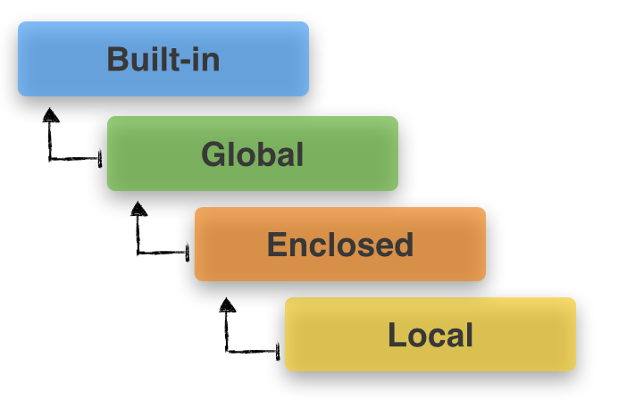

# Function

## 일급 객체(First-class Function)

파이썬에서 함수는 일급 객체다. 이는 우리가 평소에 숫자나 문자열, 클래스를 다루는 것처럼, 함수도 다른 객체와 동일하게 취급할 수 있다는 말과 같다. 

즉, 함수를 매개변수로 넘기거나 다른 변수에 대입할 수 있으며, 반환값으로도 사용이 가능하다. 심지어 리스트나 사전과 같은 자료구조에 저장할 수도 있습니다.

```python
def callf(func):
	return func()

def say_hi():
	return "안녕"

callf(say_hi)
# 안녕
```

```python
def add(a, b):
	return a + b
def substract(a, b):
	return a - b
def multiply(a, b):
	return a * b
def divide(a, b):
	return a / b

func_lst = [add, substract, multiply, divide]
a = int(input("a의 값을 입력하세요: "))
b = int(input("b의 값을 입력하세요: "))
for func in func_lst:
	print(func.__name__, ":", func(a, b))
```

## 중첩 함수 (Nested Function)

내부함수(Inner function)이라고도 불리는 중첩 함수는, def로 시작하는 함수 안에 또 다른 하나의 def로 시작하는 함수를 정의할 때 함수 안에 선언된 또 다른 함수를 말한다.

중첩 함수는 자기가 속한 원래 함수의 매개변수를 받아 사용할 수 있으며 최종 결과값을 반환하도록 한다.

 

```python
def outer_func():
	print('call outer_func')

	# 중첩 함수 정의
	def inner_func():
		return 'call inner_func'

	# 중첩 함수 호출
	print(inner_func())

outer_func()
# call outer_func
# call inner_func
```

### nonlocal

내부 함수가 외부 함수의 지역변수의 값을 다시 할당하려고 할 때, 동일한 변수명을 그대로 사용하면 외부 함수의 지역변수를 찾지 못한다. 이 문제를 해결하기 위해 nonlocal을 선언해줘야한다.

```python
def outer():
	a = 10
	def inner():
		nonlocal a
		a += 10
		print('a :', a)
	inner()

outer()
# a : 20
```

## 클로저 (Closure)

컴퓨터 언어에서 클로저는 일급 객체 함수의 개념을 이용하여 스코프에 묶인 변수를 바인딩 하기 위한 일종의 기술이다.

클로저는 내부 함수가 메모리에 존재하지 않는 경우에도, 호출될 때 주변 환경을 기억한다.

```python
def start_at(x):
	def increment_by(y):
		return x + y
	return increment_by

closure1 = start_at(1)
closure2 = start_at(2)

print("closure1:", closure1(3))
# closure1: 4

print("closure2:", closure2(4))
# closure2: 6
```

## 스코프(scope)

함수는 코드 내부에 공간(scope)를 생성합니다. 함수로 생성된 공간은 `지역 스코프(local scope)`라고 불리며, 그 외의 공간인 `전역 스코프(global scope)`와 구분됩니다.

* **전역 스코프(`global scope`)**: 코드 어디에서든 참조할 수 있는 공간
* **지역 스코프(`local scope`)**: 함수가 만든 스코프로 함수 내부에서만 참조할 수 있는 공간


* **전역 변수(`global variable`)**: 전역 스코프에 정의된 변수
* **지역 변수(`local variable`)**: 로컬 스코프에 정의된 변수


### 이름 검색(resolution) 규칙

파이썬에서 사용되는 이름(식별자)들은 이름공간(namespace)에 저장되어 있습니다.

이것을, `LEGB Rule` 이라고 부르며, 아래와 같은 순서로 이름을 찾아나갑니다.

* `L`ocal scope: 정의된 함수


* `E`nclosed scope: 상위 함수 


* `G`lobal scope: 함수 밖의 변수 혹은 import된 모듈


* `B`uilt-in scope: 파이썬안에 내장되어 있는 함수 또는 속성

### Scoping rule


Local, Enclosed, Global, Built-in

Local : 함수 내부의 공간

Global : 함수 외부의 공간

Built-in : 파이썬 자체에서 정의된 공간

Enclosed : 자신을 둘러싸는 상위 범위. 이 범위는 중첩 함수나 람다에서 나타나는데, 자신을 둘러싸는 상위 범위는 내부함수 기준으로 외부함수의 범위를 말한다고 본다.

```python
a = 1 # global
def outer():
	b = 2 # outer 함수 기준으로는 local, inner 함수 기준으로는 enclosed
	def inner():
		c = 3 # inner 함수 기준으로는 local
		print(a, b, c)
	inner()

```

### 변수의 수명주기(lifecycle)

변수의 이름은 각자의 `수명주기(lifecycle)`가 있습니다.

* **빌트인 스코프`(built-in scope)`**: 파이썬이 실행된 이후부터 영원히 유지


* **전역 스코프`(global scope)`**: 모듈이 호출된 시점 이후 혹은 이름 선언된 이후부터 인터프리터가 끝날때 까지 유지


* **지역(함수) 스코프`(local scope)`**: 함수가 호출될 때 생성되고, 함수가 가 종료될 때까지 유지 (함수 내에서 처리되지 않는 예외를 일으킬 때 삭제됨)


## 가변 인자

### 가변(임의) 인자 리스트(Arbitrary Argument Lists)

앞서 설명한 `print()`처럼 개수가 정해지지 않은 임의의 인자를 받기 위해서는 가변 인자 리스트`*args`를 활용합니다. 

가변 인자 리스트는 `tuple` 형태로 처리가 되며, 매개변수에 `*`로 표현합니다. 

---

**활용법**

```python
def func(a, b, *args):
```
> `*args` : 임의의 개수의 위치인자를 받음을 의미
> 
> 보통, 이 가변 인자 리스트는 매개변수 목록의 마지막에 옵니다.

### 가변(임의) 키워드 인자(Arbitrary Keyword Arguments)

정해지지 않은 키워드 인자들은 **`dict`** 형태로 처리가 되며, `**`로 표현합니다. 

보통 `kwagrs`라는 이름을 사용하며, `**kwargs`를 통해 인자를 받아 처리할 수 있습니다.

---

**활용법**

```python
def func(**kwargs):
```
> `**kwargs` : 임의의 개수의 키워드 인자를 받음을 의미


dictionary 클래스를 만들 때 사용하는 dict() 함수가 아래와 같이 구성돼있다. 
```python
class dict(**kwarg):
class dict(mapping, **kwarg):
class dict(iterable, **kwarg):

```

따라서 딕셔너리 생성을 아래와 같이 할 수 있다.

```python
dict(name='홍길동', age='1000')

# 주의사항
# 식별자는 숫자만으로는 이루어질 수가 없다.(키워드인자로 넘기면 함수 안에서 식별자로 쓰이기 때문)
dict(1='1', 2='2')

# 위의 경우 다음과 같이 사용해야 한다.
dict(((1, 1), (2, 1)))
```