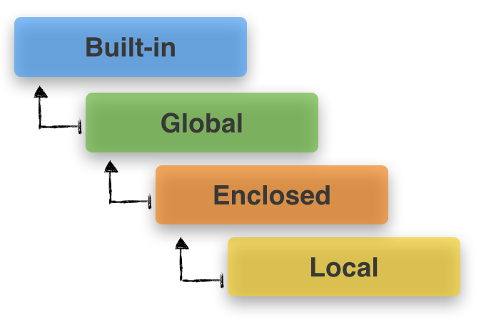

# Function

## 일급 객체(First-class Function)

파이썬에서 함수는 일급 객체다. 이는 우리가 평소에 숫자나 문자열, 클래스를 다루는 것처럼, 함수도 다른 객체와 동일하게 취급할 수 있다는 말과 같다. 

즉, 함수를 매개변수로 넘기거나 다른 변수에 대입할 수 있으며, 반환값으로도 사용이 가능하다. 심지어 리스트나 사전과 같은 자료구조에 저장할 수도 있습니다.

```python
def callf(func):
	return func()

def say_hi():
	return "안녕"

callf(say_hi)
# 안녕
```

```python
def add(a, b):
	return a + b
def substract(a, b):
	return a - b
def multiply(a, b):
	return a * b
def divide(a, b):
	return a / b

func_lst = [add, substract, multiply, divide]
a = int(input("a의 값을 입력하세요: "))
b = int(input("b의 값을 입력하세요: "))
for func in func_lst:
	print(func.__name__, ":", func(a, b))
```

## 중첩 함수 (Nested Function)

내부함수(Inner function)이라고도 불리는 중첩 함수는, def로 시작하는 함수 안에 또 다른 하나의 def로 시작하는 함수를 정의할 때 함수 안에 선언된 또 다른 함수를 말한다.

중첩 함수는 자기가 속한 원래 함수의 매개변수를 받아 사용할 수 있으며 최종 결과값을 반환하도록 한다.

 

```python
def outer_func():
	print('call outer_func')

	# 중첩 함수 정의
	def inner_func():
		return 'call inner_func'

	# 중첩 함수 호출
	print(inner_func())

outer_func()
# call outer_func
# call inner_func
```

### nonlocal

내부 함수가 외부 함수의 지역변수의 값을 다시 할당하려고 할 때, 동일한 변수명을 그대로 사용하면 외부 함수의 지역변수를 찾지 못한다. 이 문제를 해결하기 위해 nonlocal을 선언해줘야한다.

```python
def outer():
	a = 10
	def inner():
		nonlocal a
		a += 10
		print('a :', a)
	inner()

outer()
# a : 20
```

## 클로저 (Closure)

컴퓨터 언어에서 클로저는 일급 객체 함수의 개념을 이용하여 스코프에 묶인 변수를 바인딩 하기 위한 일종의 기술이다.

클로저는 내부 함수가 메모리에 존재하지 않는 경우에도, 호출될 때 주변 환경을 기억한다.

```python
def start_at(x):
	def increment_by(y):
		return x + y
	return increment_by

closure1 = start_at(1)
closure2 = start_at(2)

print("closure1:", closure1(3))
# closure1: 4

print("closure2:", closure2(4))
# closure2: 6
```

### Scoping rule



Local, Enclosed, Global, Built-in

Local : 함수 내부의 공간

Global : 함수 외부의 공간

Built-in : 파이썬 자체에서 정의된 공간

Enclosed : 자신을 둘러싸는 상위 범위. 이 범위는 중첩 함수나 람다에서 나타나는데, 자신을 둘러싸는 상위 범위는 내부함수 기준으로 외부함수의 범위를 말한다고 본다.

```python
a = 1 # global
def outer():
	b = 2 # outer 함수 기준으로는 local, inner 함수 기준으로는 enclosed
	def inner():
		c = 3 # inner 함수 기준으로는 local
		print(a, b, c)
	inner()

```