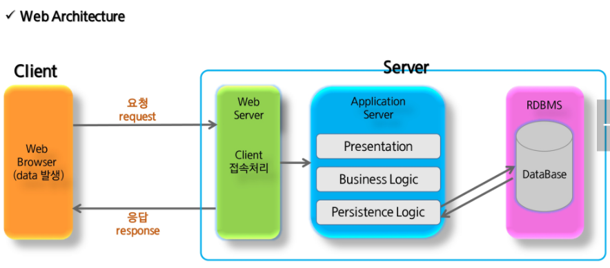
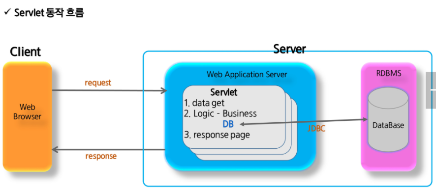
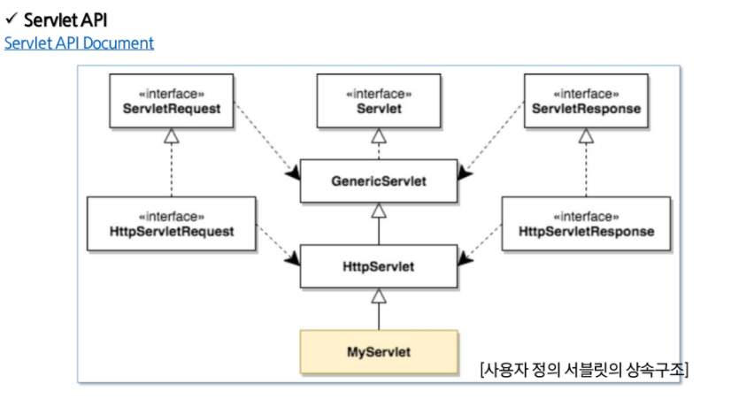
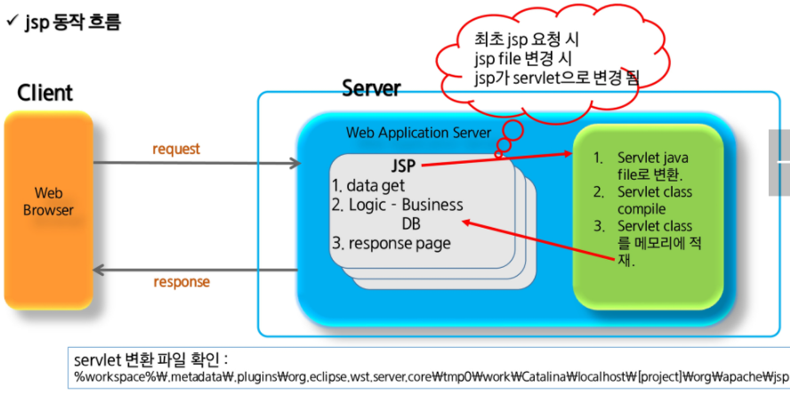
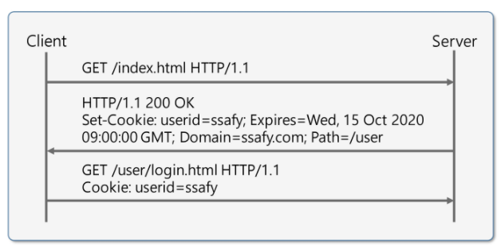
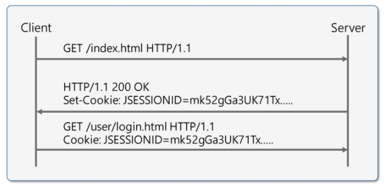
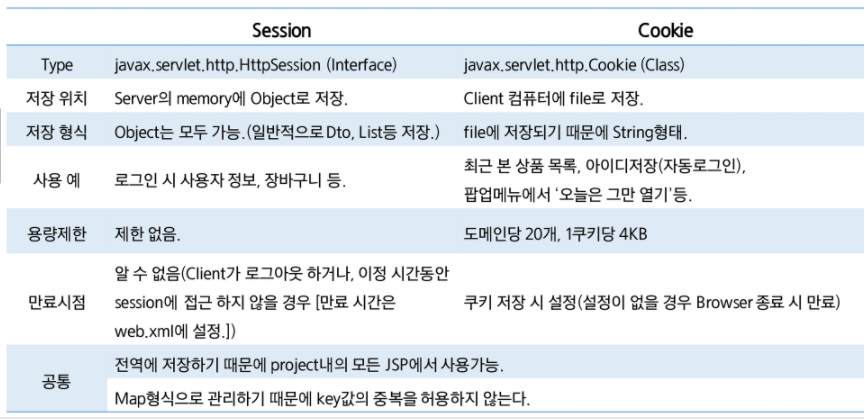

# Web Architecture

 

# Servlet

Java Servlet은 자바를 사용해 웹페이지를 **동적으로 생성**하는 서버측 프로그램 혹은 그 사양이다. Servlet은 웹 서버의 성능을 향상하기 위해 사용하는 자바 클래스의 일종으로, 자바 코드 안에 HTML을 포함하고 있다.

 

##  Servlet API

`implements Servlet` 대신 `extends GenericServlet` 을 하면 service 메소드만 override해도 된다. 이 Generic Servlet을 상속받은 추상클래스 `HttpServlet` 를 구현하면, 내가 원하는 메소드 1개 이상만 override하면 된다.

 

## Servlet Life-Cycle

Servlet class는 객체의 생성부터 사용의 주체가 사용자가 아닌 Servlet Container에게 있다.

Client가 요청(request)하면 Servlet Container는 Servlet 객체를 생성하고 초기화하며(한번만) 요청에 대한 처리를 한다(요청마다 반복). Servlet 객체가 필요없게되면 제거되는 일까지 Container가 담당한다.

 

**GET** : 전송되는 데이터가 url 뒤에 QueryString으로 전달된다. 입력값이 적은 경우나 데이터 노출에도 문제없는 경우 사용된다.

간단한 데이터를 빠르게 전송할 수 있으나 데이터 양에 제한이 있다. (url + parameters <= 2kb)

**POST** : url과 별도로 HTTP header 뒤 body에 입력 스트림 데이터로 전달된다. 

최소한의 보안 유지를 할 수 있으나 전달 데이터의 양이 같을 경우 GET 방식보다 느리다. (전송 패킷을 body에 데이터로 구성해야하므로)

# JSP

Java Server Page는 HTML 내에 **자바 코드를 삽입**해 웹 서버에서 동적으로 웹 페이지를 생성해 웹 브라우저에 돌려주는 언어다. WAS에서 동작한다.

JSP는 실행시 자바 서블릿으로 변환된 후 실행된다. 하지만 서블릿과 달리 HTML 표준에 따라 작성되어 웹디자인하기 편리하다.

 

## JSP Scripting Element

1. 선언 (Declaration) 

   `<%! 멤버변수와 method 작성%>`

   멤버변수 선언이나 메소드를 선언하는 영역이다.

2. 스크립트릿 (Scriptlet)

   `<% java code %>`

   Client 요청시 매번 호출되는 영역, 즉 Servlet 변환시 **service()** method에 해당되는 영역이다.

   request, response에 관련된 코드를 구현한다.

3. 표현식 (Expression)

   `<%= 문자열 %>`

   데이터를 브라우저에 출력할 때 사용한다. `<% out.print(문자열); %>`과 같은 표현이다.

4. 주석 (Comment)

   `<%-- 주석할 code --%>`

   코드 상에서 부가 설명을 작성할 때 사용한다.

## JSP Directive

`<%@ %>`

1. page Directive

   컨테이너에게 현재 jsp 페이지를 어떻게 처리할지 정보 제공

   `<%@ page attr1="val" attr2="val2" %>`

   사용 가능한 속성들은 다음과 같다. language, info, contentType, pageEncoding, import, session, errorPage, isErrorPage, buffer, autoflush, isThreadsafe, extends

2. include Directive

   특정 jsp file을 페이지에 포함

   `<%@ include file = "/template/header.jsp" %>`

3. taglib Directive

   JSTL 또는 custom tag를 이용할 때 사용.

   `<%@ taglib prefix="c" url="http://java,sun.com/jsp/jstl/core" %>`

## JSP 기본 객체

- request : 사용자 입력정보 읽어올 때 사용

- response : 사용자 요청에 대한 응답을 처리하기 위해 사용

- pageContext : 각종 기본객체를 얻거나 forward/include 기능을 활용할 때 사용

- session : 세션정보 처리할 때 사용. page directive의 session 속성 false로 하면 내장객체 생성x.

- application : 웹서버의 애플리케이션 처리와 관련된 정보를 레퍼런스하기 위해 사용

- out : output 스트림 처리할 때 사용

- config : 현재 jsp에 대한 초기화환경 처리 위해 사용

- page : 현재 jsp 페이지에 대한 참조변수

- exception : 전달된 오류 정보를 담고있는 내장객체다. isErrorPage 속성을 true로 설정해야 사용할 수 있다. 

## JSP 기본 객체의 영역 (scope)

map처럼 이름과 값을 이용해서 데이터를 저장한다. 저장한 데이터를 사용할 수 있는 영역은 아래와 같다. 

- pageContext : 하나의 JSP 페이지를 처리할 때 사용되는 영역. 페이지를 벗어나면 사라진다.

- request : 하나의 HTTP 요청을 처리할 때 사용되는 영역. 요청에 대한 응답이 완료되면 사라진다.

- session : 하나의 웹 브라우저와 관련된 영역. 

- application : 하나의 웹 어플리케이션과 관련된 영역.

정보를 주고받거나 공유하기 위한 메소드들은 아래와 같다.

- void setAttribute(String name, Object value)

- Object getAttribute(String name)

- Enumeration getAttributionNames()

- void removeAttribute(String name)

## Web Page 이동

페이지를 이동하는 방법에는 크게 2가지가 있다.

|              | forward(request, response)                                   | sendRedirect(location)           |
| ------------ | ------------------------------------------------------------ | -------------------------------- |
| 사용 방법    | RequestDispatcher dispatcher = request.getRequestDispatcher(path); dispatcher.forward(request, response); | response.sendRedirect(location); |
| 이동 범위    | 동일 서버(project) 내 경로                                   | 타 url도 가능                    |
| location bar | 기존 url 유지!                                               | 이동하는 page로 변경             |
| 객체         | 기존의 request, response가 그대로 전달                       | 새로운 request, response가 생성  |
| 속도         | sendRedirect보다 빠름                                        | forward에 비해 느림              |
| 데이터 유지  | request.setAttribute(name, value)                            | session, cookie                  |

# EL

JSP의 스크립트 표현식을 대신해 속성값을 쉽게 출력하도록 고안된 language다.

## 문법

`${Map.Map의 키}`, `${Java Bean.Bean 프로퍼티}`

[] 연산자 : `$(userinfo["name"])` 은 `$(userinfo.name)`과 같은 표현.

## EL 내장객체

pageContext, pageScope, requestScope, sessionScope, applicationScope, param, paramValues, header, headerValues, cookie, initParam 등이 있다.

pageContext 제외 모든 내장객체는 Map. 기본 문법은 `${expr}`이다.

# JSTL

JSP Standard Tag Liabrary는 JSP 태그라이브러리를 추가해 JSP 사양을 확장했다. 표준화된 태그 셋을 사용해 코드의 유지보수가 용이하다.

JSTL tag는 총 5가지로, core, xml, fmt, sql, 함수가 있다.

그 중 core tag를 사용하려면 `<%@taglib prefix="c" uri="http://java.sun.com/jsp/jstl/core"%>` 을 선언해야된다.

fmt tag를 사용하려면 `<%@taglib prefix="fmt" uri="http://java.sun.com/jsp/jstl/fmt"%>`를 JSP 맨 처음에 선언해야된다.

# HTTP Protocol

http protocol의 특징은 다음과 같다.

- client가 server에 요청한다
- server는 요청에 대한 처리를 한 후, client에 응답한다.
- 응답 후 연결을 해제한다. 이 상태를 stateless 하다고 한다.
  - 지속적인 연결로 인한 자원낭비를 줄이기 위한 방법이다.
  - 그러나 client, server가 연결 상태를 유지해야되는 경우 문제가 발생한다.
  - client 단위로 상태정보를 유지해야되는 경우 cookie,session을 사용한다.

즉, HTTP protocol의 특징(약점)을 보완하기 위해 사용한다.

# Cookie

사용자의 컴퓨터에 저장하는 정보 파일이다. 사용자가 별도의 요청을 하지 않아도 브라우저는 request 시 Request Header를 넣어 자동으로 서버에 전송한다.

key,value로 구성돼있고 String 형태로 이루어져있다. Browser마다 저장되는 쿠키는 다르다.

## 목적

주목적은 세션관리 / 개인화 / 트래킹이다.

주로 자동 로그인, 일주일간 다시 보지 않기, 최근 검색 상품 추천 등에 사용된다.

## 구성요소

이름 : 쿠키를 구별할 때 사용

값 : 쿠키의 이름과 매핑

유효기간 : 쿠키의 유효기간

도메인 : 쿠키를 전송할 도메인

경로(path) : 쿠키를 전송할 요청 경로

## 동작 순서

1. Client가 페이지 요청

2. WAS가 Cookie 생성
3. HTTP header에 cookie 넣어서 응답
4. Browser가 Cookie를 pc에 저장하고, WAS에 요청할 때 Cookie를 함께 전송
5. Browser가 종료되어도 Cookie의 만료기간이 남아있다면 Cookie를 계속 보관
6. 동일 사이트 재방문시, Client의 PC에 해당 Cookie가 있는 경우, 요청 페이지와 함께 Cookie를 전송

## Cookie의 특징

이름, 값, 만료일, 경로 정보로 구성돼있다.

클라이언트에 300개의 쿠키를 저장할 수 있다.

하나의 도메인당 20개의 쿠키를 가질 수 있다.

1개의 쿠키는 4KB까지 저장가능하다.

 

# Session

방문자가 웹 서버에 접속해있는 상태를 하나의 단위로 보고, 이를 세션이라고 한다.

WAS의 메모리에 Object의 형태로 저장. memory가 허용하는 용량까지 제한없이 저장 가능하다.

## 동작 순서

1. 클라이언트가 페이지 요청

2. 서버는 클라이언트의 Cookie를 확인해, 클라이언트가 해당 session-id 보냈는지 확인
3. session-id가 존재하지 않는다면, 서버는 session-id를 생성해 클라이언트에게 돌려준다.
4. 쿠키를 사용해 session-id를 서버에 저장한다. 쿠키 이름은 JSESSIONID.
5. 클라이언트는 재접속 시, 이 쿠키를 이용해 session-id 값을 서버에 전달한다.

## 특징

- **웹 서버**에 웹 컨테이너의 상태를 유지하기 위한 정보를 저장한다.

- 웹 서버에 저장되는 쿠키를 세션 쿠키라고 한다.

- 브라우저를 닫거나, 서버에서 세션을 삭제했을 때만 삭제되므로 쿠키보다 비교적 보안이 좋다.
- 저장 데이터에 제한이 없다.
- 각 클라이언트(Browser)마다 고유 session-id를 부여한다. 

 

# Session vs Cookie

 

