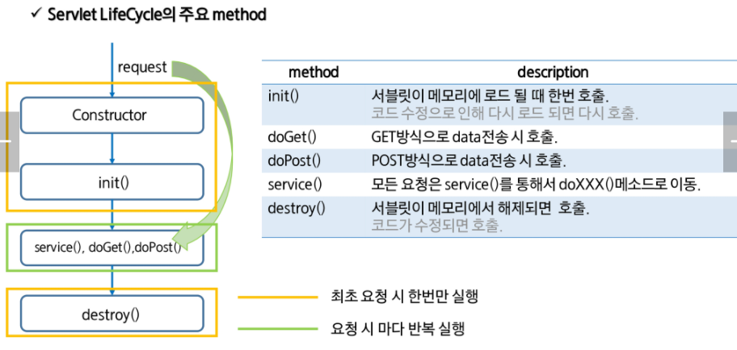

# Web Architecture

 

# Servlet

Java Servlet은 자바를 사용해 웹페이지를 **동적으로 생성**하는 서버측 프로그램 혹은 그 사양이다. Servlet은 웹 서버의 성능을 향상하기 위해 사용하는 자바 클래스의 일종으로, 자바 코드 안에 HTML을 포함하고 있다.

 

##  Servlet API

`implements Servlet` 대신 `extends GenericServlet` 을 하면 service 메소드만 override해도 된다. 이 Generic Servlet을 상속받은 추상클래스 `HttpServlet` 를 구현하면, 내가 원하는 메소드 1개 이상만 override하면 된다.

 

## Servlet Life-Cycle

Servlet class는 객체의 생성부터 사용의 주체가 사용자가 아닌 Servlet Container에게 있다.

Client가 요청(request)하면 Servlet Container는 Servlet 객체를 생성하고 초기화하며(한번만) 요청에 대한 처리를 한다(요청마다 반복). Servlet 객체가 필요없게되면 제거되는 일까지 Container가 담당한다.

 

**GET** : 전송되는 데이터가 url 뒤에 QueryString으로 전달된다. 입력값이 적은 경우나 데이터 노출에도 문제없는 경우 사용된다.

간단한 데이터를 빠르게 전송할 수 있으나 데이터 양에 제한이 있다. (url + parameters <= 2kb)

**POST** : url과 별도로 HTTP header 뒤 body에 입력 스트림 데이터로 전달된다. 

최소한의 보안 유지를 할 수 있으나 전달 데이터의 양이 같을 경우 GET 방식보다 느리다. (전송 패킷을 body에 데이터로 구성해야하므로)

# JSP

Java Server Page는 HTML 내에 **자바 코드를 삽입**해 웹 서버에서 동적으로 웹 페이지를 생성해 웹 브라우저에 돌려주는 언어다. WAS에서 동작한다.

JSP는 실행시 자바 서블릿으로 변환된 후 실행된다. 하지만 서블릿과 달리 HTML 표준에 따라 작성되어 웹디자인하기 편리하다.

 

## 요소

1. 선언 (Declaration) 

   `<%! 멤버변수와 method 작성%>`

   멤버변수 선언이나 메소드를 선언하는 영역이다.

2. 스크립트릿 (Scriptlet)

   `<% java code %>`

   Client 요청시 매번 호출되는 영역, 즉 Servlet 변환시 **service()** method에 해당되는 영역이다.

   request, response에 관련된 코드를 구현한다.

3. 표현식 (Expression)

   `<%= 문자열 %>`

   데이터를 브라우저에 출력할 때 사용한다. `<% out.print(문자열); %>`과 같은 표현이다.

4. 주석 (Comment)

   `<%-- 주석할 code --%>`

   코드 상에서 부가 설명을 작성할 때 사용한다.

