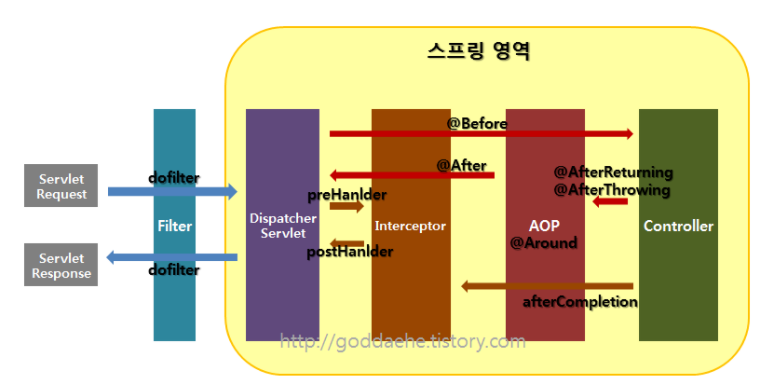
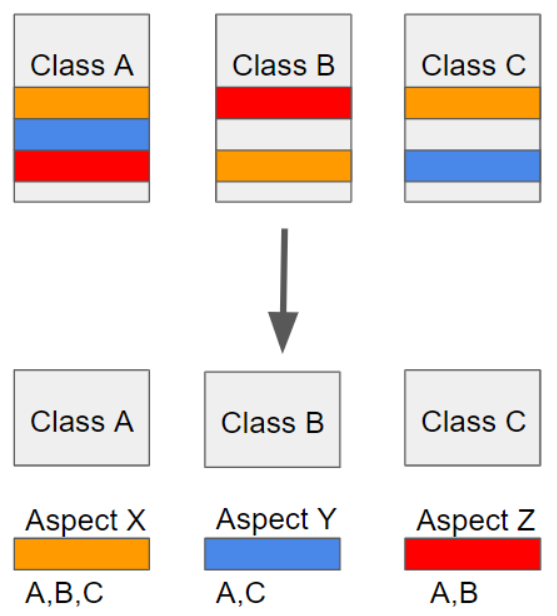

[TOC]

# Filter, Interceptor, AOP

[출처](https://goddaehee.tistory.com/154)

자바 웹 개발을 하다보면 공통적으로 처리해야할 업무들이 많은데, 이 부분은 빼서 따로 관리하는 것이 좋다.

아래의 Filter, Interceptor, AOP는 모두 어떤 행동을 하기 전에 먼저 실행하거나, 실행 후 추가적인 행동을 할 때 사용되는 기능들이다.

## 흐름

 

Filter, Interceptor는 Servlet 단위에서 실행된다. 반면 AOP는 메소드 앞에 proxy 패턴의 형태로 실행된다.

실행순서를 보면 Filter가 가장 바깥, 그 안에 Interceptor, 그 안에 AOP가 있는 형태다.

요청이 들어오면 Filter -> Interceptor -> AOP -> Interceptor -> Filter 순으로 거치게 된다. 

# Filter

요청과 응답을 거른 뒤 정제하는 역할을 한다. 

일반적으로 인코딩 변환, XSS 방어 등의 요청에 대한 처리로 사용된다.

필터의 실행 메서드는 3가지로 `init()`, `doFilter()`, `destroy()`다. 각각 필터 인스턴스 초기화와 전/후 처리, 필터 인스턴스 종료 역할을 맡고 있다. 

## 한글 처리

url-pattern에 해당하는 요청에 대해 filter를 설정한다. (`/*`)

아래와 같이 정의하면 servlet, jsp 뿐만 아니라 이미지와같은 모든 자원의 요청에도 호출된다.

```xml
<!-- web.xml -->
<filter>
    <filter-name>encodingFilter</filter-name>
    <filter-class>org.springframework.web.filter.CharacterEncodingFilter</filter-class>
    <init-param>
        <param-name>encoding</param-name>
        <param-value>UTF-8</param-value>
    </init-param>
</filter>

<filter-mapping>
    <filter-name>encodingFilter</filter-name>
    <url-pattern>/*</url-pattern>
</filter-mapping>

```


# Interceptor

요청에 대한 작업 전/후로 가로챈다. 필터는 Spring Context 외부에 존재해 Spring과 무관한 자원에 대해 동작하는 반면 Interceptor는 Spring 영역 내부에서 Controller에 관한 요청과 응답에 대해 처리한다.

일반적으로 로그인 체크, 권한 체크, 프로그램 실행시간 계산작업, 로그확인 등의 역할을 갖는다.

인터셉터는 여러 개 사용할 수 있고, Spring의 모든 빈 객체에 접근할 수 있다.

실행 메서드는 `preHandler()`, `postHandler()`, `afterCompletion()`이 있다. 각각 컨트롤러 메서드 실행 전, 실행직후 view페이지 렌더링 되기 전, view페이지 렌더링 후에 동작한다.

## 로그인이 필요한 서비스

`<interceptor>`에 해당하는 path로 왔을때, id=confirm이라는 interceptor를 실행한다.

```xml
<!-- servlet-context.xml -->
<context:component-scan base-package="com.pkg.interceptor" />

<beans:bean id="confirm" class="com.pkg.interceptor.ConfirmInterceptor"/>

<interceptors>
    <interceptor>
        <mapping path="/article/write"/>
        <mapping path="/article/modify"/>
        <mapping path="/article/delete"/>
        <beans:ref bean="confirm"/>
    </interceptor>
</interceptors>

```

Interceptor 역할을 하는 Bean은 `HandlerInterceptorAdapter` class를 상속받는다. 아래는 세션에서 유저 정보를 받아 로그인 체크하는 인터셉터 코드다. 

```java
package com.pkg.interceptor;
import modules;

public class ConfirmInterceptor extends HandlerInterceptorAdapter {

	@Override
	public boolean preHandle(HttpServletRequest request, HttpServletResponse response, Object handler) throws Exception {
		HttpSession session = request.getSession();
		MemberDto memberDto = (MemberDto) session.getAttribute("userinfo");
		if(memberDto == null) {
			response.sendRedirect(request.getContextPath());
			return false;
		}
		return true;
	}
}

```


# AOP

OOP 프로그래밍 시 중복을 줄일 수 없는 부분을 보완하기 위해 종단면(관점, 핵심적인 관점 또는 부가적인 관점 등)에서 바라보고 모듈화한다. 메서드 전후의 지점에서 자유롭게 설정이 가능하다. 

 

주소로만 대상을 구분해야했던 Filter, Interceptor와 다르게 주소, 파라미터, 애노태이션 등 다양한 방법으로 대상을 지정할 수 있다.

주로 '로깅', '트랜잭션', '에러 처리' 등 비즈니스단의 메서드에서 조금 더 세밀하게 조정하고 싶을 때 사용한다.

## 주요 개념

Aspect : 관심사를 모듈화한것. 주로 부가기능

Target : Aspect를 적용하는 곳 (Class, method..)

Advice : 실질적으로 어떤 일을 해야할지에 대한 것. 실질적인 부가**기능**을 담은 구현체

JoinPoint : Advice가 적용될 위치. 

> 끼어들 수 있는 지점, 메서드 진입 지점, 생성자 호출 시점, 필드에서 값을 꺼내올 때 등 다양한 시점에 적용 가능하다.

PointCut : JointPoint의 상세한 스펙을 정의한 것. 더 구체적으로 Advice가 실행될 지점을 정할 수 있다. (A란 메서드의 진입 시점에 호출할 것)


### Advice vs Interceptor

HandlerInterceptor와 가장 큰 차이는 파라미터의 차이다. Advice의 경우 JoinPoint나 ProceedingJointPoint 등을 활용해 호출하는 반면 HandlerInterceptor는 Filter와 유사하게 HttpServletRequest, HttpServletResponse를 파라미터로 사용한다.


## Spring AOP

프록시 패턴 기반의 AOP 구현체다. 프록시 객체를 쓰는 이유는 접근 제어 및 부가기능을 추가하기 위해서다. Spring Bean에만 AOP를 적용할 수 있다.

주로 가장 흔한 문제(중복 코드, 프록시 클래스 작성의 번거로움, 객체들 간 관계복잡도 증가)에 대한 해결책을 지원하는 것이 목적이다.

### 포인트컷 (annotation)

`@Before` : 대상 메서드의 수행 전

`@After` : 대상 메서드의 수행 후

`@AfterReturning` : 대상 메서드의 정상적인 수행 후

`@AfterThrowing` : 예외 발생 후

`@Around` : 대상 메서드의 수행 전/후


## 사용방법

우선 다음과 같이 의존성을 추가해야한다. (아래 AspectJ가 아니라 AOP를 주입하는 경우도 있다.)

```xml
<!-- AspectJ -->
<dependency>
    <groupId>org.aspectj</groupId>
    <artifactId>aspectjrt</artifactId>
    <version>${org.aspectj-version}</version>
</dependency>
<dependency>
    <groupId>org.aspectj</groupId>
    <artifactId>aspectjweaver</artifactId>
    <version>${org.aspectj-version}</version>
</dependency>	

```

아래처럼 xml 설정 파일에 `<aop:aspectj-autoproxy>` 설정을 해주면 `@Aspect` annotation을 Aspect로 사용할 수 있게 된다. Java 설정을 이용해 사용하는 경우에는 `@EnableAspectJAutoProxy`를 추가하면 된다.

```xml
<!-- root-context.xml -->
<context:component-scan base-package="com.pkg.guestbook.aop"/>
<aop:aspectj-autoproxy></aop:aspectj-autoproxy>
```

다음에는 `@Aspect` annotation을 붙여 클래스가 Aspect를 나타내는 클래스라는 것을 명시하고 `@Component`를 붙여 스프링 빈으로 등록한다. 아래 코드는 타겟 메서드를 감싸 특정 Advice를 실행시킨다는 의미다.

execution의 대상은 [AspectJ expression](https://www.egovframe.go.kr/wiki/doku.php?id=egovframework:rte:fdl:aop:aspectj)을 참고해 작성한다.

```java
@Component
@Aspect
public class LoggingAspect {

	private Logger logger = LoggerFactory.getLogger(LoggingAspect.class);
	
	@Before(value = "execution(* com.pkg.guestbook.model..*.*(..))")
	public void loggin(JoinPoint jp) {
		logger.debug("메서드 선언부 : {} 전달 파라미터 : {}", jp.getSignature(), Arrays.toString(jp.getArgs()));
	}
	
}
```

또한 경로지정 방식말고 특정 어노테이션이 붙은 포인트에 해당 Aspect를 실행할 수 있는 기능도 제공한다.

```java
@Component
@Aspect
public class PerfAspect {

    @Around("@annotation(PerLogging)")
    public Object logPerf(ProceedingJoinPoint pjp) throws Throwable{
        long begin = System.currentTimeMillis();
        Object retVal = pjp.proceed(); // 메서드 호출 자체를 감쌈
        System.out.println(System.currentTimeMillis() - begin);
        return retVal;
        }
}
```

