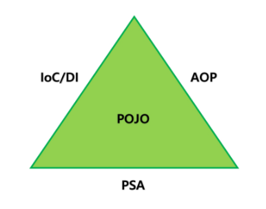
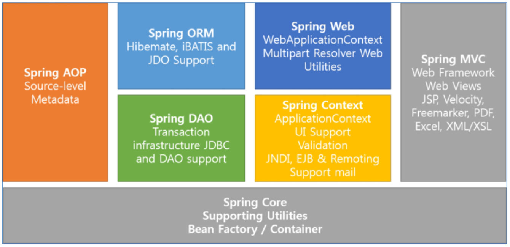
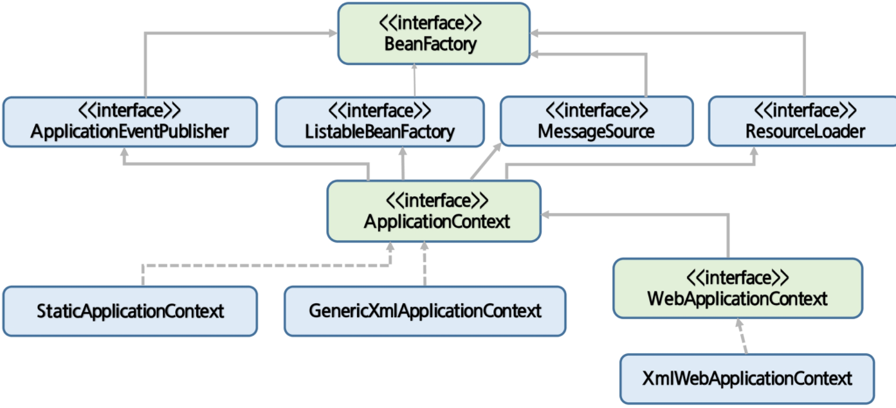
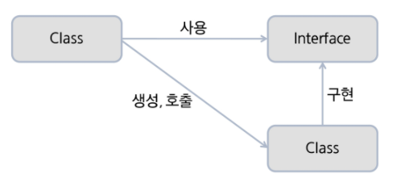
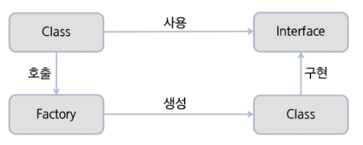
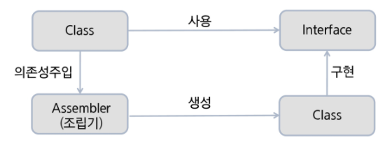

# Spring

[다운로드](https://spring.io/projects)

[TOC]


Spring Framework는 자바로 Enterprise Application을 만들 때 포괄적으로 사용하는 Programming 및 Configuration Model을 제공해주는 Framework다. Application 수준의 인프라 스트럭쳐를 제공한다.


## 구조

Enterprise Application 개발 시 복잡함을 해결하는 Spring의 핵심 4가지를 아래와 같은 삼각형으로 표현할 수 있다.

 

### POJO (Plain Old Java Object) 

특정 환경이나 기술에 종속되지 않은 객체지향 원리에 충실한 (EJB 이전) 자바 객체.

테스트하기 용이하며, 객체지향 설계를 자유롭게 적용할 수 있다.


### PSA (Portable Service Abstraction)

환경과 세부기술 변경과 관계없이 일관된 방식으로 기술에 접근할 수 있게 해주는 설계 원칙.

> ex. 데이터베이스에 관계없이 동일하게 적용할 수 있는 트랜잭션 처리방식


### IoC / DI (Inversion of Control, Dependency Injection)

DI : 유연하게 확장 가능한 객체를 만들어두고 객체 간의 의존관계는 외부에서 dynamic하게 설정한다.


### AOP (Aspect Oriented Programming)

관심사(관점)의 분리를 통해 소프트웨어의 모듈성 향상

공통 모듈을 여러 코드에 쉽게 적용가능.


## 특징

**경량 컨테이너**

- 스프링은 자바객체를 담고있는 컨테이너다. (Spring Container) 자바 객체의 생성,소멸같은 life cycle을 관리한다.
- 언제든지 spring container로부터 필요한 객체를 가져와 사용할 수 있다.

**DI 패턴 지원**

- 설정 파일, annotation을 통해 객체 간 의존관계를 설정할 수 있다.
- 객체는 의존하고있는 객체를 직접 생성하거나 검색할 필요가 없다.

**AOP 지원**

- 자체적으로 프록시 기반의 AOP를 지원하므로 트랜잭션이나 로깅,보안과 같이 여러 모듈에서 공통으로 필요하지만 실제 모듈의 핵심이 아닌 기능들을 분리하여 각 모듈에 적용이 가능하다.

**POJO 지원**

- 일반적인 자바 객체를 칭하기 위한 별칭 개념이다.

**IOC**

- 제어권이 Servlet Container, EJB Container에게 넘어갔다. 
- 스프링에서도 객체에 대한 생성과 생명주기를 관리할 수 있는 기능을 제공한다. 이 때문에 Spring Container 또는 IoC Container라고 부르기도 한다.

**트랜잭션 처리를 위한 일관된 방법 제공**

**영속성 관련 다양한 API 지원**

- JDBC, iBatis, MyBatis, Hibernate, JPA 등 DB 처리를 위한 라이브러리와 연동

**다양한 API에 대한 연동 지원**

- JMS, 메일, 스케줄링 등 다양한 API를 설정파일과 annotation을 통해 쉽게 사용할 수 있다.


## Modules

 


# IoC & Container

객체지향 언어에서 Object간의 연결관계를 런타임에 결정한다. 객체 간의 관계가 느슨하게 연결된다.

IoC의 구현방법 중 하나가 DI.

## IoC 유형

**Dependency Lookup**

- 컨테이너가 lookup context를 통해 필요한 resource나 object를 얻는 방식.
- 주로 JNDI 사용 

**Dependency Injection**

- 컨테이너가 직접 의존구조를 Object에 설정할 수 있도록 지정하는 방식
- Object는 컨테이너의 존재 여부를 알 필요가 없다.
- Lookup 관련 코드가 Object 내에서 사라진다.
- Setter Injection, Constructor Inject


## IoC Container

### Container

객체의 생성, 사용, 소멸에 해당하는 라이프사이클을 담당한다.

라이프사이클을 기본으로 Application 사용에 필요한 주요 기능을 제공한다. Dependency 객체를 제공하고, Thread를 관리해준다.

비즈니스 로직 외에 부가적인 기능에 대해서 독립적으로 관리되도록 해준다.

서비스 객체를 사용하기 위해 Factory 또는 Singleton 패턴을 직접 구현하지 않아도 된다.


### IoC Container

Object의 생성과 관계설정, 사용, 제거 등의 작업을 독립된 컨테이너가 담당한다. 컨테이너가 코드 대신 Object에 대한 제어권을 갖고있어 IoC라고 부른다. 이 때문에 스프링 컨테이너를 IoC라고 부르기도 한다. (BeanFactory, ApplicationContext 등)


**interface BeanFactory**

Bean 등록, 생성, 조회, 반환 관리.

getBean() method가 정의돼있다.


**interface ApplicationContext**

BeanFactory 상속

Bean을 관리하는 기능은 BeanFactory와 동일하다.

Spring의 각종 부가서비스를 추가로 제공한다.

**interface WebApplicationContext**

ApplicationContext 상속

웹 환경에서 사용할 때 필요한 기능이 추가된 applicationContext.

XmlWebApplicationContext를 가장 많이 사용한다.

 


## IoC

객체 간 강한 결합을 떨어뜨린다. (loose coupling)

 

다형성을 통해 결합도를 낮춘다.

- 인터페이스를 사용하고, 구현 클래스를 생성 및 호출한다.

 

Factory를 통해 결합도를 낮춘다.

- 팩토리가 구현 클래스를 생성하기때문에 팩토리를 호출하기만 하면 된다.
- 인터페이스 변경 시 팩토리만 수정하면 된다. 
- 팩토리를 호출하는 소스가 들어가야한다.

- 각 Service를 생성하여 반환하는 Factory를 사용한다.
- 이 **Factory 패턴이 적용된 것이 Container의 기능**이고, 이 **Container 기능을 제공해주고자 하는 것이 IoC 모듈**이다.

 

Assembler를 통해 결합도를 낮춘다.

- IoC 호출 방식. 어떠한 것에도 의존하지 않는 형태가 된다.
- 실행시점(Runtime)에 클래스 간 관계가 형성된다.
- 각 Service의 LifeCycle을 관리하는 Assembler를 사용한다.
- Spring Container가 외부조립기(Assembler) 역할을 한다.

```xml
<bean id="memberService" class="com.test.hello.MemberServiceImpl"/>
```

```java
ApplicationContext context = new ClassPathXmlApplicationContext("applicationContext.xml");
CommonService memberService = context.getBean("memberService", MemberService.class);
```


# DI

객체 간 의존관계를 자신이 아닌 외부의 조립기(Spring Container 제공)가 수행한다. DI를 통해 시스템에 있는 각 객체를 조정하는 외부 개체가 객체들에게 생성시 의존관계를 준다.

객체는 인터페이스에 의한 의존관계만 알고있고, 이 의존관계는 구현 클래스에 대한 차이를 모르는 채 서로 다른 구현으로 대체할 수 있다.

## 빈 설정

스프링 빈은 기본적으로 싱글톤으로 만들어진다. 항상 새로운 인스턴스를 반환하게 만들고싶을 경우 scope를 prototype으로 설정해야한다. (singleton, prototype, request, session 사용가능)


Bean 설정 메타정보 표현방식은 XML, Annotation, Java Code가 있다.


## XML

`<bean>` 태그를 통해 제어한다.

기본 속성 : name, id, class, factory-method (Singleton 패턴으로 작성된 객체의 factory 메소드 호출)

객체 주입 : ref, value(type 명시도 가능. 기본은 String)

생성자 : `<constructor-arg>` 

속성 : 하위태그, `<property>`, xml namespace (p)

Collection : `<list>`, `<set>`, `<map>`, `<props>`(java.util.Properties)


## Annotation

빈 개수가 많아질 경우 xml 파일 관리가 힘들다. 클래스에 특별한 annotation 부여해주면 자동으로 빈이 등록된다.

오브젝트 빈 스캐너로 bean scanning을 통해 자동 등록한다.

- 기본적으로 클래스 이름(의 첫 글자만 소문자로 바꾼 것)을 빈의 아이디로 사용한다.

Annotation으로 빈 설정 시, 반드시 component-scan을 설정해야한다.

```xml
<context:component-scan base-package="com.test.hello.*"/>
```

### Stereotype annotation

빈 자동등록에 사용할 수 있는 annotation : `@Repository`, `@Service`, `@Controller`, `@Component`

다른 Bean 참조할 때 사용하는 annotation : `@Resource`, `@Autowired`, `@Inject`

- 멤버변수, 메소드, 생성자에 사용한다.

- `@Autowired` 사용시 동일한 타입의 bean이 여러개일 경우 `@Qualifier("name")`로 식별한다.


## Spring Bean Life Cycle

빈 생성 => 의존성 주입 => init-method 실행 => 빈 사용 => destroy-method 실행 => 빈 소멸