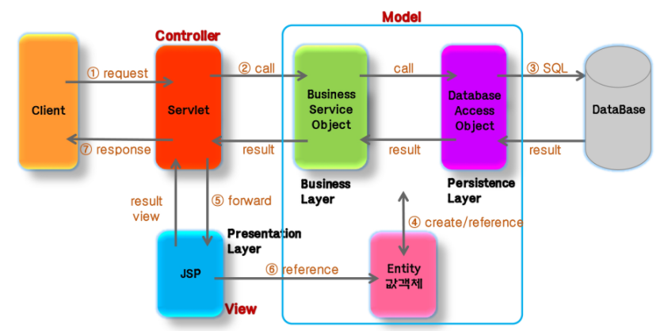
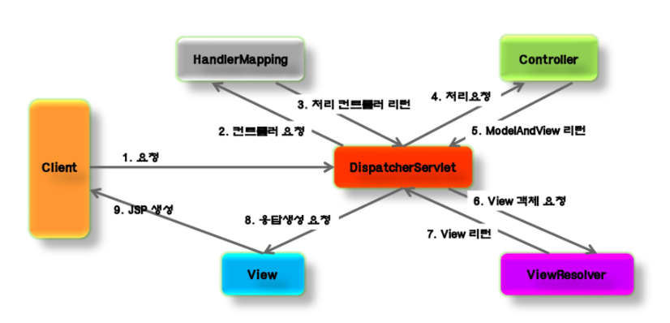
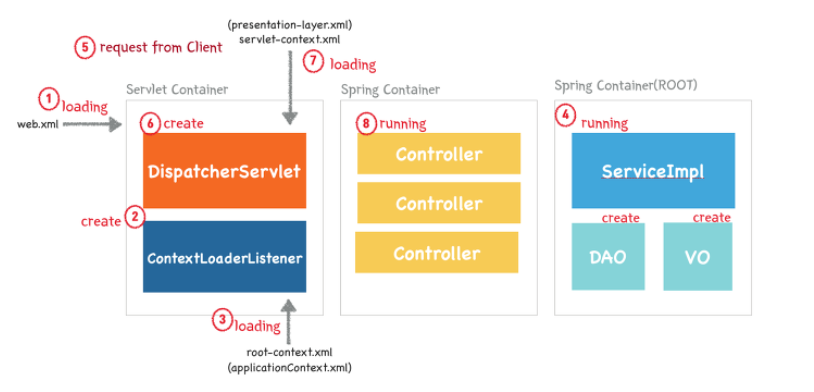
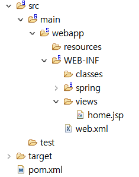

[TOC]


# Spring Web MVC

Spring은 Servlet 기반의 Web 개발을 위한 MVC Framework를 제공한다.

Spring MVC는 Model2 Architecture와 Front Controller Pattern을 Framework 차원에서 제공한다.

Spring MVC Framework는 Spring을 기반으로 하고있기 때문에 Spring이 제공하는 transaction 처리, DI, AOP 등을 손쉽게 사용할 수 있다.


## Model 2 요청 흐름




## 구성 요소

**DispatcherServlet (Front Controller)**

모든 클라이언트의 요청을 전달받는다. DispatcherServlet은 Controller에게 요청을 전달하고, Controller가 리턴한 결과값을 View에게 전달해 알맞은 응답을 생성한다.

**HandlerMapping**

클라이언트의 요청 url을 어떤 controller가 처리할지 결정한다.

url과 요청 정보를 기준으로 어떤 핸들러객체를 사용할지 결정하는 객체이며, DispatcherServlet은 하나 이상의 HandlerMapping을 가질수 있다.

**Controller**

클라이언트의 요청을 처리한 뒤, Model을 호출하고 그 결과를 DispatcherServlet에 알려준다.

**ModelAndView**

Controller가 처리한 데이터(DTO) 및 화면(View 이름)에 대한 **정보를 보유한 객체**다.

**ViewResolver**

Controller가 리턴한 View 이름을 기반으로 Controller의 처리결과를 보여줄 View를 결정한다. 논리적 이름을 실제 jsp이름으로 변환해주는 역할이다.

**View**

Controller의 처리결과를 보여줄 응답화면을 생성한다.


## Spring MVC 요청 흐름

 

## 구현

1. web.xml에 DispatcherServlet 등록 및 Spring 설정파일 등록
2. 설정파일에 HandlerMapping 설정
3. Controller 구현 및 Context 설정파일(servlet-context.xml)에 등록
4. Controller와 JSP 연결을 위해 ViewResolver 설정
5. JSP 코드 작성.

Controller가 많은 일을 하지 않고 Service에 처리를 위임하는 것이 좋은 디자인이다.


# Spring 실행순서

 

1. web.xml 로딩
2. ContextLoaderListener 자동으로 메모리에 생성
   - ApplicationContext 생성
   - Servlet의 생명주기 관리. Servlet 사용 시 servlet-context에 ApplicationContext 등록, 종료 시 삭제)
3. root-context.xml 로딩 by ContextLoaderListener
4. Spring Container 구동 (written in root-context.xml)
5. 클라이언트로부터 요청이 옴.
   - **최초의 클라이언트 요청에 의해** DispatcherServlet이 생성된다.
6. DispatcherServlet이 생성
   - servlet-context.xml 파일을 로딩 해 2번째 Spring Container를 구동한다. 이 2번째 Spring Container가 Controller 객체를 메모리에 생성한다. 
   - DispatcherServlet은 Front Controller 역할을 수행한다.
7. servlet-context.xml을 로딩 by DispatcherServlet
8. 이후 구동 순서는 [다음](#Spring-MVC-요청-흐름)과 같다.

# web.xml

web.xml은 웹페이지의 환경설정을 위한 파일이다. WAS가 최초로 구동될때 web.xml을 읽고 메모리에 로딩하며 모든 Spring Web application은 반드시 하나의 web.xml을 가져야한다.


## 문법

web.xml의 기본 문법 몇 가지는 아래와 같다.

`<context-param>` : Servlet context의 parameter를 선언해주는 부분으로 전역변수 느낌이다.

- `<param-name>` : context parameter의 이름
- `<param-value>` : context parameter의 값

`<init-param>` : 지역변수의 느낌

`<listener>` : Application Listener Bean을 가리키기 위한 부분. 

- `<listener-class>` : listener bean의 class를 지정해주는 부분

`<servlet>` : servlet을 선언할 때 사용. 흔히 Spring의 DispatcherServlet을 선언할 때 사용한다.

- `<init-param>` : servlet에서 사용할 name-value 쌍을 선언
- `<load-on-startup>` : servlet이 배치될 때의 우선순위 설정


## ContextLoader 설정

Context 설정 파일들을 로드하기 위해 web.xml 파일에 리스너를 설정한다. (ContextLoaderListener)

```xml
<!-- Creates the Spring Container shared by all Servlets and Filters -->
<listener>
    <listener-class>org.springframework.web.context.ContextLoaderListener</listener-class>
</listener>

```


## root-context.xml 설정

servlet에 관련된 설정은 servlet-context.xml, servlet 외의 설정에 관련된 내용은 root-context.xml에 적어준다.

```xml
<!-- The definition of the Root Spring Container shared by all Servlets and Filters -->
<context-param>
    <param-name>contextConfigLocation</param-name>
    <param-value>/WEB-INF/spring/root-context.xml</param-value>
</context-param>

```


## DispatcherServlet 설정

가장 대표적인 Servlet인 DispatcherServlet에 대한 설정이다. 

`<url-pattern>`에 해당하는 요청이 있을 경우, `<param-value>`에 있는 servlet-context.xml이 호출된다. 

다른 url-pattern을 각각 처리할 수 있도록 DispatcherServlet을 여러개 설정할 수도 있다.

```xml
<!-- Processes application requests -->
<servlet>
    <servlet-name>appServlet</servlet-name>
    <servlet-class>org.springframework.web.servlet.DispatcherServlet</servlet-class>
    <init-param>
        <param-name>contextConfigLocation</param-name>
        <param-value>/WEB-INF/spring/appServlet/servlet-context.xml</param-value>
    </init-param>
    <load-on-startup>1</load-on-startup>
</servlet>

<servlet-mapping>
    <servlet-name>appServlet</servlet-name>
    <url-pattern>/</url-pattern>
</servlet-mapping>

```


# Controller

Controller의 주요 annotation들은 아래와 같다.

1. Class 타입에 `@Controller` 를 선언한다.
2. Controller class를 bean에 등록한다. (servlet-context.xml)
   - 자동스캔을 사용할 수도 있다.
   - `<context: component-scan base-package="com.test.board.controller">`

3. `@RequestMapping` 선언.
   - 요청 url mapping 정보를 설정한다. Class, Method에 각각 설정할 수 있고 합쳐서 설정할 수도 있다. class, method에 나눠서 설정하면 아래 depth로 인식한다.
   - HTTP method를 한정할 수 있다. `method=RequestMethod.POST`

4. `@RequestParam` 을 이용해 parameter mapping

   - value, required, defaultValue 등을 변수에 설정할 수 있다.
   - `@RequestedParam(value="age", defaultValue="25") int age`

5. HTML form에 입력한 data를 Java Bean 객체를 이용해 전송할 수 있다.

   - ```html
     <form method="POST" action="${root}/board.write.do">
     	<input type="text" name="subject">
         <textarea name="content"></textarea>
         <!-- List 형태로도 전송 가능하다. ex) productList[0].name-->
     </form>
     ```

   - ```java
     public class BoardDto{
         private String subject;
         private String content;
         
         // setter,getter
     }
     ```

   - ```java
     @Controller
     @RequestMapping("/board")
     public class BoardController{
         @RequestMapping(value="/write.do", method="RequestMethod.POST")
         public String write(BoardDto boardDto){
             return "board/writeok";
         }
     }
     ```

   - View에서 `${boardDto.subject}` 형태로 사용할 수 있다.

     `@ModelAttribute("article") BoardDto boardDto`로 위의 write method의 parameter를 설정하면 `${article.subject}` 형태로 사용할 수 있다.

6. `@CookieValue` 를 사용하면 Cookie mapping이 가능하다.

7. `@RequestHeader`, `@RequestBody`를 사용하면 header, body에 mapping된다.

# View

Controller가 처리 결과를 보여줄 View 이름이나 객체를 리턴하면 DispatcherServlet은 View 이름이나 View 객체를 이용해 view를 생성한다.

ViewResolver : 논리적 vew와 실제 JSP파일을 mapping해준다. (servlet-context.xml)

## View 이름 지정

**명시적 지정**

1. ```java
   ModelAndView mav = new ModelAndView("hello");
   return mav;
   ```

2. ```java
   mav.setViewName("hello");
   ```

3. ```java
   public String hello(){
       return "hello";
   }
   ```

**자동 지정**

url로부터 view 이름을 결정한다.

- return type이 Model 또는 Map인 경우
- return type이 void이면서 ServletResponse, HttpServletResponse 타입의 parameter가 없는경우

```java
@RequestMapping("/hello.do")
public Map<String, Object> hello(){
    return new HashMap<String, Object>();
}
// 이 경우 hello가 view 이름이 된다.
```

**redirect view**

View 이름에 redirect: 접두어를 붙이면 지정한 페이지로 redirect된다.

- ```java
  return "redirect:board/list.html?pg=1";
  // redirect to http://localhost/board/list.html?pg=1
  ```

  

### 파일 위치 : webapp vs WEB-INF

Spring에서는 jsp 파일을 주로 WEB-INF에 두는데 (기존 backend 코딩시에는 webapp에 배치), 이는 jsp 페이지를 url로 직접 실행하는 것을 막고 Controller를 통해서만 실행하게 하기 위해서다.

WEB-INF는 HTTP 프로토콜로는 접근이 불가능하다. web.xml 등 중요한 파일들이 다 여기 존재한다.


webapp에 배치해도 에러가 생기진 않는다. url로 jsp 파일을 실행시킬 수 있다.

 


# Model

## View에 전달하는 데이터

1. argument : Map, Model, ModelMap 

      - `@RequestMapping` annotation 적용 시

      - ```java
        @RequestMapping("/hello.do")
        public String hello(Map model){ 
            // model에 데이터 담아 전달. 데이터타입은 Map 대신 Model, ModelMAp도 가능
            model.put("message", "안녕");
            return "hello";
        }
        ```


2. return ModelAndView
   
   - `@RequestMapping` annotation 적용 시
   
   - ```java
     @RequestMapping("/hello.do")
     public ModelAndView hello(){
         ModelAndView mav = new ModelAndView();
         mav.setViewName("hello");
         mav.addObject("message", "안녕?");
         return mav;
     }
     ```
   
     

3. return 객체

   - `@ModelAttribute` annotation 적용 시

   - ```java
     @ModelAttribute("modelAttrMsg")
     public String maMsg(){
         return "bye~";
     }
     ```

     jsp에서 아래처럼 사용할 수 있다.

   - ```jsp
     ${modelAttrMsg}
     ```

     출력 결과 : bye~

## URL Matching

### PathVariable

- `@RequestMapping` Annotation 값으로 {템플릿변수} 사용
- `@PathVariable` Annotation 이용해 {템플릿변수}와 동일한 이름을 갖는 parameter 추가

```java
@RequestMapping("/blog/{userId}/board1/{articleSeq}")
public String viewArticle(@PathVariable String userId, @PathVariable int articleSeq){
    return "view";
}
```


### Ant 스타일의 URI 패턴

- `?` : 하나의 문자열과 대치

- `*` : 하나 이상의 문자열과 대치
- `**` : 하나 이상의 디렉토리와 대치


