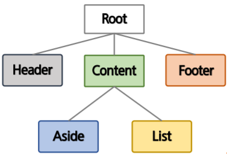

# Component

[TOC]

Vue Component는 HTML Element를 확장하여 재사용 가능한 코드를 캡슐화한다. Vue Component는 Vue instance이기도 해서, 모든 옵션 객체를 사용한다.

Life Cycle hook을 사용할 수 있고, 전역 컴포넌트와 지역 컴포넌트가 존재한다.

컴포넌트는 데이터를 함수형태로 만들어서 object를 return해줘야한다.

 

## 전역 컴포넌트

`Vue.component(tagName, options)` 를 사용해 등록한다. 컴포넌트 이름은 케밥 표기법(소문자, -)을 권장한다. [Vue 스타일 가이드](https://kr.vuejs.org/v2/style-guide/index.html)


## 지역 컴포넌트

components 인스턴스 옵션으로 등록함으로서, 다른 인스턴스/컴포넌트의 범위에서만 사용할 수 있는 컴포넌트를 만든다.

```html
<div id="app1">
    <my-local></my-local>
    <my-local></my-local>
</div>
<!-- app2에는 h2가 표시되지 않는다. -->
<div id="app2">
    <my-local></my-local>
    <my-local></my-local>
</div>
<script>
    new Vue({
        el: '#app1',
        components: {
            'my-local': {
                template: '<h2>지역 컴포넌트</h2>',
            },
        },
    });
    new Vue({
        el: '#app2',
    });
</script>

```


## Component Template

아래 코드처럼 template을 별도로 분리하고, component 내에서 사용할 템플릿을 바인딩하는 방법도 있고, 템플릿을 컴포넌트 안에 직접 설정하는 방법도 있다.

예제를 통해 component와 template을 잘 이해해보도록 하자.

### 예제 1

1. template 이름이 cv라는 템플릿을 쓸 것이라고 선언
2. `Vue.component`로 전역 컴포넌트를 생성한다. 템플릿 `#cv`를 이용해 Vue 객체를 생성한다.
3. 생성한 객체들을 이름이 `<count-view>`인 요소에 붙여준다.

```html
<h2>컴포넌트 데이터 공유 문제 해결</h2>
<div id="app">
    <count-view></count-view>
    <count-view></count-view>
    <count-view></count-view>
</div>
<template id="cv">
    <div>
        <span>{{ count }}</span>
        <button @click="count++">클릭</button>
    </div>
</template>
<script>
    // 컴퍼넌트중 이름이 count-view인 것을 찾는다.
    Vue.component('CountView', {
        // template중 id=cv인 것을 찾는다.
        template: '#cv',
        data() {
            return {
                count: 0,
            };
        },
    });
    new Vue({
        el: '#app',
    });
</script>

```


# 컴포넌트간 통신

상위(부모) - 하위(자식) 컴포넌트 간의 data 전달 방법은 제한적이다.

부모에서 자식 : 하위 컴포넌트가 갖고있는 **props**라는 특별한 이름의 속성에 데이터를 전달

자식에서 부모 : **event**로만 전달 가능. 부모는 on으로 데이터를 기다리다가 받는다. 


## props

하위 컴포넌트는 상위 컴포넌트의 값을 직접 참조할 수 없다. 대신, 상위 컴포넌트가 하위 컴포넌트의 `props` 속성에 값을 전달한다.

`v-bind`를 사용해 부모의 데이터에 접근하고, 이를 바탕으로 props를 동적으로 바인딩할 수 있다. 이 때 데이터가 상위에서 업데이트될 때마다 하위 데이터로도 전달된다.

### 예제

DOM 구조는 상위 요소가 `<div id='app'>` , 하위 요소가  `<div><h2>`다.

즉, 상위 컴포넌트 (new Vue로 선언한 지역 컴포넌트)가 area, msg라는 데이터를 하위 컴포넌트(전역 컴포넌트)의 props 속성에 전달한다.

```html
<div id="app">
    <child-comp v-for="(area, i) in areas" :key="i" :area="area" v-bind:msg="msg[3-i]">
    </child-comp>
</div>
<template id="cc">
    <div>
        <h2>{{area}} 지역 5기 {{msg}}</h2>
    </div>
</template>
<script>
    Vue.component("child-comp", {
        props: ["area", "msg"],
        template: "#cc",
    });
    new Vue({
        el: "#app",
        data: {
            areas: ["광주", "구미", "대전", "서울"],
            msg: ["굿^^", "최고!!", "실화냐?", "좋아요*"],
        },
    });
</script>

```


### 오브젝트 전달

하위 컴포넌트 props의 member라는 변수에 user라는 **오브젝트**를 바인딩할 수 있다.  

```html
<h2>컴포넌트 객체 데이터 전달</h2>
<div id="app">
    <member-view :member="user"></member-view>
</div>
<template id="MemberView">
    <div>
        <div>이름 : {{ member.name }}</div>
        <div>나이 : {{ member.age }}</div>
        <div>이메일 : {{ member.email }}</div>
    </div>
</template>
<script>
    Vue.component('member-view', {
        props: ['member'],
        template: '#MemberView',
    });
    new Vue({
        el: '#app',
        data(){
            return {
                user:{
                    name: '홍길동', 
                    age: 22, 
                    email: 'hong@email.com',
                },
            };
        },
    });
</script>

```


## event

이벤트는 자동 대소문자 변환을 제공하지 않는다. (MyComponent, my-component 혼용 불가능)

대소문자를 혼용하고, emit할 정확한 이벤트 이름을 권장한다. `v-on` 이벤트리스너는 항상 자동으로 소문자 변환이 된다. 때문에 이벤트 이름은 kebab-case를 사용하는 것이 권장된다.


이벤트 발생 : `vm.$emit("event-name", [...params]);`

이벤트 수신 : `vm.$on("event-name", callbackfunc(){});`

### 예제

```html
<h2>사용자 정의 이벤트</h2>
<div id="app">
    <button v-on:click="doAction">메세지전송</button>
    <h2>{{message}}</h2>
</div>
<script>
    new Vue({
        el: '#app',
        data: {
            message: '',
        },
        methods: {
            doAction() {
                this.$emit('sendMsg', '안녕하세요 여러분');
            },
        },
        // 객체가 생성되자마자 listen 시작
        created() {
            this.$on('sendMsg', (msg) => {
                alert(msg);
                this.message = msg;
            });
        },
    });
</script>

```


### 하위에서 상위 컴포넌트로 event 전달

하위 컴포넌트 : 이벤트 발생 `this.$emit("event-name");`

상위 컴포넌트 : 이벤트 수신 `<child v-on:event-name="parent-component-name"></child>`

단, 공식적으로 vue.js에선 하위에서 상위로 데이터를 전달하진 않는다. 단방향 통신(상위->하위) 지향. 대신 Event Bus를 이용해 이벤트인자로 data를 전달하는 방법이 존재한다.


## 비 상하위간 통신

비어있는 Vue Instance 객체를 Event Bus로 사용한다. 복잡해질 경우엔 상태관리 라이브러리인 Vuex를 사용한다.


```html
<script>
    const bus = new Vue();
    Vue.component('my-count', {
        template: '#myCount',
        data() {
            return {
                count: 0,
            };
        },
        methods: {
            send() {
                // bus에는 updateLog라는 이벤트가 생성되고, count라는 데이터가 전달된다.
                bus.$emit('updateLog', this.count);
                this.count = '';
            },
        },
    });
    Vue.component('Log', {
        template: '#log',
        data() {
            return {
                count: 0,
                list: [],
            };
        },
        methods: {
            // 호출되는 콜백함수. 전송되는 데이터는 위에서 전달한 this.count
            updateLog(data) {
                this.count += data;
                this.list.push(`${data}을 받았습니다.`);
            },
        },
        created: function () {
            // bus에서 updateLog라는 이벤트를 감시한다. this.updateLog라는 콜백함수를 호출한다.
            bus.$on('updateLog', this.updateLog);
        },
    });

</script>
```

