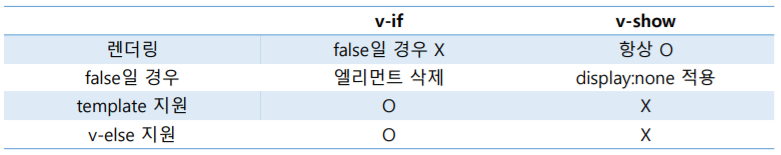

# Vue.js

[TOC]

## MVVM Pattern

Model + View + ViewModel

Model : 순수 자바스크립트 객체

View : 웹페이지의 DOM

ViewModel : Vue의 역할. View와 Model을 연결하고 자동 바인딩하므로 양방향 통신이 가능하다.


요청이 View에 오면 View가 ViewModel(Vue)에 요청하고, Vue는 Model에게 data 갱신 요청을 한다. Vue는 Model에 의해 데이터가 갱신될 때까지 기다린다.


## Vue 사용

### Install

script : download 받거나 CDN을 이용한다.

```html
<script src="https://cdn.jsdelivr.net/npm/vue/dist/vue.js"></script>
```

npm 또는 cli를 통해 다운받는 방법도 있다.


### Vue.js devtools

chrome 확장탭으로 설치하자


### 환경설정

VSCode : [Emmet 문법](https://docs.emmet.io/abbreviations/syntax/) 을 활용해 효율적인 코드를 작성한다.

```html
// div.box>p#sid*1span*2{hello}
<div class="box">
    <p id="sid"></p>
    <span>hello</span><span>hello</span>
</div>
```


# Vue Instance

## 속성

- el : Vue가 적용될 요소 지정. HTML 요소 또는 CSS Selector
- data : Vue에서 사용되는 정보 저장. 객체 또는 함수의 형태
- template : 화면에 표시할 HTML, CSS 등의 마크업 요소를 정의하는 속성. Vue의 데이터 및 기타 속성들도 함께 화면에 그릴 수 있다.

- methods : 화면 로직 제어와 관계된 method를 정의하는 속성. 화면의 전반적인 이벤트(마우스 클릭 이벤트 처리)와 화면 동작과 관련된 로직 추가.

- created : Vue 인스턴스가 생성되자마자 실행할 로직을 정의한다.


```javascript
new Vue({
    el: '#app', // id='app' 인 DOM 요소
    data: {
        message: 'Hello Vue.js!'
    }
});
```


## 유효 범위

인스턴스가 화면에 적용되는 과정

1. Vue 라이브러리 파일 로딩
2. Vue 인스턴스 객체 생성 (옵션 속성 포함)
3. 특정 화면 요소(el)에 인스턴스를 붙인다.
4. 인스턴스 내용이 화면 요소로 변환된다.
5. 변환된 화면 요소를 사용자가 최종 확인한다.

화면 요소를 벗어난 경우는 데이터를 가져다 쓸 수 없다.


## Life Cycle

크게 4단계로, Instance의 **생성**, 화면에 **부착**, Instance의 내용 **갱신**, Instance **소멸**이다.

created : Vue 객체 생성, mounted : 연결된 후.

`beforeCreate()`, `created()`, `updated()` 등의 속성을 이용할 수 있다.

 


# 디렉티브 (Directives)

## 문자열

데이터 바인딩의 가장 기본 형태는 "Mustache" 구문을 이용한 텍스트 보간이다. `{{message}}`

mustaches는 html이 아닌 일반 텍스트로 데이터를 해석한다.

모든 데이터 바인딩 내에서 JavaScript **표현식**의 모든 기능을 지원한다.

> {{var a = 1}} 은 표현식이 아닌 구문이므로, 불가능하다.


## Directives

`v-` 접두사가 있는 특수 속성으로, 디렉티브 속성값은 단일 JavaScript 표현식이 된다.

표현식의 값이 변경될 때 사이드 이펙트를 반응적으로 DOM에 적용한다.


- v-once : 데이터 변경 시 업데이트 되지 않는 일회성 보간을 수행한다.

- v-text : 일반 텍스트

- v-html : 실제 HTML 출력

- v-model : 양방향 바인딩 처리를 위해 사용한다. (form의 input, textarea 등). v-model 뒤에 있는 속성값을 읽는 요소들의 값이 동시에 변화한다. v.model.number로 적으면 타입도 지정할 수 있다.

- v-bind : 엘리먼트의 속성과 바인딩 처리를 위해 사용한다. (약어로 `:` ) 아래는 예제

  ```html
  <!-- id에 Vue 객체의 data에서 idValue의 값을 바인딩 -->
  <div v-bind:id="idValue">v-bind 지정 연습</div>
  
  <!-- [key], 즉, Vue 객체의 data에서 key의 값('id')에 data에서 idValue의 값을 바인딩 -->
  <button v-bind:[key]="btnId">버튼</button>
  
  <!-- 아래는 Vue 객체의 data 속성
  data: {
      idValue: 'test-id',
      key: 'id',
      btnId: 'btn1',
  }
  -->
  ```

- v-show : style의 display 설정. false일 경우 display='none'으로 설정

- v-if, v-else-if, v-else : 조건에 따라 엘리먼트를 화면에 렌더링

   

- v-for : 배열 또는 객체의 반복

  ```html
  <span v-for="i in 4">
      {{i}}
  </span>
  <li v-for="name in regions">
      {{name}}
  </li>
  <li v-for="(name, i) in regions">
      번호 : {{i}}, 지역 : {{name}}
  </li>
  <!-- Vue의 data 속성
  data: {
  	regions: ["광주", "구미", "대전", "서울"]
  }
  -->
  ```

- template

    여러 개의 태그들을 묶어 처리해야할 경우 template을 사용한다. 일반적으로 v-if, v-for, component와 함께 사용한다.

    ```html
    <template v-if="count % 2 == 0">
        <h4>여러개의 태그를 묶어서 처리해야 한다면??</h4>
        <h4>template 태그를 사용해 보자</h4>
        <h4>만약에 template가 없다면?? 각태그마다 v-if?</h4>
    </template>
    <template v-for="(region, index) in ssafy" v-if="region.count === count">
        <h3>지역 : {{region.name}} ({{region.count}}개반)</h3>
    </template>

    ```

- v-cloak : Vue Instance가 준비될 때까지 mustache 바인딩을 숨기는데 사용한다. Vue instance가 준비되면 v-cloak은 제거된다. 즉, 아래 코드에서 `<div v-cloak>`은 `<div>`로 변한다.

  ```html
  <style>
      [v-cloak]::before {
          content: '로딩중...'
      }
      [v-cloak] > * {
          display: none;
      }
  </style>
  
  <div v-cloak>
    <h1>2 v-cloak. - {{msg}}</h1>
  </div>
  ```
  


# Vue Method

