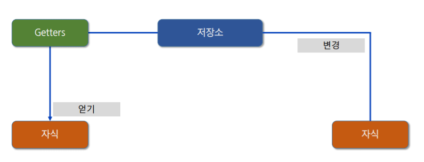

# Vuex

[TOC]

[공식문서](https://vuex.vuejs.org/kr/)

Vue.js application에 대한 상태관리패턴 + 라이브러리로, application 모든 component들의 중앙 저장소 역할을 한다.


## 상태 관리 패턴

상태 : 앱을 작동하는 원본 소스

뷰 : 상태의 선언적 매핑.

액션 : 뷰에서 사용자 입력에 대해 반응적으로 상태를 바꾸는 방법

```javascript
new Vue({
  // 상태
  data () {
    return {
      count: 0
    }
  },
  // 뷰
  template: `
    <div>{{ count }}</div>
  `,
  // 액션
  methods: {
    increment () {
      this.count++
    }
  }
})
```


## 핵심 컨셉

 


## 저장소 개념

**State** : application마다 하나의 저장소를 관리. (data)

**Mutations** : State의 상태를 변경하는 유일한 방법 (동기 methods)

**Actions** : 상태를 변이시키는 대신 액션으로 변이에 대한 커밋 처리 (비동기 methods)

**Getters** : Vue instance의 computed같은 역할. State를 기반으로 계산한다. (computed) State와 Vue components 사이에 위치한다.


# 설정

## vuex 사용

```javascript
// index.js
import Vue from 'vue';
import Vuex from 'vuex';

Vue.use(Vuex); // Vue Instance에 Vuex 설정
```


## 저장소 (Store)

state는 저장소에서 data 속성의 역할을 한다. state에 접근할 때는 `this.$store.state.data_name`을 이용한다. 그런데 component가 vuex의 state에 직접 접근하는 코드가 중복될 때 문제가 발생할 수 있다. 


## Getters

이 때 store의 state를 참조하는 getters를 활용한다.

```javascript
// store: index.js에 선언
new Vuex.Store({
    state : {count: 0,}
    getters: {
        countMsg(state){
            return "count : " + state.count;
        }
    }
})

// components: 사용
{
	computed: {
        countMsg(){
            return this.$store.getters.countMsg;    
        }    
    }   
}
```

 


## mapGetters

getters를 더 간단하게 호출한다. 

```javascript
// store.getters에 있는 함수 countMsg, msg1, msg2, msg3를 손쉽게 사용하고싶을 때
{
    computed:{
	    ...mapGetters(["countMsg", "msg1", "msg2", "msg3"]),
    }
}

```


## Mutations

State 값을 변경하기 위해 사용한다. 각 컴포넌트에서 state값을 직접 변경하는 것은 권장하지 않는다.

state 값의 추적을 위해 동기적 기능에 사용한다.

**중요** !! Mutations는 직접 호출이 불가능하고 `commit`을 이용한다.  

> `store.commit('mutation_name')`으로 호출한다.

Mutations는 state라는 인자값을 기본적으로 갖고 있다.

```javascript
// store: Mutations 등록. index.js
export default new Vuex.Store({
    mutations: {
        ADD_ONE(state) {
            state.count += 1;
        },
        ADD_COUNT(state, payload) {
            state.count += payload;
        },
        ADD_OBJ_COUNT(state, payload) {
            state.count += payload.num;
        },
    },
})

// components: store에 등록된 mutation 사용. mapGetters처럼 mapMutations 사용
{
    methods: {
        ...mapMutations({
            addMOne: "ADD_ONE",
            addMTenCount: "ADD_TEN_COUNT",
            addMObjCount: "ADD_OBJ_COUNT",
        }),
        addCount: function() {
            this.count += 1;
            // this.$store.commit('addOne');
            this.addMOne();
        },
        addTenCount: function() {
        	this.count += 10;
            // this.$store.commit('addCount', 10);
            this.addMTenCount(10);
        },
        addObjCount: function() {
        	let num = Math.round(Math.random() * 100);
            this.count += num;
            // this.$store.commit('addObjCount', { num });
            this.addMObjCount({ num });
        },
    },
}
```


## Actions

비동기 작업의 결과를 적용하려고할 때 사용된다. Actions는 비동기 로직의 처리가 종료되면 자동으로 Mutations를 호출한다.

Actions를 호출할 때는 `dispatch`를 이용한다.

Actions는 첫 번째 인자값으로 context가 들어온다. 

```javascript
// store
new Vuex.Store({
    actions: {
        asyncAddOne(context) {
            setTimeout(() => {
                context.commit('ADD_ONE');
            }, 2000);
        },
    },
})

// components
{
    asyncCount() {
        this.$store.dispatch("asyncAddOne");
    },
}
```

action이 많으면 components에서 mapActions를 이용할 수 있다. 