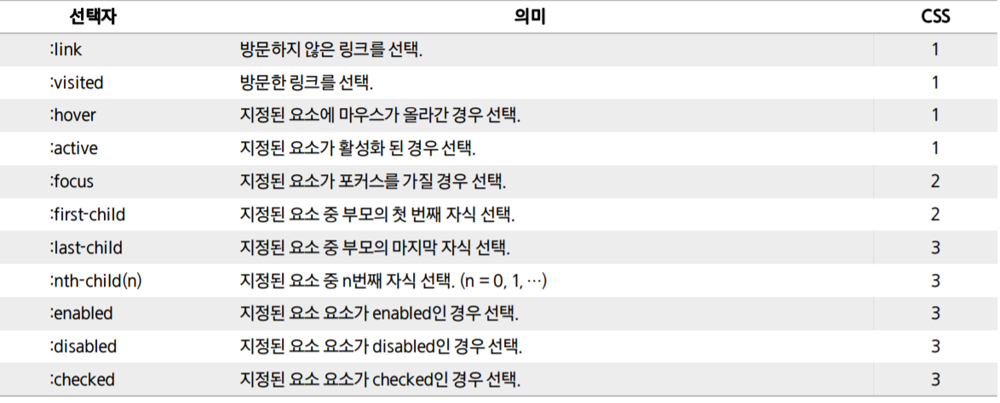
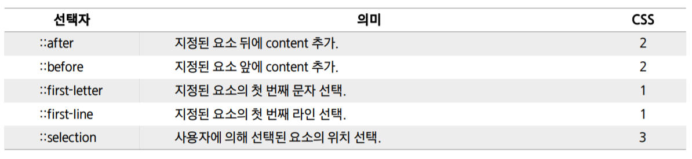
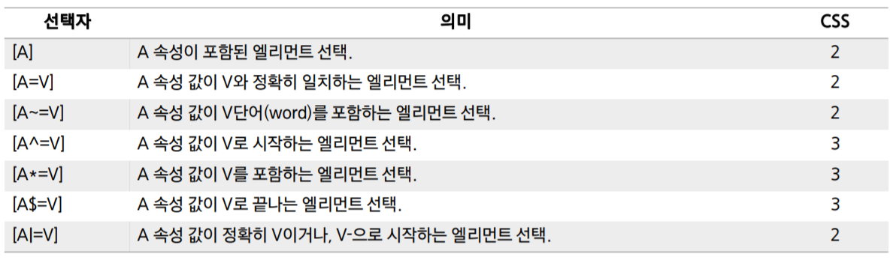

[TOC]


# CSS

> Cascading Style Sheet

스타일, 레이아웃 등을 통해 HTML이 사용자에게 어떻게 표시 되는지를 지정하는 언어

사용자에게 문서(HTML)를 표시하는 방법을 지정하는 언어


## CSS 구문

- **선택자**(selector)와 함께 열린다.
- 스타일을 지정할 html 요소 선택
- 중괄호`{}`에 속성:값 쌍의 형태 **선언**(declaration)

**속성**(Property) : 글꼴, 너비, 배경색 등 변경할 스타일 기능

**값**(Value) : 어떻게 변경할지

```css
selector {
	property: value;    
}

.big-box {
  position: relative;
  margin: 100px auto 500px;
  border: 5px solid black;
  width: 500px;
  height: 500px;
}

```

## CSS 정의 방법

1. `Inline style`
2. 내부 참조 (`Embedding style`)
3. 외부 참조 (`Link style`)


# CSS 선택자

> 스타일을 지정할 웹 페이지의 HTML 요소를 선택


## 클래스 선택자

`.` 문자로 시작. 해당 클래스가 적용된 문서의 모든 항목 선택


## 아이디(id) 선택자

`#` 문자로 시작. 아이디는 문서당 한번만 사용 가능. 요소에는 단일 id값만 적용할 수 있다.


## 선택자 적용 우선순위

`!important` > inline style > id 선택자 > class 선택자 > 요소 선택자(h1, p) > 소스 순서


---


## 결합자

자손 결합자 (`A 공백 B `) : A의 모든 후손 요소(level n) 중 B와 일치하는 요소

자식 결합자 (`A > B`) : A의 모든 자식 요소(level 1) 중 B와 일치하는 요소

일반 형제 결합자 (`A ~ B`) : A의 형제요소 중 A 뒤에 위치하는 B요소 모두 선택

인접 형제 결합자 (`A + B`) : A의 형제요소 중 A 바로 뒤에 위치하는 B요소. 중간에 다른 요소 있으면 선택X


## 가상 클래스 선택자

 


## 가상 엘리먼트 선택자

 


## 속성 선택자

 


# CSS 단위

## 크기

px : 픽셀. 고정 단위

% : 백분율 단위

em : 상속의 영향을 받는다. 상황에 따라 각기 다른 값 가짐.

```css
font-size: 1.5em; /*상위 요소 크기의 1.5배*/
```

rem : 최상위 요소인 html을 기준으로 절대 단위. 상속 영향 X. 보통 16px

viewport : 현재 보이는 웹 컨텐츠 영역 기준. 1vh = viewport 높이의 1%. 1vw = viewport 너비의 1%


## 색상

색상 키워드 : red, blue, black

RGB : r,g,b,alpha(투명도)

HSL : 색상,채도,명도,alpha(투명도)


# Box Model

모든 HTML 요소는 box 형태로 돼있다. 하나의 박스는 네 영역으로 이루어진다.

> content / padding / border / margin


Content : tag가 존재하는 공간. 글이나 이미지, 비디오 등 요소의 실제 내용

Padding : Border(테두리) 안쪽의 **내부 여백**. 배경색, 이미지 지정 가능

Border

Margin : 테두리 바깥의 **외부 여백**. 배경색 지정 불가능

마진 상쇄 : block의 top, bottom margin이 때로는 가장 큰 하나의 마진으로 결합(상쇄, collapsed)된다.


# Display

> 요소를 블록과 인라인 요소 중 어느쪽으로 처리할지와 함께, 자식 요소를 배치할 때 사용할 레이아웃 설정

## block 

가로 영역을 모두 채운다. block 요소 다음 태그는 **줄바꿈**이 된다.

```css
<style>
.block1{ width: 300px; border: 3px solid #333 }
.block2{ width: 200px; border: 3px solid #999 }
</style>

<div class="block1">1</div>
<div class="block2">2</div>
```


## inline 

인라인 박스. 줄바꿈이 되지 않는다. 글자나 문장에 효과를 주기 위해 존재하는 단위.

width, height는 지정 불가능하다.

```css
<style>
.inline1{
	width: 200px; /* 이 값은 무시됩니다 */
	border: 3px solid #999;
}
</style>
<span class="inline1">reprehenderit</span>
```


## inline-block 

block과 inline의 중간 형태. 줄바꿈이 되지 않지만 크기를 지정할 수 있다.

```css
<style>
.inline-block2{
	display: inline-block;
	width: 200px; /* 이 값은 이제 정상 작동합니다 */
	border: 3px solid #999;
}
</style>
<span class="inline-block2">reprehenderit</span>
```


none : 화면에서 사라지고, 요소의 공간조차 사라짐. (`visibility:hidden;` 은 공간이 남음)


# Position

> 박스위 위치 속성 & 값
>
> static / absolute / relative / fixed
>
> z-index


## static

기본 위치. 모든 태그의 기본. 태그의 default


## relative

상대 위치. 기본 위치(static)를 기준으로 좌표 속성을 사용해 위치 이동

```html
<style>
.top {
  position: relative;
  top: 5px;
}
</style>
<span class="top">top</span>
```

relative는 각 방향을 기준으로 태그 안쪽방향으로 이동한다. 즉, 위의 top은 아래로 이동한다.


## absolute

절대 위치. static이 아닌 **부모/조상** 요소를 기준으로 좌표 속성만큼 이동

position이 relative, absolute, fixed인 부모가 없으면 body의 기준으로 이동한다.

```html
<style>
#parent {
  position: relative;
  width: 100px;
  height: 100px;
  background: skyblue;
}

#child {
  position: absolute;
  right: 0;
}
</style>

<div id="parent">
  <div id="child">children</div>
</div>
```


## fixed 

고정 위치. 브라우저의 viewport를 기준으로 좌표속성만큼 이동. 스크롤에 영향을 받지 않는다.


# Flexbox

> Flexible Box

```css
display: flex;
```

Container와 Items에 적용하는 속성이 구분되어 있다.
Container에는 `display`, `flex-flow`, `justify-content` 등의 속성을 사용할 수 있으며,
Items에는 `order`, `flex`, `align-self` 등의 속성을 사용할 수 있다.


## main-axis, cross-axis

값 `row`는 Items를 수평축으로 표시하므로 이때는 주 축이 수평이며 교차 축은 수직이 된다.
반대로 값 `column`은 Items를 수직축으로 표시하므로 주 축은 수직이며 교차 축은 수평이 된다.


## justify-content

한 줄 안에서 요소들을 어디에 놓을지 정한다. 왼쪽 정렬, 오른쪽 정렬, 중앙 정렬, 적당히 띄우기

flex-start : flexbox가 시작되는 곳에 정렬해!

> flex-start, flex-end, flex-center, space-around, space-between


## align-items

`justify-content` 의 수직 방향.

> flex-start, flex-end, center, baseline, stretch

### align-self

혼자만 움직인다.


## flex-direction

main 축을 row로 삼을지 (default), column으로 삼을지 결정한다. Flex의 방향이 column일 경우 `justify-content`의 방향이 세로로, `align-items`의 뱡향이 가로로 바뀐다.

> row, row-reverse, column, column-reverse


## order

요소들의 순서. default=0이고, 양수나 음수로 바꿀 수 있다. 모든 요소의 default=1이기때문에, 하나만 양수로 바꾸면 그 요소가 맨 뒤로 간다.


## flex-wrap


nowrap (모든 요소를 한 줄에 정렬), wrap(여러 줄), wrap-reverse(여러 줄, 반대로)


## flex-flow

flex-direction, flex-wrap을 함께 사용한다.

row wrap, column nowrap


## align-content

여러 줄 사이의 간격을 지정할 수 있다. flex-direction이 row(default)인 경우, 윗줄과 아랫줄의 간격을 정한다. 

flex-start, flex-end, center, space-between, space-around, stretch