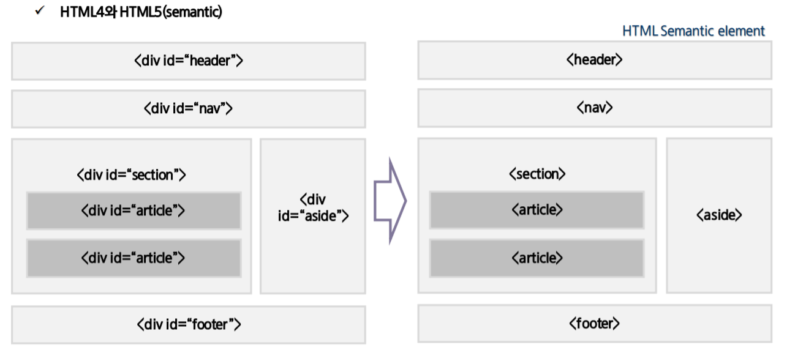

# HTML5

[TOC]

---

HTML5는 지금도 개발중이고 다양한 기능이 추가됐다.

- 멀티미디어 요소 재생 : 별도의 플러그인이 필요 없다.
- 서버와 통신 : 서버와 클라이언트 사이에 소켓 통신이 가능하다.
- Semantic tag : 특정 tag에 의미를 부여하는 방식. 검색엔진이 좀 더 빠르게 검색할 수 있도록 한다.

## Web & HTML 작동원리

1. 서버는 클라이언트의 요청 내용을 분석해 결과값을 HTML로 전송
2. 서버는 결과값을 전송한 후 클라이언트와 연결 종료
3. 클라이언트는 서버로부터 전달받은 HTML을 웹 브라우저에 표시
4. 각 브라우저에 내장된 브라우저 엔진이 tag를 해석하여 화면에 표현

## Tag

tag는 속성과 값이 존재한다.

글로벌 속성(global attribute, 어느 tag에나 넣어서 사용할 수 있는 속성)은 다음과 같다.

- class 
- dir : 내용의텍스트 방향을 지정. 왼쪽 >> 오른쪽(기본값, ltr), 오른쪽 >> 왼쪽(rtl).
- id
- style
- title : tag에 추가 정보를 지정. tag에 마우스 포인터를 위치시킬 경우 title의 값 표시.

## 특수문자

| 이름     | 출력 | 설명                     |
| -------- | ---- | ------------------------ |
| `&nbsp;` |      | 공백. non breaking space |
| `&lt;`   | `<`  | less than                |
| `&gt;`   | `>`  | greater than             |
| `&amp;`  | `&`  | ampersand                |
| `&quot;` | `"`  | quotation mark           |
| `&copy;` | ©    | copyright                |
| `&reg;`  | ®    | registered trademark     |

## semantic

 

